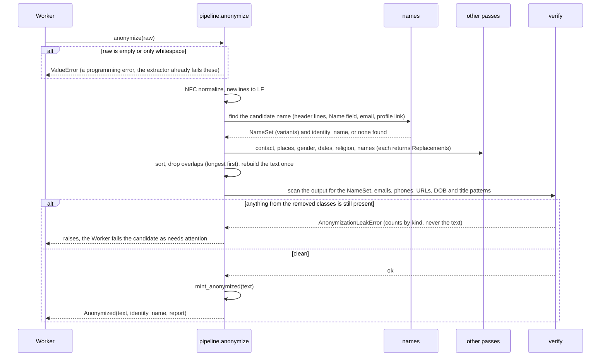

# Low Level Design: Anonymizer

- Task: HK-16, HLD: docs/design/hirekit-hld.md (sections 2, 3, 9), ADRs: ADR-0002 (Python), docs/architecture/tenets.md (tenets 2, 7), docs/design/gateway-lld.md (section 3, the text classes), docs/design/worker-lld.md (the `Anonymizer` and `load_anonymized` ports)
- Author: midhun.m (git), delivering entity: unattributed (no .bearing/company.json), 2026-09-30, status Draft, version v1
- Serves: US-00-004, US-00-005, US-02-004 (AC-US-02-004-1), US-02-006 (AC-US-02-006-1 to AC-US-02-006-5); REQ-011 to REQ-018, REQ-047, REQ-056, REQ-058
- Acceptance criteria the tests cover: AC-US-00-004-1 to AC-US-00-004-7, AC-US-00-005-1, AC-US-00-005-2, AC-US-00-005-6, AC-US-02-004-1, AC-US-02-006-1, AC-US-02-006-3

Nothing exists under `backend/app/anonymizer/` yet, so every path is `(new)`. Statements about resumes in the wild are prefixed "assumption:" and listed in section 10. One technology decision is proposed in section 3 for you to make; nothing is added until you do.

## 1. Scope

The anonymizer is a pure Python package that turns the raw text of one resume into the only text the model may see: it removes or masks the candidate's name and its variants, gender signals, age signals, religion signals, location, and email addresses, phone numbers and links, then checks its own output for what it removed. It returns the anonymized text (as an `AnonymizedText`), the name it found (for the audited reveal), and a count of what it masked. It never touches the database or the network. Text extraction, the scoring prompt and the gateway are outside it.

**It is a floor, not proof of fairness** (PRD section 13, AGENTS.md). It removes the named signals only. Proxies remain: schools, clubs, gendered nouns such as "chairman", career gaps, employer names and years of experience. Nothing in this package, its tests, its reports or its docs may claim otherwise.

## 2. Module layout

All under `backend/`. Line counts are estimates. No file is expected to pass 400 lines.

| Path | Owns | Lines |
| --- | --- | --- |
| `app/anonymizer/__init__.py` (new) | exports `anonymize`, `Anonymized`, `load_anonymized` | 15 |
| `app/anonymizer/tokens.py` (new) | the fixed placeholder tokens and the `Span` and `Replacement` types | 60 |
| `app/anonymizer/names.py` (new) | find the candidate's name and build its variants | 200 |
| `app/anonymizer/contact.py` (new) | email addresses, phone numbers, URLs, social handles | 120 |
| `app/anonymizer/places.py` (new) | postal codes, street addresses, the place gazetteer match | 150 |
| `app/anonymizer/gender.py` (new) | gender fields, titles, pronouns | 90 |
| `app/anonymizer/dates.py` (new) | dates of birth, stated ages, graduation years | 180 |
| `app/anonymizer/religion.py` (new) | stated religion and religious affiliations | 80 |
| `app/anonymizer/pipeline.py` (new) | run the passes in order, apply the replacements, build the report | 150 |
| `app/anonymizer/verify.py` (new) | the residual scan and `AnonymizationLeakError` | 90 |
| `app/anonymizer/loader.py` (new) | `load_anonymized`: read the stored anonymized text and mint it | 40 |
| `app/anonymizer/data/*.txt` (new) | word lists: places, titles, religion terms, common-word names | 6 files, about 3,000 lines of data |

Tests (new): `tests/anonymizer/` with one file per module above, `test_hard_cases.py`, `test_properties.py`, `test_name_swap.py`, `test_boundaries.py`, and `tests/anonymizer/fixtures/` (synthetic resumes only: no real person, PRD section 14).

Rules that shape the layout: the package is the only importer of `mint_anonymized` (tenet 2, the existing guard in `tests/gateway/test_boundaries.py`). Word lists are data files, not code, so a reviewer can read and correct them, and a change to a list shows up as a data diff. Each pass is a pure function `text -> list[Replacement]`; only `pipeline.py` edits the text, so no pass can see another pass's placeholder by accident.

## 3. Types and schemas

**Placeholders** (`tokens.py`), fixed strings so two inputs that differ only in a removed value give identical output (name-swap eval, AC-US-02-006-3): `[NAME]`, `[EMAIL]`, `[PHONE]`, `[URL]`, `[LOCATION]`, `[ADDRESS]`, `[PRONOUN]`, `[TITLE]`, `[DATE]`, `[AGE]`, `[RELIGION]`, `[GENDER]`. A placeholder never carries the length, shape or first letter of what it replaced.

**`Replacement`** (frozen dataclass): `start`, `end` (offsets in the input), `token`, `kind` (the field: name, gender, age, religion, location, contact). `pipeline.py` sorts them, drops any that overlap an earlier one (longest first), and rebuilds the text once.

**`Anonymized`** (frozen dataclass), what `anonymize` returns:

| Field | Type | Meaning |
| --- | --- | --- |
| `text` | `AnonymizedText` | built with `mint_anonymized`, the only place it is minted |
| `identity_name` | `str or None` | the name found, for `candidates.identity_name`; `None` when none was found |
| `report` | `AnonymizationReport` | counts per kind and per pass (integers only), safe to log (tenet 7) |

**Signature** (the Worker port, worker-lld section 3): `anonymize(raw: str) -> Anonymized`. The Worker's port returns `(AnonymizedText, str or None)`; the Worker unpacks it. `load_anonymized(session, candidate_id) -> AnonymizedText` reads `resume_texts.anonymized_text` and mints it, so a re-scoring sees exactly the text the quotes were verified against.

**Determinism.** The same input gives the same output on any machine: no randomness, no clock, no locale-dependent calls, word lists read in file order, and text normalized to NFC with `\n` newlines first (the same normalization the gateway key applies), so a replay recording keyed on the anonymized text stays valid.

**Where validation lives.** The input is a `str` from the extractor (validated there). `anonymize` raises `ValueError` on an empty or whitespace-only string (the extractor already fails those, so this is a programming error) and `AnonymizationLeakError` when the residual scan finds something (section 6). Nothing else is validated: the input is untrusted text and every pass treats it as data.

### The technology decision for you: how names and places are found

Names of the candidate and places are the hardest part. Two ways, with a recommendation; nothing is added until you choose (AGENTS.md: a technology choice is never silent).

| Option | What it is | For | Against |
| --- | --- | --- | --- |
| **A. Rules, discovery and word lists (recommended)** | The candidate's own name is found from their own document (the first lines, a `Name:` field, the email address, the profile link) and removed everywhere with its variants. Places come from checked-in gazetteers (countries, states and provinces, a few thousand cities) plus postal-code and street patterns. | No new dependency; fully deterministic; every list is reviewable data; the name-swap eval tests exactly the mechanism used (the name is derived from the same document); fast. | Misses a place not in the list and a name the document never states in a findable position; grows by editing lists. |
| **B. Rules plus a small NER model (spaCy `en_core_web_sm`)** | The same rules as the floor, plus a statistical model that tags every PERSON, place and nationality-or-religious-group mention. | Generalises to places and names no list has; catches a second person's name too. | Adds spaCy and a 12 MB model (a dependency to pin and audit); output can shift between model versions, which breaks the determinism replay depends on unless the version is pinned exactly; over-masks employers and skills that look like names or places ("Jordan", "Amazon", "Chelsea"). |

Recommendation: A first, with the residual scan and both evals as the judge. If the name-swap eval or the 40-resume hard cases show leaks the lists cannot close, add B as an extra pass behind the same interface without changing the rest. Owner: midhun.

## 4. Sequence

One flow. Every pass runs on the same NFC-normalized input; only the last step edits text.

**What each pass removes** (the acceptance criteria, mapped):

| Pass | Removes | Keeps | Criteria |
| --- | --- | --- | --- |
| `names` | the candidate's full name, each part, initials (`J. Doe`, `J D`, `JD`), reversed order (`Doe, Jane`), upper and lower case forms, hyphenated and multi-part names (`Mary-Ann van der Berg`), the name in a repeated header or footer line, the name inside an email or a link | everyone else's name: a referee or a manager is not the candidate (see assumptions) | REQ-011, AC-US-00-004-1 |
| `gender` | fields (`Gender: Male`, `Sex:`), titles (`Mr`, `Mrs`, `Ms`, `Miss`, `Mx`, `Sir`, `Madam`), gendered pronouns (`he`, `him`, `his`, `himself`, `she`, `her`, `hers`, `herself`) replaced by `[PRONOUN]` | neutral titles such as `Dr` and `Prof`; gendered nouns such as `chairman` (a proxy that remains, section 1) | REQ-012, AC-US-00-004-2 |
| `dates` | dates of birth in every format (`12/03/1990`, `03-12-1990`, `12 March 1990`, `March 12, 1990`, `1990-03-12`, `12.03.90`) and after `DOB`, `Date of Birth`, `Born`; stated ages (`Age: 34`, `34 years old`, `34-year-old`, `aged 34`); graduation years and dates in an education line or section, and after `graduated`, `class of`, `batch of` | employment dates, which are evidence (a proxy for age that remains) | REQ-013, AC-US-00-004-3 |
| `religion` | stated religion (`Religion: Hindu`), affiliations (`Member of the Catholic Youth Association`, `Sikh Students Society`), and religion words from the list | languages and cultural skills | REQ-015, AC-US-00-004-5 |
| `places` | postal codes (US ZIP and ZIP+4, UK, Canadian, six-digit Indian PIN), street addresses, and cities, states, provinces and countries from the gazetteer, including inside a school or employer name (`University of Madras` becomes `University of [LOCATION]`) | the rest of the school or employer name, which is a proxy that remains | REQ-016, AC-US-00-004-6 |
| `contact` | email addresses, phone numbers in local and international forms, every URL, `linkedin.com/in/...`, `github.com/...`, `@handles` | nothing in this class is evidence, so nothing is kept | REQ-017, AC-US-00-004-7 |

**Photos and embedded images** (REQ-014, AC-US-00-004-4) never reach this package: it receives text. The extractor design must return body text only, with no image alt text, captions, or file metadata (a PDF or DOCX `Author` field is a name); `test_boundaries.py` cannot check that, so it is a precondition stated here and tested in the extractor's design. This package's test only proves that a resume with the literal text `[Photo of the candidate]` or an `` string is scrubbed of the name in it.

## 5. Data access

None. The package reads word lists from `app/anonymizer/data/` at import time, once per process, into frozen sets and compiled patterns; `load_anonymized` is the one function that touches the database, through the `AsyncSession` its caller gives it:

| # | Query | Shape | Index |
| --- | --- | --- | --- |
| Q1 | `SELECT anonymized_text FROM resume_texts WHERE candidate_id = :c` | one row | `resume_texts_pkey` |

Queries: 1 (without index: 0). Transactions: none opened here; `load_anonymized` runs inside the caller's. **Concurrency:** none: every function is pure and the compiled patterns and word sets are read-only, so any number of Workers and threads may call `anonymize` at once. **Migrations:** none.

**Regex safety.** Every pattern is bounded (no nested unbounded quantifiers, no unanchored `.*` between optional groups) and the input is capped: `anonymize` refuses more than 500,000 characters with `ValueError`, well above a real resume (about 10,000). `test_adversarial_input_finishes_quickly` feeds long runs of digits, at-signs, dots and dashes and asserts a time bound with an injected clock, so a pattern that backtracks catastrophically fails the build.

## 6. Errors

| Error | Created in | Wrapped | Mapped to |
| --- | --- | --- | --- |
| `ValueError` (empty input, over 500,000 characters) | `pipeline.py` | not wrapped | a programming error: the Worker's "any other exception" row (logged with ids and the type only) |
| `AnonymizationLeakError` (a removed class is still present after the passes) | `verify.py` | not wrapped; carries counts by kind, never text | the Worker fails the candidate with the plain reason "This resume could not be made anonymous, so it was not sent to the model. Review it by hand." and `last_error = anonymization_leak`; not retried, because the same input gives the same output. It is added to the Worker design's error table as a permanent failure. |

Both messages hold counts and kinds only (tenet 7); the residual scan never puts the leaked string in a message, a log line or the report.

## 7. Configuration

None. No environment variable, no setting: the word lists and patterns are code and data, so the same commit gives the same behaviour everywhere. Count: 0 (missing from `.env.example`: 0).

## 8. Tests

`pytest`, no network, no clock except the injected one in the timing test. Fixtures are synthetic, written for the hard cases, in `tests/anonymizer/fixtures/`. The 40 seed resumes are also run through the suite once they exist (US-02-007).

| Test | Kind | Proves |
| --- | --- | --- |
| `test_the_full_name_is_masked_wherever_it_appears` | unit | AC-US-00-004-1 |
| `test_each_name_part_alone_is_masked` | unit | AC-US-00-004-1 |
| `test_initials_and_reversed_order_are_masked` | unit | AC-US-00-004-1 |
| `test_a_hyphenated_and_a_multi_part_name_are_masked` | unit | AC-US-00-004-1, hard case |
| `test_the_name_in_a_repeated_header_and_footer_is_masked` | unit | AC-US-00-004-1, hard case |
| `test_the_name_inside_an_email_address_is_masked` | unit | AC-US-00-004-1, AC-US-00-004-7, hard case |
| `test_the_name_inside_a_profile_url_is_masked` | unit | AC-US-00-004-7, hard case |
| `test_a_name_that_is_also_a_common_word_is_masked_in_name_positions_and_not_in_running_text` | unit | AC-US-00-004-1, hard case |
| `test_the_name_is_found_from_a_name_field_the_first_lines_and_the_email` | unit | REQ-011 |
| `test_identity_name_is_returned_for_the_reveal_and_none_when_absent` | unit | AC-US-00-009-2 |
| `test_another_persons_name_such_as_a_referee_is_kept` | unit | AC-US-00-004-7 (kept: employers, titles) |
| `test_gender_field_and_titles_are_masked` | unit | AC-US-00-004-2 |
| `test_gendered_pronouns_inside_sentences_are_masked` | unit | AC-US-00-004-2, hard case |
| `test_neutral_titles_and_the_word_her_inside_another_word_are_kept` | unit | AC-US-00-004-2 |
| `test_a_date_of_birth_in_each_of_six_formats_is_masked` | unit (parametrised) | AC-US-00-004-3, hard case |
| `test_a_stated_age_in_each_phrasing_is_masked` | unit (parametrised) | AC-US-00-004-3 |
| `test_graduation_years_in_the_education_section_are_masked` | unit | AC-US-00-004-3 |
| `test_employment_dates_are_kept` | unit | AC-US-00-004-3 (kept: evidence) |
| `test_stated_religion_and_affiliations_are_masked` | unit | AC-US-00-004-5 |
| `test_a_school_name_that_reveals_a_place_or_a_religion_is_partly_masked` | unit | AC-US-00-004-5, AC-US-00-004-6, hard case |
| `test_postal_codes_in_each_supported_format_are_masked` | unit (parametrised) | AC-US-00-004-6 |
| `test_street_address_city_state_and_country_are_masked` | unit | AC-US-00-004-6 |
| `test_a_city_that_is_also_a_common_word_is_masked_as_a_place_only_when_capitalised` | unit | AC-US-00-004-6, hard case |
| `test_emails_phones_urls_and_handles_are_masked_in_every_form` | unit (parametrised) | AC-US-00-004-7 |
| `test_skills_employers_titles_projects_and_outcomes_are_kept` | unit | AC-US-00-004-7 |
| `test_a_photo_caption_or_image_alt_text_with_the_name_is_scrubbed` | unit | AC-US-00-004-4 (text side) |
| `test_placeholders_do_not_reveal_length_or_shape_of_what_they_replaced` | unit | REQ-011 |
| `test_swapping_the_candidate_name_gives_byte_identical_anonymized_text` | unit | AC-US-02-006-1, AC-US-02-006-3 |
| `test_swapping_the_name_across_origins_and_genders_gives_identical_text` | unit (8 name pairs) | AC-US-02-006-1 |
| `test_the_same_input_gives_the_same_output` | property | determinism |
| `test_anonymizing_twice_changes_nothing` | property (idempotence) | correctness |
| `test_windows_and_unix_newlines_give_the_same_output` | unit | determinism |
| `test_the_residual_scan_raises_when_a_name_part_survives` | unit (a broken pass planted) | section 6 |
| `test_the_residual_scan_raises_when_an_email_or_a_dob_survives` | unit | section 6 |
| `test_a_leak_error_and_the_report_carry_counts_never_text` | unit | AC-US-00-005-6, tenet 7 |
| `test_adversarial_input_finishes_quickly` | unit (injected clock) | regex safety |
| `test_an_input_over_500000_characters_is_refused` | unit | limit |
| `test_an_empty_input_is_refused` | unit | limit (the pair) |
| `test_overlapping_matches_keep_the_longest` | unit | pipeline |
| `test_only_this_package_mints_anonymized_text` | unit (existing guard) | tenet 2 |
| `test_load_anonymized_returns_the_stored_text_as_anonymized_text` | integration | AC-US-00-005-1, AC-US-00-005-2 |
| `test_all_forty_seed_resumes_leave_no_name_email_phone_or_dob` | integration (once US-02-007 exists) | AC-US-02-004-1 |

Tests named: 42. Every limit has both sides (500,000 characters refused, an empty string refused; a common-word name masked in a name position and kept in running text; a city masked capitalised and kept as a common word).

## 9. Work breakdown

Each item is one MR and leaves `make check` green; every pass ships with its tests. Every type, function and data file an item uses is defined by the same item or an earlier one.

1. **Tokens, types, the pipeline shell and the verify step.** Files: `app/anonymizer/__init__.py`, `tokens.py`, `pipeline.py`, `verify.py`, `tests/anonymizer/test_pipeline.py`, `test_verify.py`, `test_properties.py`. The pipeline runs with no passes yet (returns the normalized text). About 330 lines.
2. **Contact pass** (email, phone, URL, handle). Files: `contact.py`, its tests, the adversarial-input test. About 260 lines.
3. **Name discovery and removal.** Files: `names.py`, `data/common_word_names.txt`, `test_names.py`, part of `test_hard_cases.py`. About 380 lines.
4. **Gender pass.** Files: `gender.py`, `data/titles.txt`, tests. About 220 lines.
5. **Dates pass** (DOB, age, graduation). Files: `dates.py`, tests. About 330 lines.
6. **Religion pass.** Files: `religion.py`, `data/religion_terms.txt`, tests. About 200 lines.
7. **Places pass.** Files: `places.py`, `data/countries.txt`, `states.txt`, `cities.txt`, tests. About 300 lines of code and about 3,000 lines of data (a data-only diff, reviewed as data).
8. **The name-swap and the hard-case suites over the whole pipeline.** Files: `test_name_swap.py`, `test_hard_cases.py`, the synthetic fixtures. About 380 lines.
9. **The loader and the boundary guard.** Files: `loader.py`, `tests/anonymizer/test_boundaries.py`, `tests/integration/test_anonymizer_loader.py`. About 150 lines.

Items: 9 (largest about 380 lines of code, over 400: 0).

## 10. Assumptions

- assumption: resumes are in English, in Latin script. A name written in two scripts, or transliterated inconsistently, can leak; the residual scan catches only forms the name set already contains. Owner: midhun, confirm the seed data and the intended users are English.
- assumption: the candidate's own name appears somewhere findable (the first lines, a name field, the email, the profile link). A resume with none leaves `identity_name` as `None` and only the contact, gender, age, religion and place passes protect it; the residual scan cannot check what it does not know.
- assumption: another person's name (a referee, a manager, a co-author) is kept, because REQ-011 names the candidate and REQ-017 keeps employers and outcomes. A reference's name is a small residual signal.
- assumption: place coverage is bounded by the checked-in lists (countries, states and provinces, a few thousand cities). A small town, a neighbourhood or a misspelling can survive. Option B (section 3) is the way to widen it. Falsify with the 40 seed resumes and 20 name-swap pairs (US-02-007) plus a hand-written set of 10 resumes with obscure places. Owner: midhun.
- assumption: masking a place inside a school or employer name (`University of [LOCATION]`) is right even though it slightly damages an employer name that REQ-017 says to keep. The alternative (keep employer names whole) leaks location.
- assumption: graduation years are recognised by an education heading or by cue words within the line; a bare year in an unlabelled list can survive. This is REQ-013's "where practical".
- assumption: years in employment dates stay, because they are the evidence; years of experience therefore remain a proxy for age.
- assumption: the extractor returns body text only (no image alt text, no captions, no metadata such as a PDF `Author`). If it does not, names and other signals arrive through a door this package never sees. To be enforced in the extractor's design and checked in its tests.
- assumption: the anonymizer is a floor: schools, clubs, gendered nouns (`chairman`, `salesman`), career gaps and employer names remain. Every place this package's output is described says so, and no report or copy may claim fairness beyond the named signals.
- Downstream that goes stale once this is built: the Worker design's error table (add `AnonymizationLeakError`, a permanent failure with the plain reason in section 6), the extractor design (the body-text-only precondition), the seed data task (synthetic resumes with planted signals for the hard-case suite), and the backlog note on US-00-004 (a resume the anonymizer cannot clear is failed for review, not sent).
