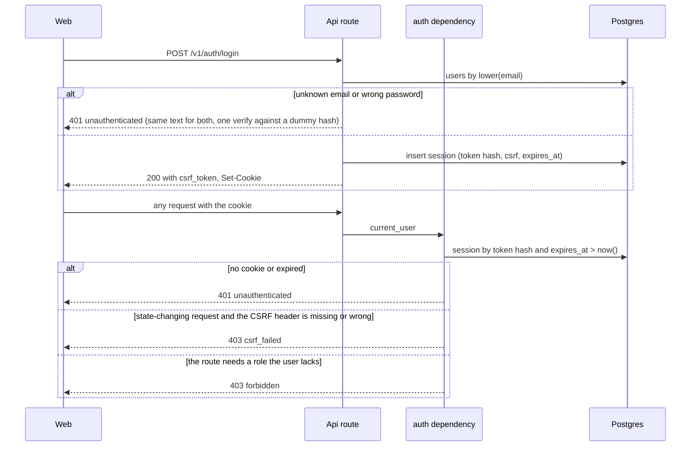
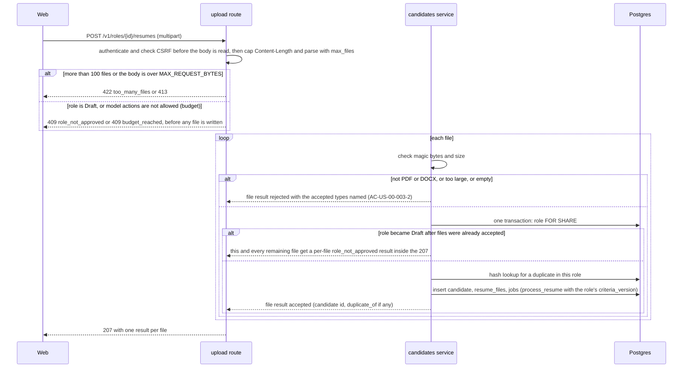
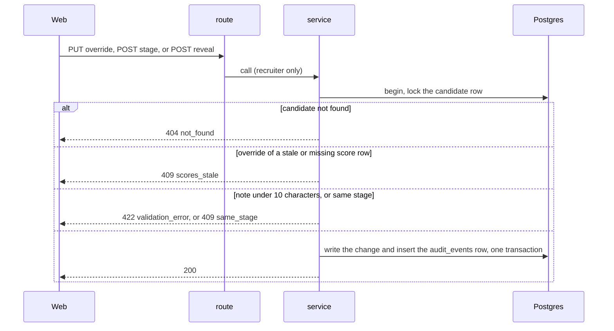
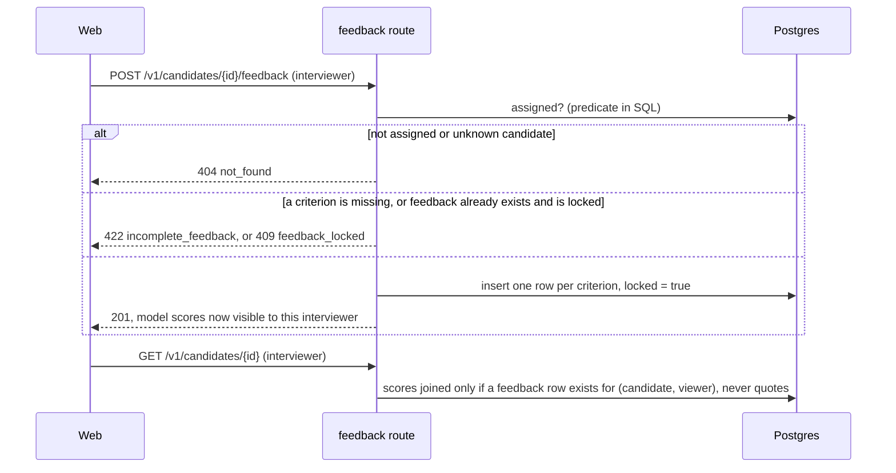
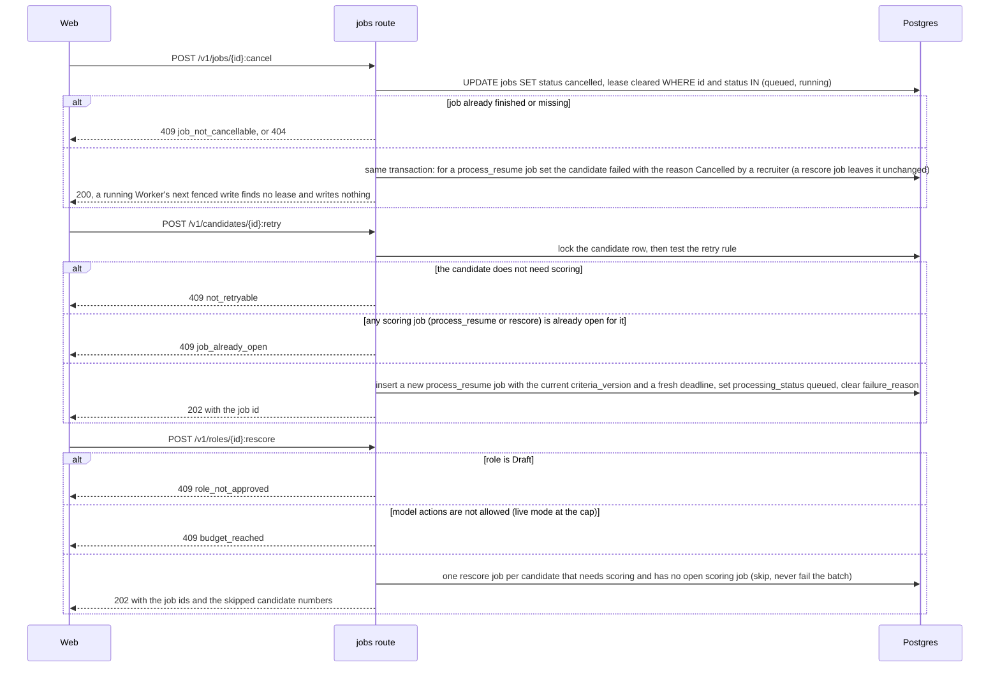

# Low Level Design: Api

- Task: HK-13, HLD: docs/design/hirekit-hld.md (sections 2, 3, 5, 7, 9), ADRs: ADR-0001, ADR-0004, ADR-0005, ADR-0006, ADR-0008, docs/architecture/tenets.md (tenets 1, 3, 4, 6, 7), docs/design/data-model.md, docs/design/worker-lld.md, docs/design/gateway-lld.md
- Author: midhun.m (git), delivering entity: unattributed (no .bearing/company.json), 2026-09-30, status Draft, version v1
- Serves: US-00-001 to US-00-016, US-02-002 (AC-US-02-002-4); REQ-001 to REQ-010, REQ-024 to REQ-030, REQ-031 to REQ-039, REQ-049, REQ-050, REQ-052 to REQ-055, REQ-062
- Acceptance criteria the tests cover: AC-US-00-001-1, AC-US-00-001-2, AC-US-00-001-4, AC-US-00-002-1 to AC-US-00-002-6, AC-US-00-003-1 to AC-US-00-003-4, AC-US-00-003-6, AC-US-00-005-5, AC-US-00-006-5, AC-US-00-008-2 to AC-US-00-008-5, AC-US-00-009-1 to AC-US-00-009-4, AC-US-00-010-1 to AC-US-00-010-5, AC-US-00-011-1 to AC-US-00-011-4, AC-US-00-012-1 to AC-US-00-012-6, AC-US-00-013-1, AC-US-00-013-5, AC-US-00-013-6, AC-US-00-014-2 to AC-US-00-014-7, AC-US-00-015-1 to AC-US-00-015-4, AC-US-00-015-6, AC-US-00-016-1 to AC-US-00-016-3, AC-US-02-002-4

`backend/app/api/health/` exists (`/healthz`, `/readyz`); everything else here is `(new)`. The HTTP shapes are written in the OpenAPI spec (`backend/api/openapi.yaml`, generated from the FastAPI models and committed, ADR-0006), which is the next task; this design fixes routes, roles, transactions, queries and errors. Statements about the outside world are prefixed "assumption:" and listed in section 10.

## 1. Scope

The Api is the FastAPI process the Web talks to: sessions and roles, the REST routes of HLD section 5, per-resource authorisation, the upload transaction, enqueueing and cancelling jobs, the audited recruiter decisions, and the queries that hide what an interviewer may not see. It never imports the gateway (tenet 1), never calls a model, and never writes a score (tenet 3) or, outside the stage route, a stage (tenet 4). The Worker, the gateway, the seed command and the Web are separate components.

## 2. Module layout

All under `backend/`. A resource is a folder `app/api/<resource>/` with `router.py` (routes only) and `schemas.py` (Pydantic request and response models, `extra="forbid"` on requests); rules live in `app/domain/<area>/service.py`, SQL in `app/db/repositories/`. Line counts are estimates; none should pass 400.

| Path | Owns | Lines |
| --- | --- | --- |
| `app/core/passwords.py` (new) | hash and verify a password | 40 |
| `app/core/auth.py` (new) | `current_user`, `RecruiterUser`, `InterviewerUser` dependencies; the session cookie; CSRF check | 130 |
| `app/api/auth/` (new) | `POST /v1/auth/login`, `POST /v1/auth/logout`, `GET /v1/auth/me` | 130 |
| `app/api/roles/` (new) | roles, criteria replace, approve | 220 |
| `app/api/resumes/` (new) | multipart upload, per-role queue view | 160 |
| `app/api/candidates/` (new) | ranked list, detail, retry, stage, reveal, assignments, override | 300 |
| `app/api/kit/` (new) | kit read, generate, question edit and regenerate | 150 |
| `app/api/feedback/` (new) | submit, read, approve edit, edit | 170 |
| `app/api/compare/` (new) | comparison view | 90 |
| `app/api/jobs/` (new) | job status, cancel, rescore | 100 |
| `app/api/cost/` (new) | cost log and budget | 80 |
| `app/domain/roles/service.py` (new) | create, replace criteria, approve, the Draft rules | 200 |
| `app/domain/candidates/service.py` (new) | upload, retry, stage, reveal, assign, override | 300 |
| `app/domain/feedback/service.py` (new) | submit, approve edit, edit, model-score visibility | 170 |
| `app/domain/visibility.py` (new) | `Viewer` and the rule "what may this viewer see of this candidate" | 60 |
| `app/db/repositories/users.py`, `sessions.py` (new) | login lookup, session create, read, delete | 120 |
| `app/db/repositories/roles.py`, `criteria.py` (new) | role and criteria SQL | 200 |
| `app/db/repositories/candidates.py`, `uploads.py` (new) | ranked list, detail, upload insert, stage | 300 |
| `app/db/repositories/audit.py` (new) | append an audit event | 60 |
| `app/db/repositories/feedback.py`, `compare.py`, `kit.py` (new) | their SQL | 260 |
| `app/db/repositories/jobs_api.py` (new) | enqueue, cancel, status, queue view | 150 |
| `app/db/repositories/cost.py` (new) | cost log page | 40 |
| `app/db/repositories/budget.py` (exists) | `read_spent`, used for the cost log and the 409 | 0 |
| `app/core/errors.py` (edit) | add the error classes of section 6 | 40 |
| `app/core/config.py` (edit) | the settings of section 7 | 30 |
| `app/main.py` (edit) | include the routers | 15 |

Tests: `tests/api/` (unit, over `httpx.ASGITransport` with dependency overrides and fake repositories) and `tests/integration/test_api_*.py` (Postgres). Preconditions from other tasks: migration 2 (the `hirekit_api` role with no `UPDATE` on `scores` model columns and no write on `budget` or `call_log`) before any deployment, and the seed command that creates the users (US-02-007).

Rules that shape the layout: a route parses, calls one service method and returns a schema; no SQL and no `try` that builds an error body (python rules). Repositories own SQL; services own transactions (`async with session.begin()`).

## 3. Types and schemas

**Session and CSRF** (`app/core/auth.py`). Login verifies the password, creates a random 256-bit session token, stores its SHA-256 in `sessions.token_hash` with a random `csrf_token` and `expires_at`, and sets the cookie `hirekit_session` (`HttpOnly`, `SameSite=Lax`, `Secure` when `SESSION_COOKIE_SECURE` is true, `Path=/`). The login response and `GET /v1/auth/me` return the `csrf_token`; every `POST`, `PUT` and `DELETE` must send it in the `X-CSRF-Token` header and it is compared in constant time with the stored value (`hmac.compare_digest`). A missing or wrong token is `403 csrf_failed`. `current_user` hashes the cookie, looks the session up with `expires_at > now()`, and loads the user; no cookie or an expired session is `401 unauthenticated`.

**`Viewer`** (`app/domain/visibility.py`), a frozen dataclass `(user_id, role)` built from the session user. Every repository query that returns candidate data takes a `Viewer` and, for an interviewer, carries `candidate_id IN (SELECT candidate_id FROM assignments WHERE user_id = :viewer)` in SQL (tenet 6). No service loads a row and then compares in Python.

**Routes.** One row per route of HLD section 5, plus the routes the acceptance criteria need that the HLD lacked (marked +). `R` recruiter, `I` interviewer, `any` a signed-in user. Request and response shapes are in `openapi.yaml`.

| Method and path | Who | Does | Success |
| --- | --- | --- | --- |
| `POST /v1/auth/login` | none | verify, create session, set cookie | 200 |
| `POST /v1/auth/logout` | any | delete the session | 204 |
| `GET /v1/auth/me` + | any | user, role, `csrf_token` | 200 |
| `POST /v1/roles` | R | create a Draft role | 201 |
| `GET /v1/roles` | R | list roles | 200 |
| `GET /v1/roles/{id}` | R, I | role, criteria and rubric (an interviewer only for a role in which they have an assigned candidate) | 200 |
| `GET /v1/me/candidates` + | I | the interviewer's assigned candidates: `candidate_no`, `role_id`, role title, `has_submitted`; bounded (max 200) | 200 |
| `POST /v1/roles/{id}/criteria:propose` | R | enqueue `propose_criteria`, return the job id | 202 |
| `PUT /v1/roles/{id}/criteria` | R | replace the criteria set in place by id, bump the version, back to Draft | 200 |
| `POST /v1/roles/{id}/approve` | R | set Approved; the body carries the `criteria_version` the recruiter saw | 200 |
| `POST /v1/roles/{id}/resumes` | R | upload up to 100 files, one result per file | 207 |
| `GET /v1/roles/{id}/candidates` | R | ranked list with filters and sort | 200 |
| `GET /v1/roles/{id}/queue` | R | per-file job status for the role | 200 |
| `POST /v1/roles/{id}:rescore` | R | enqueue `rescore` for every candidate that needs scoring and has no open scoring job (rule in 4.5) | 202 |
| `GET /v1/candidates/{id}` | R, I | detail (interviewer: only if assigned; no text, no quotes, no notes, no audit history, no file name) | 200 |
| `GET /v1/candidates/{id}/text` + | R | raw and anonymized resume text | 200 |
| `POST /v1/candidates/{id}:retry` | R | new `process_resume` job for a candidate that needs scoring (rule in 4.5) | 202 |
| `PUT /v1/candidates/{id}/scores/{criterion}/override` | R | override with a note | 200 |
| `POST /v1/candidates/{id}/stage` | R | change the stage | 200 |
| `POST /v1/candidates/{id}:reveal-identity` | R | audited reveal; the only response that carries `identity_name` and `file_name` after the upload | 200 |
| `GET /v1/users?role=interviewer` | R | the interviewers a recruiter can assign: `id` and `name` only, never the email; `role` required and only `interviewer` (else 422); bounded (max 200) | 200 |
| `GET /v1/candidates/{id}/assignments` | R | the candidate's assigned interviewers (`user_id`, `name`); unknown candidate 404 | 200 |
| `POST /v1/candidates/{id}/assignments` | R | assign an interviewer | 201 |
| `DELETE /v1/candidates/{id}/assignments/{user}` | R | remove it | 204 |
| `POST /v1/roles/{id}/kit:generate` | R | enqueue `generate_kit` | 202 |
| `GET /v1/roles/{id}/kit` | R, I | the kit, with `stale` derived | 200 |
| `PUT /v1/kit/questions/{id}` | R | edit or reorder a question in place | 200 |
| `DELETE /v1/kit/questions/{id}` + | R | delete a question | 204 |
| `POST /v1/kit/questions/{id}:regenerate` | R | enqueue `regenerate_question` | 202 |
| `POST /v1/candidates/{id}/feedback` | I | submit feedback, all criteria | 201 |
| `GET /v1/candidates/{id}/feedback` | R, I | all (R) or own (I) | 200 |
| `POST /v1/candidates/{id}/feedback/{interviewer}:approve-edit` | R | unlock one interviewer's feedback | 200 |
| `PUT /v1/candidates/{id}/feedback` + | I | save an approved edit, relock | 200 |
| `GET /v1/compare?ids=` | R, I | 2 to 4 candidates side by side | 200 |
| `GET /v1/jobs/{id}` | R | job status | 200 |
| `POST /v1/jobs/{id}:cancel` | R | cancel a queued or running job | 200 |
| `GET /v1/cost-log` | R | budget and the call log page | 200 |

Bodies and responses never contain resume text for an interviewer (Q-003), and never contain quotes for one (conflict 4). Lists are bounded (section 5).

**Who sees which field** (the leak surface, reviewed here because the OpenAPI spec inherits it):

| Field | Recruiter | Interviewer |
| --- | --- | --- |
| `candidate_no`, `stage`, weighted total, must-have coverage, flags | yes | no |
| per-criterion model score, override value | yes | only for a candidate they have submitted on |
| evidence `quote`, `override_note`, `flag_reason` | yes | never |
| raw and anonymized resume text | `GET .../text` only | never |
| `file_name`, `identity_name` | `:reveal-identity` only (the upload response echoes the names the recruiter just sent, once) | never |
| audit history (`audit_events`) | yes, in the detail | never |
| feedback | all interviewers' | their own only, in detail and in compare |
| `password_hash`, session token | never | never |

Lists and the queue view identify a candidate by `candidate_no`, never by name, so a file name like "Jane_Doe_CV.pdf" cannot sit beside C-014 and defeat the audited reveal (AC-US-00-009-2, Q-003).

**Validated once, where it enters.** Request bodies in the Pydantic request models; the session in `current_user`; the upload's type and size in `app/domain/candidates/service.py` (magic bytes `%PDF-`, or `PK\x03\x04` plus a `word/document.xml` entry in the zip listing so an xlsx or jar is rejected as the wrong type; size at most `MAX_UPLOAD_BYTES`); settings in `app/core/config.py`.

## 4. Sequence

Every flow draws its error branches. Errors are named in section 6.

### 4.1 Sign in and every later request

### 4.2 Upload

### 4.3 An audited decision (override, stage, reveal)

### 4.4 Interviewer feedback and the model-score rule

### 4.5 Cancel, retry and rescore

**The rule.** A candidate *needs scoring* when it has no score rows at the role's current `criteria_version`, or has a `failed` score row at its latest version, or its `processing_status` is `failed`. Retry and rescore use the same rule, so nobody is stranded: a stale `process_resume` (no score rows), a schema retry that failed every criterion, a cancelled job and a failed file are all eligible. Two paid scoring jobs for one candidate cannot coexist: the Api locks the candidate row and refuses (or skips, for rescore) when any `process_resume` or `rescore` job is open, because `uq_jobs_open_candidate` alone is per type.

## 5. Data access

All SQL is in repositories, parameterised, columns named, no `SELECT *`, every list bounded. Predicates repeat the partial-index predicates.

| # | Query | Shape | Index |
| --- | --- | --- | --- |
| Q1 | login: `SELECT id, password_hash, role FROM users WHERE lower(email) = lower(:e)` | one row | `uq_users_email` |
| Q2 | session: `SELECT ... FROM sessions WHERE token_hash = :h AND expires_at > now()` | one row | `sessions_pkey` |
| Q3 | roles list: `SELECT ... FROM roles ORDER BY created_at DESC LIMIT :n` (max 50) | few rows | none: under 10^2 rows, a known scan |
| Q4 | criteria of a role: `... FROM criteria WHERE role_id = :r AND retired_at IS NULL ORDER BY position` and its rubric by `criterion_id = ANY(:ids)` | few rows | `idx_criteria_role_position`, `rubric_levels_pkey` |
| Q5 | criteria replace: lock `roles ... FOR UPDATE`, upsert by id, set `retired_at` on ids not sent, bump `criteria_version`, set status Draft | few rows | primary keys |
| Q6 | duplicate check: `SELECT id FROM candidates WHERE role_id = :r AND content_hash = :h ORDER BY created_at LIMIT 1` | one row | `idx_candidates_role_content_hash` |
| Q7 | upload insert: `candidates`, `resume_files`, `jobs` in one transaction | inserts | none needed |
| Q8 | ranked list, per role: every candidate of the role is listed, LEFT JOINed to its latest score rows (`s.criteria_version = (SELECT max(criteria_version) FROM scores WHERE candidate_id = c.id)`), with `stale = s.criteria_version < roles.criteria_version` returned per candidate, so scores from an older version are shown and marked stale after an edit and an unscored or queued candidate is never dropped (AC-US-00-002-5, AC-US-00-009-4); `sum(effective * weight)` over live criteria (`effective = coalesce(override_score, model_score)`, a failed criterion counts 0 and is flagged), must-have coverage (`count(*) FILTER (WHERE kind = 'must_have' AND status = 'scored')`), filter `stage = :s`, order by total DESC then `candidate_no`, `LIMIT :n` (max 200) `OFFSET :o` (max 1,000) | per role | `idx_candidates_role_stage` for the role and stage, `scores_pkey` prefix by candidate; the weighted sum is computed, so it is a known scan of that role's rows (10^2 to 10^4) |
| Q9 | order by one criterion: `... WHERE s.criterion_id = :c AND s.criteria_version = :v ORDER BY coalesce(override_score, model_score) DESC` | per role | `idx_scores_criterion_id` |
| Q10 | candidate detail: for a recruiter, the candidate, its scores with quotes and notes, and its audit history from `audit_events WHERE candidate_id = :c ORDER BY created_at DESC, id DESC`; for an interviewer, only the candidate number, the kit link, and (after they submit) score values without quote, note or flag reason, and no audit history | one candidate | `candidates_pkey`, `scores_pkey`, `idx_audit_events_candidate_created` |
| Q11 | interviewer's candidates, behind `GET /v1/me/candidates`: `SELECT c.candidate_no, c.role_id, r.title, EXISTS(feedback) AS has_submitted FROM candidates c JOIN roles r ... WHERE c.id IN (SELECT candidate_id FROM assignments WHERE user_id = :v) ORDER BY c.candidate_no LIMIT :n` (max 200); the same predicate guards `GET /v1/roles/{id}` and the kit for an interviewer (`EXISTS` an assigned candidate in that role) | per interviewer | `idx_assignments_user_id` |
| Q12 | has-submitted: `EXISTS (SELECT 1 FROM feedback WHERE candidate_id = :c AND interviewer_id = :v)` | one probe | `feedback_pkey` prefix |
| Q13 | override: `UPDATE scores SET override_score, override_note, overridden_by, updated_at WHERE candidate_id = :c AND criterion_id = :k AND criteria_version = :v` then the `audit_events` insert | one row | `scores_pkey` |
| Q14 | stage: `UPDATE candidates SET stage = :s, updated_at = now() WHERE id = :c` then the `audit_events` insert (from, to, note) | one row | `candidates_pkey` |
| Q15 | assignments: `INSERT ... ON CONFLICT DO NOTHING` (idempotent, so a repeat is not a 500) (target user must be an interviewer: `SELECT role FROM users WHERE id = :u` in the same transaction), delete by `(candidate_id, user_id)` | one row | `assignments_pkey` |
| Q16 | kit read: `interview_kits` by `role_id`, `questions WHERE role_id = :r ORDER BY criterion_id, position`; `stale = kit.criteria_version < roles.criteria_version` | few rows | `interview_kits_pkey`, `idx_questions_role_criterion_position` |
| Q17 | feedback: insert one row per criterion with `INSERT ... SELECT ... WHERE EXISTS (SELECT 1 FROM assignments WHERE candidate_id = :c AND user_id = :v)`, so a removal between check and write cannot leave feedback behind; a repeat submit hits `feedback_pkey` and is answered 409 `feedback_locked`; approve edit `UPDATE feedback SET locked = false WHERE candidate_id = :c AND interviewer_id = :i`; edit updates the rows, sets `locked = true`, and inserts `feedback_edited` audit rows with `old_score` and `old_comment` | few rows | `feedback_pkey`, `idx_feedback_interviewer_id` |
| Q18 | compare: for 2 to 4 ids, one query per viewer type; for an interviewer, each score and override column is `CASE WHEN EXISTS(feedback for viewer and candidate) THEN ... END`, the feedback joined is `WHERE interviewer_id = :viewer` only (never another interviewer's), no quote, note or flag column is selected at all, and one unassigned id makes the whole request `404 not_found` | at most 4 candidates | `scores_pkey`, `feedback_pkey` |
| Q19 | jobs: `INSERT` (enqueue, after the candidate row lock and the open-scoring-job check `NOT EXISTS (SELECT 1 FROM jobs WHERE candidate_id = :c AND type IN ('process_resume','rescore') AND status IN ('queued','running'))`, which uses `idx_jobs_candidate_id`), `UPDATE ... WHERE id = :j AND status IN ('queued','running')` (cancel, with the candidate status update in the same transaction), `SELECT` by id, per-role queue view `WHERE role_id = :r ORDER BY created_at DESC LIMIT :n` (max 200) | few rows | `jobs_pkey`, `idx_jobs_role_status` |

Note (HK-57): the queue view returns the role's candidates, each with its latest `process_resume` or `rescore` job (LATERAL on `idx_jobs_candidate_id`), plus job-based counts, as `api/openapi.yaml` says; it is not a list of jobs.
| Q20 | cost log page: `ORDER BY created_at DESC, id DESC LIMIT :n` with a keyset cursor `(created_at, id) < (:t, :i)` (max 100), and `read_spent` | keyset | `idx_call_log_created_at`, `budget_pkey` |
| Q21 | assignment pickers (HK-81): `SELECT id, name FROM users WHERE role = :r ORDER BY name, id LIMIT :n` (max 200, `role` fixed to `interviewer` by the route) behind `GET /v1/users`, and `SELECT a.user_id, u.name FROM assignments a JOIN users u ON u.id = a.user_id WHERE a.candidate_id = :c ORDER BY u.name, a.user_id` behind `GET /v1/candidates/{id}/assignments`; the email is never selected | users under 10^2 rows; one candidate's pairs | `users_pkey`, `assignments_pkey` (the candidate lookup scans the pkey prefix); the users filter and sort have no index |

Queries: 21 (without index: 3, all known bounded scans: Q3 and Q21 under 10^2 rows and the computed sort in Q8).

**Transactions**, opened in the service layer with `async with session.begin()`:

| # | Inside | Not inside, and why |
| --- | --- | --- |
| T1 login | the session insert only | Q1 is a plain read before it, and the password verify runs between them off the loop (`run_in_threadpool`, gated by an `asyncio.Semaphore(4)` so a login flood cannot hold unbounded memory), so no transaction is open while it runs |
| T2 upload, one per file | role `FOR SHARE`, Q6, Q7 | reading and hashing the file bytes (done before) |
| T3 criteria replace | Q5 | nothing else; enqueueing a proposal is its own transaction |
| T4 enqueue (propose, kit, regenerate, rescore, retry) | role read, Q19 insert, and for a retry the candidate reset | any model call: the Api never makes one |
| T5 decision (override, stage, reveal, approve edit, edit) | the row lock, the change, the audit insert | the response serialisation |
| T7 approve | role `FOR UPDATE`, criteria and rubric count, the status write | nothing else; a body `criteria_version` that differs from the locked row is `409 criteria_changed`, and a role with no criteria is `422 no_criteria` |
| T6 read | one repeatable-read statement set for the ranked list and the comparison, so totals and rows agree | writes: none |

**Lock order** is the Worker design's: `roles`, then `jobs`, then `candidates`, then `criteria`, `rubric_levels`, `questions`, `scores`, ascending id within a table. A criteria edit locks `roles` and never touches `jobs`.

**Concurrency.** Any number of Api processes may run; they share no state except the database. Two recruiters overriding the same score both succeed and both are audited (last write wins on the row, history keeps both); a stage change reads the caller's role and writes in the same transaction (HLD section 7). A double-clicked retry, proposal or kit generation is stopped by the partial unique indexes on `jobs`, answered `409 job_already_open`.

**Migrations.** None new. Migration 2 (`database_roles_and_grants`, a work item of the Worker design) creates `hirekit_api` and `hirekit_worker`. The Api and the Worker are separate processes and each gets its own `DATABASE_URL` naming its role; the owner URL is used only by migrations and by the integration fixtures, and local role passwords come from the environment at migrate time, never from the repository. Tenet 4 is protected in the database only for the Worker (its role has no UPDATE on `candidates.stage`); the Api holds `UPDATE (stage)` and is held to the stage route by the AST guard. The Api's grants, per table:

| Table | `hirekit_api` may |
| --- | --- |
| `users` | SELECT |
| `sessions` | SELECT, INSERT, DELETE |
| `roles` | SELECT, INSERT, UPDATE (`title`, `job_description`, `status`, `criteria_version`, `updated_at`) |
| `criteria` | SELECT, INSERT, UPDATE |
| `rubric_levels` | SELECT, INSERT, UPDATE, DELETE |
| `candidates` | SELECT, INSERT, UPDATE (`stage`, `processing_status`, `failure_reason`, `updated_at`) |
| `resume_files` | SELECT, INSERT |
| `resume_raw_texts`, `resume_texts` | SELECT |
| `scores` | SELECT, UPDATE (`override_score`, `override_note`, `overridden_by`, `updated_at`) only: it cannot write `model_score`, `quote`, `status` or `flag_reason` (tenet 3) |
| `assignments` | SELECT, INSERT, DELETE |
| `audit_events` | SELECT, INSERT; no UPDATE, DELETE or TRUNCATE (data-model open concern 16) |
| `interview_kits` | SELECT |
| `questions` | SELECT, UPDATE (`question_text`, `strong_answer`, `weak_answer`, `position`, `updated_at`), DELETE |
| `feedback` | SELECT, INSERT, UPDATE (`score`, `comment`, `locked`, `updated_at`) |
| `jobs` | SELECT, INSERT, UPDATE (`status`, `lease_token`, `lease_expires_at`, `updated_at`) for cancel |
| `budget`, `call_log` | SELECT |

One integration test connects as `hirekit_api` and asserts that an UPDATE of `scores.model_score` fails.

## 6. Errors

All are `DomainError` subclasses raised in services and mapped once in `app/core/errors.py` to the JSON envelope (`{"error": {"code", "message", "details", "request_id"}}`).

| Error | Status and code | Created in | Notes |
| --- | --- | --- | --- |
| `UnauthenticatedError` | 401 `unauthenticated` | `core/auth.py`, login | same text for "no user" and "wrong password" |
| `CsrfError` | 403 `csrf_failed` | `core/auth.py` | |
| `ForbiddenError` | 403 `forbidden` | `core/auth.py` role dependency | a role lacks the route (AC-US-00-012-2, AC-US-00-012-4) |
| `NotFoundError` | 404 `not_found` | services | also for a candidate an interviewer is not assigned to: existence is not leaked (AC-US-00-012-3) |
| `RoleNotApprovedError` | 409 `role_not_approved` | roles and candidates services | "Approve the criteria first" (AC-US-00-002-3) |
| `ScoresStaleError` | 409 `scores_stale` | candidates service | override of a score from an older criteria version (US-00-010 non-goal) |
| `SameStageError` | 409 `same_stage` | candidates service | `chk_audit_events_stage_shape` would refuse it |
| `JobAlreadyOpenError` | 409 `job_already_open` | jobs repository (unique violation) | |
| `NotRetryableError`, `JobNotCancellableError` | 409 | services | |
| `FeedbackLockedError` | 409 `feedback_locked` | feedback service | AC-US-00-014-4 |
| `IncompleteFeedbackError` | 422 `incomplete_feedback` | feedback service | a criterion has no score or comment (AC-US-00-014-3) |
| `TooManyFilesError` | 422 `too_many_files` | upload route | more than 100 |
| `CriteriaChangedError`, `NoCriteriaError` | 409 `criteria_changed`, 422 `no_criteria` | roles service | approve with a stale `criteria_version`, or on a role with no criteria |
| `PayloadTooLargeError` | 413 `payload_too_large` | upload route | `Content-Length` over `MAX_REQUEST_BYTES` |
| `BudgetReachedApiError` | 409 `budget_reached` | services that enqueue model work | when `model_actions_allowed` is false; message "The model budget of $8.00 has been reached. No new model calls can be made." (AC-US-02-002-4) |
| `RequestValidationError` | 422 `validation_error` | FastAPI | existing handler |
| any other exception | 500 `internal` | `RequestIdMiddleware` | existing handler; no body, no ids beyond the request id |

Wrapping: services raise; routes never catch. A database unique violation on the `jobs` open-job indexes is caught in the jobs repository and re-raised as `JobAlreadyOpenError`; one on `feedback_pkey` becomes `FeedbackLockedError`; a repeated assignment is an idempotent no-op. Any other database error propagates to the 500 handler.

## 7. Configuration

Read once in `app/core/config.py` (`pydantic-settings`, fails fast). `DATABASE_URL`, `ENV`, `LOG_LEVEL` and the gateway variables exist in `.env.example` already. The Api reads `MODEL_MODE` only to pass it to `model_actions_allowed`. New variables: 6 (missing from `.env.example`: 6, added by item 1).

| Variable | Default | When missing |
| --- | --- | --- |
| `SESSION_COOKIE_SECURE` | `true` unless `ENV` is explicitly `development` or `test` (an unset `ENV` gives `true`) | the default applies; local `http` needs `ENV=development` or `false` (HLD section 9) |
| `SESSION_TTL_HOURS` | `12` (assumption: the lifetime is UNDEFINED, data-model open concern 5) | the default applies |
| `MAX_UPLOAD_BYTES` | `5000000` (assumption: files are about 200 KB, HLD section 17) | the default applies |
| `MAX_FILES_PER_UPLOAD` | `100` (REQ-050) | the default applies |
| `MAX_REQUEST_BYTES` | `100000000` (assumption: 100 files of about 200 KB is 20 MB, so 100 MB is generous) | the default applies |
| `SEED_PASSWORD_*` | none | read only by the seed command (US-02-007), never by the Api; generated at seed time, never committed |

The Web is proxied by the Vite dev server, so no CORS setting is needed (assumption, section 10).

## 8. Tests

`pytest`, `asyncio_mode = "auto"`, `httpx.AsyncClient` over `ASGITransport` with `asgi_lifespan.LifespanManager`, dependencies overridden with `app.dependency_overrides`, no network. Unit tests use in-memory repositories; SQL is proven on Postgres under `make test-integration` (no CI host yet, so `make check` does not run it). The permission matrix is one parametrised test over every route and both roles plus anonymous (the `auth` design), so a new route without a declared role fails it.

| Test | Kind | Proves |
| --- | --- | --- |
| `test_every_route_declares_a_role_and_the_matrix_matches_the_table` | unit (walks `app.routes`) | AC-US-00-012-1, AC-US-00-012-2, tenet 6 |
| `test_anonymous_request_is_refused_on_every_route_but_login_and_health` | unit | AC-US-00-012-5 |
| `test_interviewer_cannot_reject_edit_criteria_upload_override_or_move_stage` | unit (matrix) | AC-US-00-012-2, AC-US-02-004-4 |
| `test_interviewer_cannot_read_the_cost_log` | unit | AC-US-00-012-4 |
| `test_interviewer_cannot_request_raw_or_anonymized_text_or_quotes` | unit | AC-US-00-005-5, AC-US-00-012-6 |
| `test_login_sets_an_httponly_samesite_cookie_and_returns_a_csrf_token` | unit | HLD section 9 |
| `test_wrong_password_and_unknown_email_give_the_same_401` | unit | AC-US-00-012-5 |
| `test_expired_session_is_refused` | unit | ADR-0005 |
| `test_state_changing_request_without_the_csrf_header_is_403` | unit | HLD section 9 |
| `test_the_session_token_is_stored_only_as_a_hash` | integration | ADR-0005 |
| `test_create_role_is_draft_and_recruiter_only` | unit | AC-US-00-001-1 |
| `test_propose_criteria_enqueues_one_job_and_returns_its_id` | integration | AC-US-00-001-2 |
| `test_second_proposal_while_one_is_open_is_409_job_already_open` | integration | HLD section 6 |
| `test_replace_criteria_saves_reorder_edit_and_delete_by_retiring` | integration | AC-US-00-002-1 |
| `test_editing_an_approved_role_returns_it_to_draft_and_bumps_the_version` | integration | AC-US-00-002-4 |
| `test_after_an_edit_scores_read_as_stale_and_rescore_is_offered` | integration | AC-US-00-002-5 |
| `test_after_an_edit_the_kit_reads_as_stale` | integration | AC-US-00-002-6 |
| `test_approve_needs_five_rubric_levels_per_criterion` | unit | AC-US-00-002-2 |
| `test_upload_blocked_while_the_role_is_draft` | integration | AC-US-00-002-3 |
| `test_upload_accepts_pdf_and_docx_and_creates_candidate_file_and_job_together` | integration | AC-US-00-003-1, ADR-0008 |
| `test_upload_rejects_other_types_naming_the_accepted_ones` | unit | AC-US-00-003-2 |
| `test_upload_checks_magic_bytes_not_only_the_file_name` | unit | AC-US-00-003-2 |
| `test_upload_flags_a_duplicate_hash_and_still_accepts_it` | integration | AC-US-00-003-4 |
| `test_upload_of_101_files_is_refused` | unit | REQ-050 |
| `test_an_anonymous_or_csrf_less_upload_is_refused_before_the_body_is_read` | unit | critic finding |
| `test_an_oversized_request_is_413` | unit | critic finding |
| `test_a_zip_that_is_not_a_docx_is_rejected_as_the_wrong_type` | unit | AC-US-00-003-2 |
| `test_upload_at_the_budget_cap_in_live_mode_is_409_before_any_file_is_written` | unit | AC-US-02-002-4 |
| `test_a_criteria_edit_between_two_files_gives_per_file_results_not_a_whole_409` | unit (fake repository) | AC-US-00-003-1, AC-US-00-002-3 |
| `test_a_failed_file_in_the_batch_does_not_stop_the_others` | integration | AC-US-00-003-1 |
| `test_queue_view_lists_each_file_status_and_the_running_job` | integration | AC-US-00-003-6 |
| `test_ranked_list_orders_by_weighted_total_with_overrides_applied` | integration | AC-US-00-009-1, AC-US-00-010-4 |
| `test_ranked_list_shows_ids_not_names_by_default` | unit | AC-US-00-009-2 |
| `test_ranked_list_filters_by_stage_and_sorts_by_any_criterion` | integration | AC-US-00-009-3 |
| `test_ranked_list_never_hides_a_low_scorer` | integration | AC-US-00-009-4 |
| `test_ranked_list_shows_stale_scores_marked_stale_when_the_role_is_at_a_newer_version` | integration | AC-US-00-002-5 |
| `test_ranked_list_includes_queued_and_unscored_candidates` | integration | AC-US-00-009-4 |
| `test_no_response_except_reveal_and_the_upload_echo_carries_a_file_name_or_identity_name` | unit | AC-US-00-009-2, Q-003 |
| `test_must_have_coverage_is_returned_beside_the_total` | integration | AC-US-00-008-2, AC-US-00-008-3 |
| `test_every_score_carries_its_source_and_the_total_links_to_them` | unit | AC-US-00-008-4, AC-US-00-008-5 |
| `test_override_needs_a_note_of_ten_characters` | unit | AC-US-00-010-1, AC-US-00-010-2 |
| `test_override_keeps_the_model_value_and_writes_the_audit_row` | integration | AC-US-00-010-3, AC-US-00-010-5 |
| `test_override_of_a_stale_score_is_409` | integration | US-00-010 non-goal |
| `test_stage_change_writes_from_to_user_time_and_optional_reason` | integration | AC-US-00-011-1, AC-US-00-011-2 |
| `test_rejecting_is_logged_under_the_recruiter` | integration | AC-US-00-011-3 |
| `test_no_route_other_than_stage_writes_the_stage` | unit (AST scan) | AC-US-00-011-4, tenet 4 |
| `test_same_stage_is_409` | unit | data-model constraint |
| `test_reveal_identity_is_audited_before_the_name_is_returned` | integration | AC-US-00-009-2 |
| `test_assignment_makes_the_candidate_visible_to_that_interviewer_only` | integration | AC-US-00-016-1 |
| `test_removing_an_assignment_hides_the_candidate` | integration | AC-US-00-016-2 |
| `test_only_a_recruiter_can_assign_and_only_to_an_interviewer` | unit | AC-US-00-016-3 |
| `test_an_interviewer_gets_404_for_an_unassigned_candidate` | integration | AC-US-00-012-3, tenet 6 |
| `test_an_interviewer_lists_only_their_assigned_candidates_with_role_and_submitted_flag` | integration | AC-US-00-012-3, AC-US-00-016-1 |
| `test_an_interviewer_reads_a_role_and_its_kit_only_when_assigned_a_candidate_in_it` | integration | tenet 6 |
| `test_a_recruiter_can_read_raw_and_anonymized_text_and_an_interviewer_is_refused` | integration | AC-US-00-005-5 |
| `test_an_interviewer_never_sees_audit_history_notes_or_other_interviewers_feedback` | integration | HLD section 9, tenet 6 |
| `test_compare_with_one_unassigned_id_is_404_for_the_whole_request` | integration | tenet 6 |
| `test_every_repository_function_that_returns_candidate_data_takes_a_viewer` | unit (AST scan) | tenet 6 |
| `test_interviewer_queries_carry_the_assignment_predicate_in_sql` | integration (statement capture) | tenet 6 |
| `test_generate_kit_enqueues_a_job_and_is_blocked_for_a_draft_role` | integration | AC-US-00-013-1 |
| `test_editing_a_question_is_saved_and_the_interviewer_sees_the_edit_read_only` | integration | AC-US-00-013-5, AC-US-00-013-6 |
| `test_a_question_can_be_deleted_reordered_and_regenerated` | integration | AC-US-00-013-5 |
| `test_feedback_needs_every_criterion_scored_and_commented` | unit | AC-US-00-014-2, AC-US-00-014-3 |
| `test_submitted_feedback_is_locked` | integration | AC-US-00-014-4 |
| `test_approved_edit_unlocks_saves_relocks_and_audits_the_old_comment` | integration | AC-US-00-014-5 |
| `test_model_scores_are_hidden_from_an_interviewer_until_they_submit` | integration | AC-US-00-014-6 |
| `test_model_scores_show_after_submit_but_never_quotes` | integration | AC-US-00-014-7 |
| `test_compare_needs_two_to_four_candidates` | unit | AC-US-00-015-3 |
| `test_compare_groups_criteria_by_kind_with_score_override_and_feedback` | integration | AC-US-00-015-1, AC-US-00-015-2 |
| `test_compare_marks_interviewer_disagreement` | unit | AC-US-00-015-4 |
| `test_compare_hides_scores_and_overrides_for_candidates_the_interviewer_has_not_submitted_on` | integration | AC-US-00-015-6 |
| `test_compare_never_selects_the_quote_column_for_an_interviewer` | integration (statement capture) | conflict 4 |
| `test_cancel_a_running_job_makes_the_workers_next_write_fail` | integration | AC-US-00-001-4 |
| `test_retry_creates_a_new_job_with_the_current_version` | integration | AC-US-00-003-3 |
| `test_retry_is_offered_for_a_failed_score_row_at_the_current_version` | integration | AC-US-00-006-5 |
| `test_retry_and_rescore_reach_a_stale_process_resume_with_no_score_rows` | integration | AC-US-00-006-5 |
| `test_cancelling_a_process_resume_job_marks_the_candidate_failed_and_retryable` | integration | AC-US-00-003-3 |
| `test_rescore_skips_a_candidate_with_any_open_scoring_job_instead_of_failing_the_batch` | integration | critic finding |
| `test_rescore_of_a_draft_role_is_409_and_at_the_budget_cap_is_409` | unit | AC-US-00-002-3, AC-US-02-002-4 |
| `test_approve_locks_the_role_and_a_changed_version_is_409` | integration | critic finding |
| `test_approve_of_a_role_with_no_criteria_is_422` | unit | critic finding |
| `test_a_repeated_assignment_is_idempotent_and_a_repeated_feedback_submit_is_409` | integration | critic finding |
| `test_hirekit_api_cannot_update_score_model_columns` | integration (connects as the role) | tenet 3 |
| `test_logout_clears_the_cookie_and_the_session_row` | unit | ADR-0005 |
| `test_login_hashing_is_bounded_by_a_semaphore` | unit | critic finding |
| `test_retry_of_a_candidate_that_is_not_failed_is_409` | unit | AC-US-00-003-3 |
| `test_cost_log_shows_budget_and_calls_to_a_recruiter` | integration | AC-US-00-012-1 |
| `test_model_actions_are_refused_with_the_budget_message_in_live_mode_at_the_cap` | unit | AC-US-02-002-4 |
| `test_replay_mode_never_refuses_model_actions_because_of_recorded_spend` | unit | HLD section 16 |
| `test_no_response_carries_a_password_hash_or_a_session_token` | unit | ADR-0005 |
| `test_logs_carry_ids_not_resume_text_or_notes` | unit | tenet 7 |

Every limit has both sides: 100 files accepted, 101 refused; a 9-character override note refused, 10 accepted; 2 and 4 candidates compared, 1 and 5 refused; the budget message in live mode at the cap and never in replay.

Tests named: 91.

## 9. Work breakdown

Each item is one MR and leaves `make check` green; integration tests run under `make test-integration`. Every type, function and table an item uses is defined by the same item or an earlier one. The seed command (US-02-007) must exist for sign-in on a real database; unit tests build users in memory.

1. **Auth core.** Files: `core/passwords.py`, `core/auth.py`, `app/api/auth/`, `db/repositories/users.py`, `sessions.py`, `core/errors.py` (edit), `core/config.py` (edit), `.env.example` (edit), `main.py` (edit), `tests/api/test_auth.py`, `test_permission_matrix.py` (the harness, empty of later routes). About 390 lines.
2. **Roles and criteria.** Files: `app/api/roles/`, `domain/roles/service.py`, `db/repositories/roles.py`, `criteria.py`, tests. About 390 lines.
3. **Jobs: propose, get, cancel, queue view.** Files: `app/api/jobs/`, `db/repositories/jobs_api.py`, the propose route in `app/api/roles/`, tests. The cancel test is written against a hand-set lease row: the Worker's fence does not exist yet, and the Worker's own end of it is proven in the Worker design's tests. About 260 lines.
4. **Upload.** Files: `app/api/resumes/`, upload part of `domain/candidates/service.py`, `db/repositories/uploads.py`, tests. About 340 lines.
5. **Ranked list, detail and text.** Files: `app/api/candidates/` (list, detail, `GET .../text`), `domain/visibility.py`, `db/repositories/candidates.py`, tests. About 390 lines.
6. **Override, stage and reveal.** Files: the decision routes and service methods, `db/repositories/audit.py`, tests. About 330 lines.
7. **Assignments and interviewer visibility.** Files: assignment routes, `GET /v1/me/candidates`, the interviewer's role and kit predicate, and the predicate tests. About 300 lines.
8. **Kit routes.** Files: `app/api/kit/`, `db/repositories/kit.py`, tests. About 280 lines.
9. **Feedback.** Files: `app/api/feedback/`, `domain/feedback/service.py`, `db/repositories/feedback.py`, tests. About 380 lines.
10. **Compare.** Files: `app/api/compare/`, `db/repositories/compare.py`, tests. About 250 lines.
11. **Retry, rescore, cost log and budget.** Files: retry and rescore routes, `app/api/cost/`, `db/repositories/cost.py`, `budget_reached` handling, tests. About 300 lines.
12. **Guards.** Files: the AST scan for stage writes, the AST scan that every repository function returning candidate data takes a `Viewer`, the route-declares-a-role check, the statement-capture helpers, `tests/api/test_boundaries.py`, and the `hirekit_api` grant test once migration 2 exists. About 240 lines.

Items: 12 (largest about 390 lines, over 400: 0).

## 10. Assumptions

- assumption: argon2 for password hashing (ADR-0005 commits to it, library "to be confirmed here"). `argon2-cffi` is a new dependency and is proposed, not added (ground rule 7): approve it, or use the standard library's `hashlib.scrypt` with no dependency. Owner: midhun, before item 1.
- assumption: `SESSION_TTL_HOURS` of 12 stands in for an undefined lifetime (data-model open concern 5). Expired rows are never purged in the first build.
- assumption: no login rate limiting or lockout in the first build (seeded local accounts, HLD section 9). A hosted deployment needs one; the login route is the place.
- assumption: files are about 200 KB and a cap of 5 MB per file is generous (HLD section 17). Each file is read into memory once for hashing and the `bytea` insert; 100 files at 200 KB is about 20 MB.
- assumption: the Web is served through the Vite dev server's proxy, so requests are same-origin and cookies need no CORS (HLD section 5 names none). A separate origin would need explicit CORS with credentials.
- assumption: the ranked list may return `offset` up to 1,000 with a limit of 200; a role with more than about 1,200 candidates needs keyset paging on a stored total, which is not built.
- assumption: an interviewer's request for an unassigned candidate is `404`, not `403`, so existence is not leaked; HLD section 7 says 403 for a forbidden action, which stays for role failures.
- assumption: an override applies only to the current criteria version; after a re-run the new row has none (data-model open concern 3).
- assumption: `PUT /v1/candidates/{id}/feedback`, `DELETE /v1/kit/questions/{id}` and `GET /v1/auth/me` are added (marked +) because AC-US-00-014-5, AC-US-00-013-5 and the CSRF token need them; the HLD lists none of the three.
- assumption: the integration tests carry every tenet 6 proof and `make check` does not run them (no CI host). The unit-level AST scan of repositories (every function returning candidate data takes a `Viewer`) and the route-matrix test are the safety net that does run in `make check`; wire `make test-integration` into CI as soon as a git host exists.
- note (HK-56): CI now exists in `.github/workflows/ci.yml`; its `backend-integration` job runs `make test-integration`, so the "no CI host" statements above predate it.
- assumption: reading raw text is recruiter-only and not audited (no story asks for an audit); a real deployment would want it logged.
- assumption: cookie `Max-Age` equals the session TTL, logout clears the cookie and deletes the session row, and expired rows are never purged (data-model open concern 5).
- assumption: there is no path to delete a candidate (`audit_events` RESTRICT blocks it); a retention job must delete the events first (data-model section 6).
- assumption: local role passwords for `hirekit_api` and `hirekit_worker` come from environment variables read by migration 2, and `.env.example` names them without values.
- Downstream that goes stale once this is built: HLD section 5 (five new routes: `GET /v1/auth/me`, `GET /v1/me/candidates`, `GET /v1/candidates/{id}/text`, `PUT /v1/candidates/{id}/feedback`, `DELETE /v1/kit/questions/{id}`), `backend/api/openapi.yaml` (does not exist; the next task writes it from this table), the Web (its client is generated from the spec), the seed command's user creation, and migration 2.

**Critic review (2026-09-30).** Findings: BLOCKER 1, MAJOR 5, MINOR 3, NIT 1, all folded into this version: `GET /v1/me/candidates` and the role and kit predicate for interviewers; stale scores shown and marked stale and unscored candidates never dropped; one shared retry and rescore rule with a candidate-level open-job check, cancel that marks the candidate failed, and budget and Draft checks on rescore; an upload that decides Approved once before the loop and reports a later Draft as per-file results; a field-visibility table so `file_name`, notes, audit history and other interviewers' feedback never reach an interviewer; idempotent assignment and 409 on a repeat feedback submit; an approve transaction with a version check; authentication before the multipart body, a request-size cap and a stricter docx check; and the exact migration 2 grants. Its three weakest claims are the Python-side check ban (now an AST scan over repositories), integration tests standing in for `make check`, and the upload's whole-request 409, each with its falsifier. Verdict: do not approve until the interviewer candidate-list route exists, then approve after the stale list, re-run targets, upload 409, `file_name` and feedback leaks are fixed, which this version does; not re-reviewed.
