# Entity relationship diagram: HireKit

PostgreSQL. 18 tables, 26 relationships.

## Diagram

```mermaid
erDiagram
    users ||--o{ sessions : "user_id"
    roles ||--o{ criteria : "role_id"
    criteria ||--o{ rubric_levels : "criterion_id"
    roles ||--o{ candidates : "role_id"
    candidates ||--o{ candidates : "duplicate_of_id"
    candidates ||--o| resume_files : "candidate_id"
    candidates ||--o| resume_raw_texts : "candidate_id"
    candidates ||--o| resume_texts : "candidate_id"
    candidates ||--o{ scores : "candidate_id"
    criteria ||--o{ scores : "criterion_id"
    users ||--o{ scores : "overridden_by"
    candidates ||--o{ assignments : "candidate_id"
    users ||--o{ assignments : "user_id"
    candidates ||--o{ audit_events : "candidate_id"
    users ||--o{ audit_events : "actor_id"
    users ||--o{ audit_events : "subject_user_id"
    roles ||--o| interview_kits : "role_id"
    interview_kits ||--o{ questions : "role_id"
    criteria ||--o{ questions : "role_id"
    candidates ||--o{ feedback : "candidate_id"
    users ||--o{ feedback : "interviewer_id"
    criteria ||--o{ feedback : "criterion_id"
    roles ||--o{ jobs : "role_id"
    candidates ||--o{ jobs : "candidate_id"
    questions ||--o{ jobs : "question_id"
    roles ||--o{ call_log : "role_id"
    users {
        uuid id PK "Surrogate key"
        text name "Display name shown beside overrides, stage moves and feedbac"
        text email "Sign-in identifier, unique ignoring case"
        user_role role "recruiter or interviewer"
        text password_hash "Password hash"
        timestamptz created_at "When the row was written"
    }
    sessions {
        bytea token_hash PK "SHA-256 of the session cookie value"
        uuid user_id FK "The signed-in user"
        text csrf_token "Token the client echoes in a header on state-changing reques"
        timestamptz expires_at "When the session stops being valid"
        timestamptz created_at "When the row was written"
    }
    roles {
        uuid id PK "Surrogate key"
        text title "The role title"
        text job_description "The job description the criteria proposal and kit prompts ar"
        role_status status "Draft or Approved"
        integer criteria_version "Counter bumped by every criteria or rubric write, including"
        timestamptz created_at "When the row was written"
        timestamptz updated_at "Last change to the row, set by the repository on every UPDAT"
    }
    criteria {
        uuid id PK "Surrogate key"
        uuid role_id FK "The role this criterion belongs to"
        text name "What is being judged, for example Python experience"
        criterion_kind kind "must_have or nice_to_have"
        numeric_6_3 weight "Weight in the total"
        integer position "Display order inside the role"
        timestamptz retired_at "When the recruiter deleted the criterion"
        timestamptz created_at "When the row was written"
        timestamptz updated_at "Last change to the row, set by the repository on every UPDAT"
    }
    rubric_levels {
        uuid criterion_id PK, FK "The criterion described"
        smallint level "Score value from 0 to 4"
        text descriptor "What a resume at this level looks like"
        timestamptz created_at "When the row was written"
        timestamptz updated_at "Last change to the row, set by the repository on every UPDAT"
    }
    candidates {
        uuid id PK "Surrogate key"
        bigint candidate_no "Number shown as C-014 in every list instead of a name"
        uuid role_id FK "The role the resume was uploaded to"
        candidate_stage stage "Hiring stage"
        processing_state processing_status "Per-file pipeline status"
        text failure_reason "Plain reason a file failed"
        text file_name "Original upload name"
        text content_hash "SHA-256 hex of the uploaded bytes, kept after the bytes are"
        uuid duplicate_of_id FK "The earlier candidate with the same hash"
        text identity_name "Name the anonymizer found, for Reveal identity"
        timestamptz created_at "When the row was written"
        timestamptz updated_at "Last change to the row, set by the repository on every UPDAT"
    }
    resume_files {
        uuid candidate_id PK, FK "The candidate this file was uploaded as"
        text media_type "PDF or DOCX media type"
        bytea content "The original file bytes"
        timestamptz created_at "When the row was written"
    }
    resume_raw_texts {
        uuid candidate_id PK, FK "The candidate whose file this text came from"
        text raw_text "Extracted text with names, contacts and location intact"
        timestamptz created_at "When the row was written"
    }
    resume_texts {
        uuid candidate_id PK, FK "The candidate this text belongs to"
        text anonymized_text "Text after identity signals were removed"
        timestamptz created_at "When the row was written"
    }
    scores {
        uuid candidate_id PK, FK "The candidate scored"
        uuid criterion_id PK, FK "The criterion scored"
        integer criteria_version "The roles"
        score_status status "scored, no_evidence or failed"
        smallint model_score "The model's score after capping"
        text quote "The evidence quote, stored only after code found it in the a"
        text flag_reason "One line saying why the item is flagged, for example the quo"
        smallint override_score "Recruiter's replacement value"
        text override_note "Why the recruiter overrode"
        uuid overridden_by FK "The recruiter who overrode"
        timestamptz created_at "When the row was written"
        timestamptz updated_at "Last change to the row, set by the repository on every UPDAT"
    }
    assignments {
        uuid candidate_id PK, FK "The candidate assigned"
        uuid user_id PK, FK "The interviewer assigned"
        timestamptz created_at "When the row was written"
    }
    audit_events {
        bigint id PK "Sequence number"
        uuid candidate_id FK "The candidate acted on"
        uuid actor_id FK "The user who acted"
        text kind "score_override, stage_change, identity_reveal, feedback_edit"
        text criterion_name "Name of the criterion at the time"
        smallint old_score "Value before the change"
        smallint new_score "Value after the change"
        candidate_stage from_stage "Stage before a stage_change"
        candidate_stage to_stage "Stage after a stage_change"
        uuid subject_user_id FK "The interviewer whose feedback an event concerns"
        text old_comment "The comment before a feedback_edited change"
        text note "Override note or optional stage reason"
        timestamptz created_at "When it happened"
    }
    interview_kits {
        uuid role_id PK, FK "The role the kit is for"
        integer criteria_version "The roles"
        timestamptz created_at "When the row was written"
        timestamptz updated_at "Last change to the row, set by the repository on every UPDAT"
    }
    questions {
        uuid id PK "Surrogate key"
        uuid role_id FK "The role whose kit holds the question"
        uuid criterion_id FK "The criterion the question probes"
        text question_text "The question"
        text strong_answer "What a strong answer looks like"
        text weak_answer "What a weak answer looks like"
        integer position "Order inside the criterion"
        timestamptz created_at "When the row was written"
        timestamptz updated_at "Last change to the row, set by the repository on every UPDAT"
    }
    feedback {
        uuid candidate_id PK, FK "The candidate interviewed"
        uuid interviewer_id PK, FK "The interviewer who scored"
        uuid criterion_id PK, FK "The criterion scored"
        smallint score "The interviewer's score on the rubric scale"
        text comment "The interviewer's short comment"
        boolean locked "True after submit"
        timestamptz created_at "When the row was written"
        timestamptz updated_at "Last change to the row, set by the repository on every UPDAT"
    }
    jobs {
        bigint id PK "Job id returned to the Web for polling"
        text type "process_resume, propose_criteria, generate_kit, regenerate_q"
        text status "queued, running, succeeded, failed (dead letter), stale or c"
        uuid role_id FK "The role the job works for"
        uuid candidate_id FK "The candidate, for process_resume and rescore"
        uuid question_id FK "The question, for regenerate_question"
        integer criteria_version "roles"
        smallint attempt "Attempts started, at most 3"
        timestamptz run_after "Earliest time the job may be claimed"
        timestamptz deadline_at "Time after which retries stop and the job fails"
        uuid lease_token "Random token of the Worker holding the job"
        timestamptz lease_expires_at "When the lease lapses and another Worker may take the job"
        text last_error "Short error code or message from the last failed attempt"
        timestamptz created_at "When the row was written"
        timestamptz updated_at "Last change to the row, set by the repository on every UPDAT"
    }
    call_log {
        bigint id PK "Sequence number of the call"
        uuid role_id FK "The role the call was for"
        text purpose "criteria, scoring, kit or eval"
        call_status status "reserved, settled, replayed or released"
        text model "Model id sent, for example claude-haiku-4-5"
        text request_key "SHA-256 hex of request, model id, prompt version and schema-"
        smallint schema_retry "0 for the first try, 1 for the retry after malformed output"
        integer input_tokens "Input tokens"
        integer output_tokens "Output tokens"
        numeric_12_6 cost_usd "USD counted against the budget for this call: the reserved m"
        timestamptz created_at "When the row was written"
        timestamptz updated_at "Last change to the row, set by the repository on every UPDAT"
    }
    budget {
        smallint id PK "Always 1"
        numeric_12_6 spent_usd "USD spent or reserved so far, seeded from the committed spen"
        timestamptz updated_at "Last change to the row, set by the repository on every UPDAT"
    }
```

## Relationships

| From | | To | Meaning |
| --- | --- | --- | --- |
| users | one-to-many via sessions.user_id | sessions | A user can have several sessions; signing a user out or removing them ends every session, so no cookie outlives its user. (CASCADE) |
| roles | one-to-many via criteria.role_id | criteria | A role has about eight criteria; criteria have no meaning without their role. (CASCADE) |
| criteria | one-to-many via rubric_levels.criterion_id | rubric_levels | A criterion has one descriptor for each level 0 to 4; they are part of the criterion. (CASCADE) |
| roles | one-to-many via candidates.role_id | candidates | A role collects many candidates; a role with candidates cannot be deleted, because no story deletes candidate records. (RESTRICT) |
| candidates | one-to-many via candidates.duplicate_of_id | candidates | A duplicate upload points at the earlier one; removing the original clears the flag instead of removing the duplicate (REQ-029: nothing is hidden). (SET NULL) |
| candidates | one-to-one via resume_files.candidate_id | resume_files | A candidate has at most one stored file, present only until extraction succeeds. (CASCADE) |
| candidates | one-to-one via resume_raw_texts.candidate_id | resume_raw_texts | A candidate has one raw text, recruiter only, droppable without touching the anonymized text. (CASCADE) |
| candidates | one-to-one via resume_texts.candidate_id | resume_texts | A candidate has one anonymized text, the only text the model sees. (CASCADE) |
| candidates | one-to-many via scores.candidate_id | scores | A candidate has one score per criterion per criteria version; scores follow the candidate. (CASCADE) |
| criteria | one-to-many via scores.criterion_id | scores | A deleted criterion takes its scores; the recruiter's override history survives in audit_events. (CASCADE) |
| users | one-to-many via scores.overridden_by | scores | The recruiter who overrode a score is recorded and cannot be deleted while the override stands. (RESTRICT) |
| candidates | one-to-many via assignments.candidate_id | assignments | A candidate can have several interviewers; assignments follow the candidate. (CASCADE) |
| users | one-to-many via assignments.user_id | assignments | An interviewer can be assigned many candidates; a user with assignments cannot be deleted. (RESTRICT) |
| candidates | one-to-many via audit_events.candidate_id | audit_events | Every override, stage move and reveal belongs to a candidate; a candidate with history cannot be deleted without an explicit purge of that history first. (RESTRICT) |
| users | one-to-many via audit_events.actor_id | audit_events | Every event names who acted; that user cannot be deleted while their history stands. (RESTRICT) |
| users | one-to-many via audit_events.subject_user_id | audit_events | Feedback events name the interviewer concerned. (RESTRICT) |
| roles | one-to-one via interview_kits.role_id | interview_kits | A role has at most one kit, which goes with the role. (CASCADE) |
| interview_kits | one-to-many via questions.role_id | questions | A kit holds many questions; regenerating a kit replaces them. (CASCADE) |
| criteria | one-to-many via (questions.role_id, questions.criterion_id) | questions | A question probes one criterion of the same role; a composite key stops a question pointing at another role's criterion. (CASCADE) |
| candidates | one-to-many via feedback.candidate_id | feedback | Feedback belongs to a candidate and follows it. (CASCADE) |
| users | one-to-many via feedback.interviewer_id | feedback | An interviewer scores many candidates; submitted feedback is not lost with a user. (RESTRICT) |
| criteria | one-to-many via feedback.criterion_id | feedback | Locked feedback is never removed with a criterion; deleting a criterion sets retired_at instead. (RESTRICT) |
| roles | one-to-many via jobs.role_id | jobs | Every job works for a role; the queue view is per role. (RESTRICT) |
| candidates | one-to-many via jobs.candidate_id | jobs | A scoring job with no candidate has nothing to do. (CASCADE) |
| questions | one-to-many via jobs.question_id | jobs | A regenerate job for a deleted question has nothing to do. (CASCADE) |
| roles | one-to-many via call_log.role_id | call_log | Spend is attributed to a role and the record outlives no deletion of it. (RESTRICT) |

Every table has at least one line except `budget`, the single running total of spend, which is read and written on its own.
