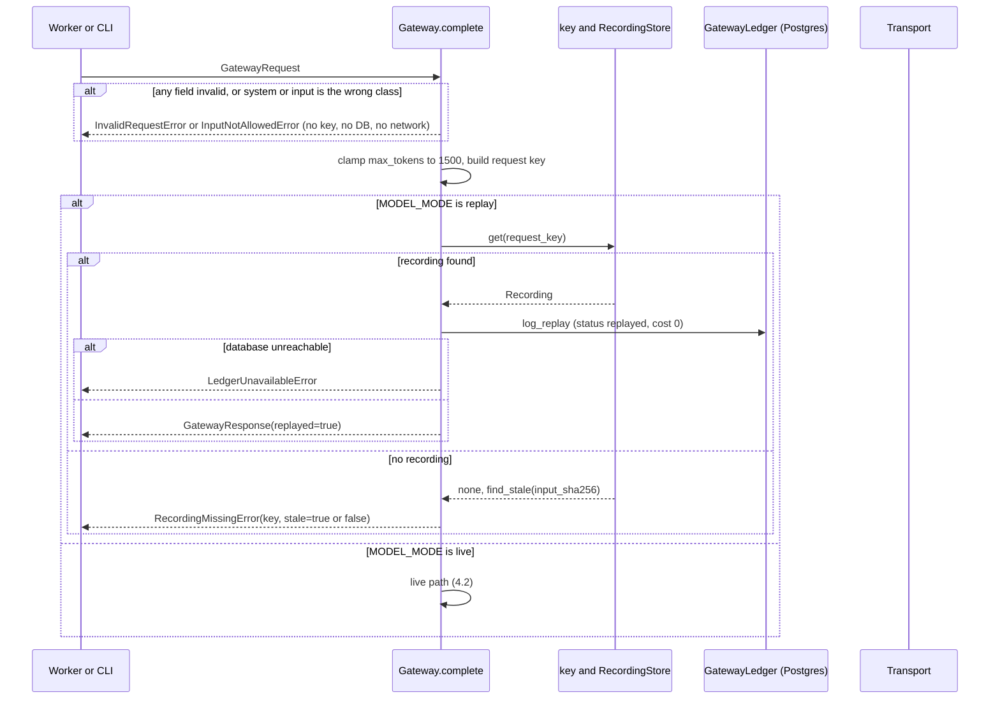
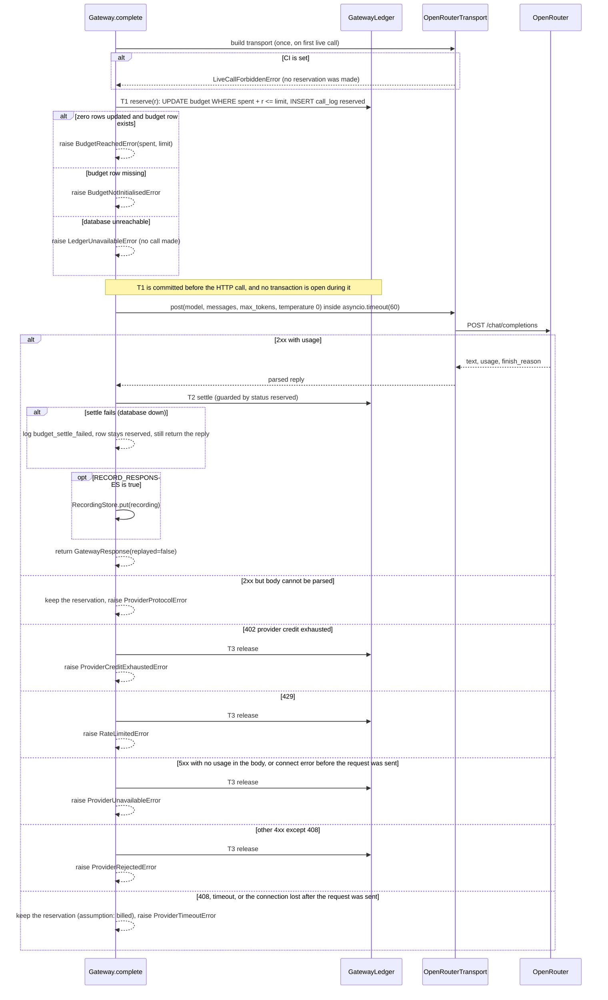
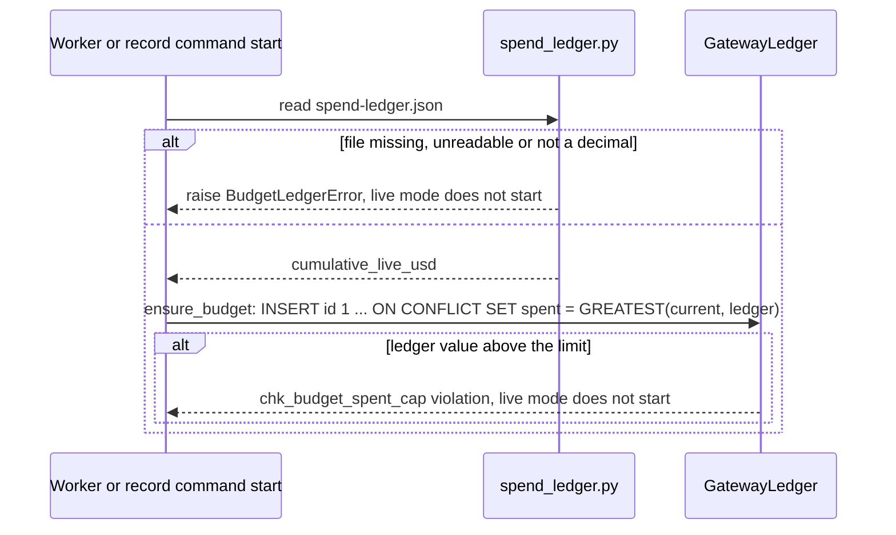
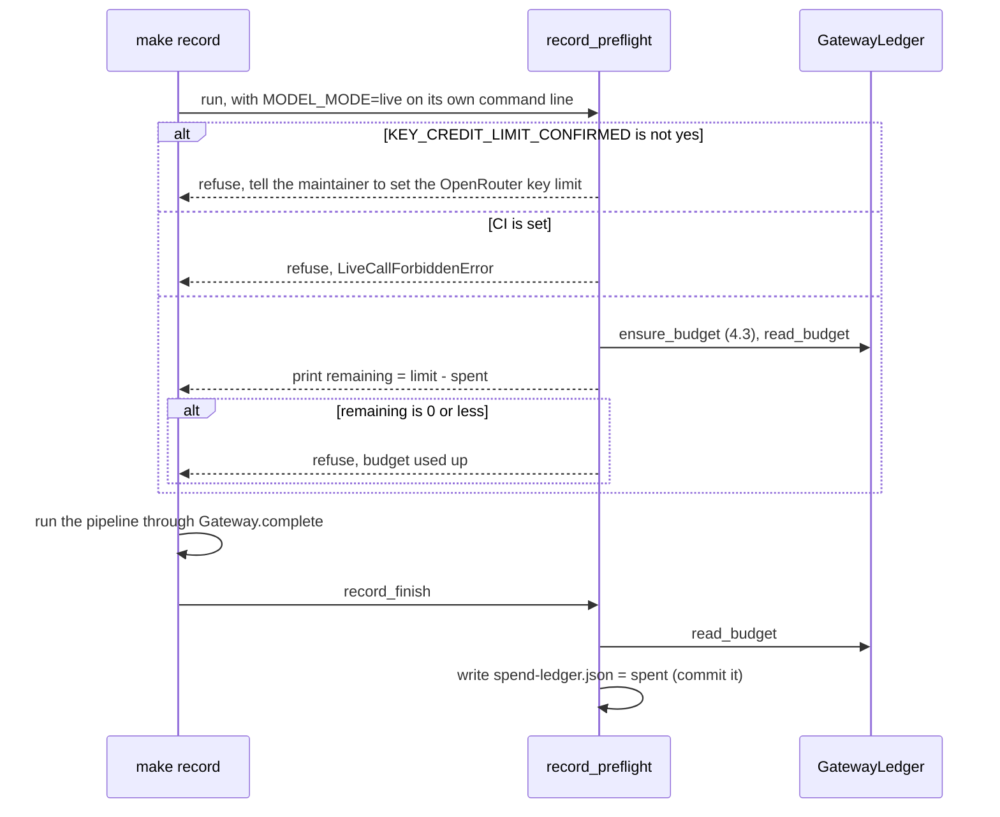

# Low Level Design: Model gateway

- Task: HK-1, HLD: docs/design/hirekit-hld.md (section 3, Gateway), ADRs: ADR-0001, ADR-0002, ADR-0004, docs/architecture/tenets.md (tenets 1, 2, 5, 8)
- Author: midhun.m (git), delivering entity: unattributed (no .bearing/company.json), 2026-09-30, status Draft, version v1
- Serves: US-02-001, US-02-002, US-02-003, US-00-005 (AC-US-00-005-3, AC-US-00-005-4), US-02-004 (AC-US-02-004-3); REQ-018, REQ-040 to REQ-048, REQ-059
- Acceptance criteria the tests cover: AC-US-02-001-1 to AC-US-02-001-6, AC-US-02-002-1 to AC-US-02-002-4, AC-US-02-003-1 to AC-US-02-003-5, AC-US-00-005-3, AC-US-00-005-4, AC-US-02-004-3

Nothing exists in `backend/` yet (green field). Every path below is `(new)` unless marked `(edit)`, which means a file the backend scaffold creates. Statements about the provider are prefixed "assumption:" and listed in section 10.

## 1. Scope

The gateway is the one Python package, `backend/app/gateway/`, through which every model call passes: it checks the input classes, clamps `max_tokens` to 1500, computes the replay key, replays a recording or makes a live OpenRouter call under a committed budget reservation, and logs every call. The budget policy (limit, prices, "may a model action start") lives in a small sibling package, `backend/app/budget/`, that the Api may import and the gateway also uses. The Worker's retry and reschedule logic, the prompts, the scoring schema, the anonymizer and the record and eval pipelines stay outside; they call `Gateway.complete` and receive typed results or typed errors.

## 2. Module layout

All under `backend/`. Line counts are estimates. No file is expected to pass 400 lines.

| Path | Owns | Lines |
| --- | --- | --- |
| `app/gateway/__init__.py` (new) | exports `Gateway`, `GatewayRequest`, `GatewayResponse` only | 15 |
| `app/gateway/text.py` (new) | `AnonymizedText`, `JobDescriptionText`, `PromptText` and the three `mint_*` functions | 90 |
| `app/gateway/types.py` (new) | `Purpose`, `GatewayRequest` (validating), `GatewayResponse`, `Recording`, `PURPOSE_INPUT`, and the `MAX_TOKENS_CAP` re-export | 110 |
| `app/gateway/errors.py` (new) | the `GatewayError` family, each with `retryable` | 120 |
| `app/gateway/key.py` (new) | text normalization, canonical JSON and `request_key` (SHA-256) | 60 |
| `app/gateway/recordings.py` (new) | `RecordingStore`: `get`, `put`, `find_stale` over `RECORDINGS_DIR/*.json` | 130 |
| `app/gateway/spend_ledger.py` (new) | read and write `recordings/spend-ledger.json` | 60 |
| `app/gateway/transport.py` (new) | `Transport` protocol and `OpenRouterTransport`, the only place that imports httpx or names the provider URL | 150 |
| `app/gateway/service.py` (new) | `Gateway.complete`, the single public entry: replay and live paths | 220 |
| `app/gateway/record.py` (new) | `record_preflight`, `record_finish` for the record command | 90 |
| `app/budget/__init__.py` (new) | exports the policy functions | 5 |
| `app/budget/policy.py` (new) | `BUDGET_LIMIT_USD`, `MAX_TOKENS_CAP`, `reserve_amount`, `actual_cost`, `model_actions_allowed`; pure, no gateway import | 80 |
| `app/db/repositories/gateway_ledger.py` (new) | all gateway SQL: `reserve`, `settle`, `release`, `log_replay`, `ensure_budget` | 150 |
| `app/db/repositories/budget.py` (new) | read-only `read_budget` for the Api and the gateway | 30 |
| `app/db/models.py` (edit) | add `Budget` and `CallLog` mapped classes matching `docs/design/schema.sql` | 60 |
| `app/core/config.py` (edit) | the gateway settings and their validators | 70 |
| `recordings/spend-ledger.json` (new) | committed cumulative live spend, starts at `0` | 3 |
| `.env.example` (new) | every variable in section 7 with a placeholder | 25 |
| `Makefile` (edit) | a `record` target that runs `record_preflight`, the pipeline entry, then `record_finish` | 15 |

Tests (new): `tests/gateway/test_text.py`, `test_request.py`, `test_errors.py`, `test_key.py`, `test_recordings.py`, `test_spend_ledger.py`, `test_policy.py`, `test_transport.py`, `test_service_replay.py`, `test_service_live.py`, `test_record.py`, `test_boundaries.py`, `conftest.py`, and `tests/integration/test_gateway_ledger.py` (Postgres).

Preconditions from other tasks, not items of this LLD: the `backend/` scaffold with `make check` green (ADR-0007), the Alembic revision built from `docs/design/schema.sql` (over 700 lines by itself, so its own `db-migration` task), and migration 2 (data-model section 7).

Rules that shape the layout: the gateway is the only package that imports httpx or names `openrouter.ai`. The repository owns SQL and the service owns transactions (python rules). Nothing under `app/api/` imports `app.gateway` (tenet 1); the Api reads budget state through `app.budget` and `db/repositories/budget.py`.

**Dependencies.** httpx, structlog and pydantic-settings are stack defaults (python skill) and are assumed by the scaffold. `import-linter` is new and is proposed here, not added (ground rule 7): if you decline it, the AST scans in `test_boundaries.py` already enforce every boundary in section 3 and are what `make check` runs.

## 3. Types and schemas

Validated once each, at the point named.

**The three text classes** (`text.py`). Real classes, each a frozen wrapper around one `str` (`__slots__ = ("value",)`, `@final`). The constructor raises unless given the module-private `_MINT` sentinel, so `AnonymizedText("raw")` fails at runtime. Only the `mint_*` functions supply it, and each is imported by one producer only:

| Class | Minted by | Holds |
| --- | --- | --- |
| `AnonymizedText` | `app.anonymizer` | the anonymizer's output for one resume |
| `JobDescriptionText` | `app.jobs.job_description` | a job description, and for `kit` the approved criteria; never candidate data (AC-US-00-013-4) |
| `PromptText` | `app.prompts` | a fixed prompt template with role criteria and rubric filled in; never resume text |

`PromptText` is added by this LLD: scoring needs the per-role criteria in the system prompt, and a plain `str` there would let a raw resume reach the model with every check passing (critic finding). It extends tenet 2 from two classes to three; the tenet and HLD step 1 are listed as downstream. The `isinstance` checks inside `Gateway.complete` are what count (tenet 2).

**`Purpose`**: `Literal["criteria", "scoring", "kit", "eval"]`, the four values of `call_log.purpose` (REQ-042). `PURPOSE_INPUT` fixes the class each purpose accepts, so a raw resume wrapped in the wrong class is refused too:

| Purpose | Accepted input class |
| --- | --- |
| `scoring`, `eval` | `AnonymizedText` |
| `criteria`, `kit` | `JobDescriptionText` |

`system` must be a `PromptText` for every purpose.

**`GatewayRequest`** (frozen dataclass, `types.py`). `__post_init__` validates every field and raises `InvalidRequestError` (not retryable), because `Literal` is not enforced at runtime:

| Field | Type | Rule |
| --- | --- | --- |
| `purpose` | `Purpose` | must be a key of `PURPOSE_INPUT` |
| `role_id` | `UUID or None` | goes to `call_log.role_id`; never part of the replay key (ids differ per database) |
| `prompt_version` | `str` | non-empty; part of the replay key |
| `system` | `PromptText` | class checked in `Gateway.complete` step 1 |
| `input` | `AnonymizedText or JobDescriptionText` | class must equal `PURPOSE_INPUT[purpose]`, checked in step 1 |
| `max_tokens` | `int` | at least 1; clamped to `MAX_TOKENS_CAP = 1500` |
| `schema_retry` | `int` | 0 or 1 (REQ-023) |

**`GatewayResponse`** (frozen dataclass): `text`, `input_tokens`, `output_tokens`, `finish_reason`, `request_key`, `replayed`, `cost_usd: Decimal`. `finish_reason == "length"` is passed through; the caller treats it as malformed (HLD section 7).

**`Recording`** (JSON file `RECORDINGS_DIR/<request_key>.json`, validated on read with a Pydantic model, `extra="forbid"`):

```json
{"key_version": 1, "request_key": "<64 hex>", "input_sha256": "<64 hex>", "model": "...",
 "prompt_version": "...", "schema_retry": 0, "purpose": "scoring",
 "response": {"text": "...", "input_tokens": 1234, "output_tokens": 321, "finish_reason": "stop"}}
```

**Request key** (`key.py`). Every text field is NFC-normalized and its newlines converted to `\n` before hashing, and the canonical JSON is UTF-8 with `sort_keys`, `separators=(",", ":")` and `ensure_ascii=False`, so a CRLF checkout or a different Unicode form of the same text gives the same key. The hashed object is `{key_version: 1, model, prompt_version, schema_retry, max_tokens (after clamping), temperature: 0, system, input}`. `input_sha256` is the SHA-256 of the normalized `input`, `purpose` and `schema_retry` only; it exists so a miss can say a recording for the same input exists under a different prompt, model or criteria (AC-US-02-003-3). The key excludes `role_id`, timestamps and any run-specific id.

**Constants in code, not configuration**: `MAX_TOKENS_CAP = 1500` and `BUDGET_LIMIT_USD = Decimal("8")`, both in `budget/policy.py` (`gateway/types.py` re-exports the cap, so the Api's `model_actions_allowed` and the gateway share one value; HLD section 12: changing it needs an ADR and a migration of `chk_budget_spent_cap`). SQL receives the limit as a bound parameter, so the literal 8 appears once in Python and once in the CHECK.

**Budget policy** (`budget/policy.py`, pure functions):

- `reserve_amount(max_tokens, chars, price_in, price_out)` = `max_tokens * price_out / 1e6 + ceil(chars / 3) * price_in / 1e6`, rounded up to 6 decimals, where `chars` counts `system` plus `input` (assumption: characters divided by 3 over-counts tokens).
- `actual_cost(input_tokens, output_tokens, price_in, price_out)`.
- `model_actions_allowed(mode, spent)`: `True` in replay mode (a missing budget row counts as spent 0); in live mode `spent + reserve_amount(1500, 30000, ...) <= BUDGET_LIMIT_USD`. The Api uses it to answer model actions with `409 budget_reached` only in live mode, so a replay-mode demo is never refused because of a maintainer's recorded spend, and near the cap the Api stops enqueuing jobs the gateway would refuse.

**Guards** (AST scans in `test_boundaries.py`; import-linter contracts if accepted): `app.api` may not import `app.gateway` (tenet 1); each `mint_*` is imported only by its producer; only `app.gateway.transport` imports `httpx`; no module outside `app/gateway/` contains `openrouter.ai` (AC-US-02-001-1).

## 4. Sequence

Every flow draws its error branches. Errors are named in section 6.

### 4.1 One call, either mode



In replay mode the transport is never constructed and the budget row is never touched (tenet 5, tenet 8, AC-US-02-003-1). `OpenRouterTransport.__init__` refuses when `CI` is set, so the CI guard lives where the client is built and a test can inject a fake `Transport` without disabling it (AC-US-02-003-4).

### 4.2 Live call: reserve, call, settle or release



Crash between T1 and T2: the row stays `reserved` at its full reservation, so spend is over-counted, never under-counted (HLD section 7). Only 2xx replies are recorded (decisions.md conflict 2). The transport failure mapping is one table, in section 6.

### 4.3 Start-up in live mode: seed the running total



Replay mode skips this flow: it never reads or writes the budget.

### 4.4 The record command



**How live mode is switched on.** `MODEL_MODE` is read from the process environment only, never from `.env` (the settings class does not list it as an env-file field), and `.env.example` does not contain it. `make record` runs `MODEL_MODE=live RECORD_RESPONSES=true RECORDINGS_DIR=<absolute path> python -m ...`, so a later `make test` or eval, which starts a fresh process, is in replay. Worker processes started by the record pipeline inherit the variables from that command; a Worker started under docker compose gets them only by explicit `environment:` entries, with `RECORDINGS_DIR` absolute. `tests/gateway/conftest.py` forces `MODEL_MODE=replay` and disables the env file.

## 5. Data access

Tables come from `docs/design/schema.sql`: `budget` (one row) and `call_log`. All SQL lives in `gateway_ledger.py` and `budget.py`, parameterised, columns named, no `SELECT *`. `:limit` is `BUDGET_LIMIT_USD`.

| # | Query | Shape | Index |
| --- | --- | --- | --- |
| Q1 | `UPDATE budget SET spent_usd = spent_usd + :r, updated_at = now() WHERE id = 1 AND spent_usd + :r <= :limit RETURNING spent_usd` | one row by key | `budget_pkey` |
| Q2 | `INSERT INTO call_log (role_id, purpose, status, model, request_key, schema_retry, cost_usd) VALUES (..., 'reserved', ..., :r) RETURNING id` | insert | none needed |
| Q3 | settle, first: `UPDATE call_log SET status = 'settled', input_tokens = :i, output_tokens = :o, cost_usd = :actual, updated_at = now() WHERE id = :id AND status = 'reserved' RETURNING <reserved cost read before the update>` | one row by key | `call_log_pkey` |
| Q4 | settle, second, only when Q3 returned a row: `UPDATE budget SET spent_usd = LEAST(:limit, GREATEST(0, spent_usd - :reserved + :actual)), updated_at = now() WHERE id = 1` | one row by key | `budget_pkey` |
| Q5 | release: the same two steps, the call_log update setting `status = 'released', cost_usd = 0` and the budget update `spent_usd = GREATEST(0, spent_usd - :reserved)`, again only when the call_log row matched | one row by key each | `call_log_pkey`, `budget_pkey` |
| Q6 | `INSERT INTO call_log (..., status 'replayed', cost_usd 0, input_tokens, output_tokens)` | insert | none needed |
| Q7 | `SELECT spent_usd FROM budget WHERE id = 1` (gateway and Api) | one row by key | `budget_pkey` |
| Q8 | `INSERT INTO budget (id, spent_usd) VALUES (1, :ledger) ON CONFLICT (id) DO UPDATE SET spent_usd = GREATEST(budget.spent_usd, EXCLUDED.spent_usd)` | upsert | `budget_pkey` |
| Q9 | cost log for `GET /v1/cost-log` (Api LLD, listed because it reads this table): `... ORDER BY created_at DESC, id DESC LIMIT :n` | keyset | `idx_call_log_created_at` |
| Q10 | `make doctor`: `SELECT count(*), sum(cost_usd) FROM call_log WHERE status = 'reserved'` | known full scan, 10^4 to 10^5 rows a year | none: a maintainer command, not a request path (data-model open concern 14) |

Queries: 10 (without index: 1, Q10, a known full scan).

The budget update in Q4 and Q5 runs only when the guarded `call_log` update matched a row and uses the reserved cost that row held, so a second settle, or a release after a settle, changes nothing (critic finding). Two tests cover both.

**Transactions**, opened and closed in `service.py` from an `async_sessionmaker` the Gateway is constructed with. The Gateway never receives the caller's session, so a reservation cannot end up inside the transaction that stores scores (tenet 8).

| # | Inside | Not inside, and why |
| --- | --- | --- |
| T1 reserve | Q1 then Q2 | the HTTP call: a transaction holds no lock across a network call, and the reservation must be committed before the call so a crash leaves a `reserved` row |
| T2 settle | Q3 then Q4 | the recording write and the caller's result write |
| T3 release | Q5 | same |
| T4 replay log | Q6 | the recording read |
| T5 ensure | Q8 | the ledger file read |

Lock order: a settle or release locks its own `call_log` row, then the `budget` row. T1 locks only `budget` and inserts a new `call_log` row that no one else can hold, so it never waits on a `call_log` lock and no cycle exists. T1 uses READ COMMITTED: after waiting for the row lock, Postgres re-evaluates `spent_usd + :r <= :limit` on the new row version, so concurrent reservations cannot overshoot, and `chk_budget_spent_cap` backs it up.

**Concurrency.** Up to 4 Worker processes plus the maintainer's commands call the gateway at once (HLD section 8). The gateway has no queue and takes no item, so nothing needs a claim; two callers are kept from double-spending by the atomic Q1 and by each call owning its own `call_log` row. The double-enqueue protection is in `jobs` (`uq_jobs_open_*`), owned by the Worker LLD. If a second `make record` runs beside a first, both reserve against the same row, which is safe.

**Migrations in order, as `db-migration` names them.** None new: this design uses `initial_schema` (1). Migration 2, `database_roles_and_grants`, creates `hirekit_api` and `hirekit_worker`; it must grant `hirekit_api` SELECT only on `budget` and `call_log`, and `hirekit_worker` INSERT and UPDATE on them. The record command and the evals connect as `hirekit_worker` (no third role is created).

## 6. Errors

All subclass `GatewayError(DomainError)`, created in the file shown, raised as is (never wrapped), and mapped once. `retryable` tells the Worker whether to reschedule with `run_after` backoff (HLD section 6) or fail the job at once.

| Error | Created in | Retryable | Mapped where and to what |
| --- | --- | --- | --- |
| `InvalidRequestError` | `types.py` | no | a programming error: the Worker fails the job with `last_error = invalid_request`, logged at error level with ids only |
| `InputNotAllowedError` | `service.py` step 1 | no | same, `last_error = input_not_allowed`. Never shown to a user. |
| `LiveCallForbiddenError` | `transport.py` (CI set) and `record.py` | no | fails the CI job or the record command |
| `BudgetReachedError(spent, limit)` | `service.py` after Q1 returns no row | no | the Worker fails the job with `last_error = budget_reached`. The Api does not call the gateway; it uses `model_actions_allowed` and answers with `409 budget_reached`, message "The model budget of $8.00 has been reached. No new model calls can be made." (AC-US-02-002-4), mapped in `app/core/errors.py` by the Api LLD. |
| `ProviderCreditExhaustedError` | `transport.py` (402) | no | treated like `BudgetReachedError` by the Worker (the provider-side key limit is the real backstop, HLD section 6); the reservation is released |
| `BudgetNotInitialisedError` | `service.py` | no | fails the job; the maintainer starts live mode through 4.3 |
| `BudgetLedgerError` | `spend_ledger.py` | no | live mode refuses to start |
| `LedgerUnavailableError` | `service.py` (database error at T1 or T4) | yes | reschedule; on the live path no call was made, so nothing was spent |
| `RecordingMissingError(key, found_key)` | `recordings.py` via `service.py` | no | the test or demo fails with "no recording for <key>" or, when `find_stale` matched the input, "a recording exists for the same input under a different prompt, model or criteria (<old key>); re-record" (AC-US-02-003-2, AC-US-02-003-3) |
| `RecordingCorruptError` | `recordings.py` | no | a recording file that cannot be parsed or does not match its own key fails the test or demo naming the file (added while building item 2) |
| `RateLimitedError` | `transport.py` | yes | reschedule |
| `ProviderUnavailableError` | `transport.py` | yes | reschedule; the Worker's failure text is "The model service is unavailable. Try again later" |
| `ProviderTimeoutError` | `transport.py` | yes | reschedule; the reservation stays |
| `ProviderRejectedError` | `transport.py` | no | fail the job; the reservation is released |
| `ProviderProtocolError` | `transport.py` | no | fail the job; the reservation stays, a person reconciles |

**Transport failure mapping**, one row per httpx outcome (`transport.py`), checked in this order:

| Outcome | Error | Reservation |
| --- | --- | --- |
| 2xx, body parses, has usage | none | settled |
| 2xx, body does not parse or has no usage | `ProviderProtocolError` | kept |
| 402 | `ProviderCreditExhaustedError` | released |
| 429 | `RateLimitedError` | released |
| 408 | `ProviderTimeoutError` | kept |
| other 4xx | `ProviderRejectedError` | released |
| 5xx whose body reports usage | `ProviderUnavailableError` | kept (billed) |
| 5xx with no usage in the body | `ProviderUnavailableError` | released |
| `httpx.ConnectError`, `ConnectTimeout` (request never sent) | `ProviderUnavailableError` | released |
| `ReadTimeout`, `WriteTimeout`, `ReadError`, `RemoteProtocolError`, or `asyncio.TimeoutError` from `asyncio.timeout(GATEWAY_TIMEOUT_SECONDS)` (request probably sent) | `ProviderTimeoutError` | kept |

Each error carries `billed`: true means the call may have been billed and the reservation stays, false means it is released; `Gateway.complete` reads it instead of matching classes. A 2xx body that fails validation is raised `from None`, because a pydantic error repeats the body in its repr and the body can echo the prompt; only the names of the bad fields are kept (found by a test while building item 4). The whole call, not each phase, is bounded by `asyncio.timeout(GATEWAY_TIMEOUT_SECONDS)`, so one call cannot outlast the 180 second lease (HLD section 8). The key and any resume text are never put in an error message or a log line; messages carry ids, the request key and counts (tenet 7, AC-US-02-001-5, AC-US-02-001-6).

## 7. Configuration

Read once in `app/core/config.py` (`pydantic-settings`, fails fast on a bad value). `.env.example` does not exist yet, so every variable is missing from it; item 1 of the work breakdown creates it. Count: 11 (missing from `.env.example`: 11). `MODEL_MODE` is documented there as a comment only, never as a value (section 4.4).

| Variable | Default | When missing |
| --- | --- | --- |
| `MODEL_MODE` | `replay` | the default applies; read from the process environment only, and `live` is set by `make record` on its command line |
| `CI` | unset | not CI. When set, the settings validator rejects `MODEL_MODE=live` at start-up and `OpenRouterTransport.__init__` refuses (AC-US-02-003-4) |
| `OPENROUTER_API_KEY` | none | required only when `MODEL_MODE=live`; start-up fails then. Held as `SecretStr`, read only inside `transport.py`. |
| `MODEL_ID` | `anthropic/claude-haiku-4.5` (assumption: the OpenRouter slug) | the default applies. The one value that names provider and model (AC-US-02-001-2). |
| `GATEWAY_TIMEOUT_SECONDS` | `60` (assumption, HLD section 6) | the default applies |
| `PRICE_INPUT_USD_PER_MTOK` | `1` (assumption, HLD section 8) | the default applies |
| `PRICE_OUTPUT_USD_PER_MTOK` | `5` (assumption, HLD section 8) | the default applies |
| `RECORDINGS_DIR` | `<repo>/backend/recordings` (resolved to an absolute path at start-up) | the default applies; the directory is created on the first `put` |
| `RECORD_RESPONSES` | `false` | responses are not written to disk; `make record` sets it to `true` |
| `KEY_CREDIT_LIMIT_CONFIRMED` | unset | read only by `record_preflight`; anything but `yes` refuses to record |
| `DATABASE_URL` | none | required; shared with the rest of the backend (the gateway's session factory uses it) |

## 8. Tests

`pytest` with `asyncio_mode = "auto"`, no network, no `time.sleep`. `tests/gateway/conftest.py` forces `MODEL_MODE=replay`, unsets `CI`-dependent behaviour by injecting a fake `Transport`, and disables the env file. Transport tests use `httpx.MockTransport`; tenet 5 forbids a hand-written response standing in for a recording, and this is the exception: those tests exercise `transport.py` itself and never a scoring or eval path. Every test except the integration ones uses an in-memory fake ledger, so `make check` (which runs `pytest -m "not integration"` only) proves the refusal order, the replay path, the reserve, settle and release arithmetic and every error mapping without Postgres.

**Integration tests** (`tests/integration/test_gateway_ledger.py`, run by `make test-integration` against a local Postgres). `make check` does not run them and no CI host exists yet (CLAUDE.md: no git host), so until one does, the properties that only Postgres can show are proven when someone runs that target: concurrent reservations never pass the limit, a crash leaves a `reserved` row, the ledger seeds the budget, and the budget row is untouched by replay. Section 9 item 3 says so in its description. The same properties have a unit-level twin against the fake ledger where a fake can carry them (the guard order and the arithmetic).

| Test | Kind | Proves |
| --- | --- | --- |
| `test_gateway_is_the_only_provider_caller` | unit (scans `app/`) | AC-US-02-001-1 |
| `test_only_transport_imports_httpx` | unit | AC-US-02-001-1 |
| `test_api_package_does_not_import_gateway` | unit (AST scan) | tenet 1 |
| `test_each_mint_function_has_one_importer` | unit (AST scan) | tenet 2 |
| `test_provider_and_model_come_from_one_setting` | unit | AC-US-02-001-2 |
| `test_max_tokens_above_cap_is_clamped_to_1500` | unit | AC-US-02-001-3 |
| `test_max_tokens_at_or_below_cap_passes_unchanged` | unit | AC-US-02-001-3 (the pair) |
| `test_request_sent_never_exceeds_1500_tokens` | unit (transport) | AC-US-02-001-3 |
| `test_invalid_request_fields_raise_invalid_request` | unit | schema_retry 2, max_tokens 0, bad purpose, empty prompt_version |
| `test_completed_call_logs_tokens_cost_purpose_role_through_ledger` | unit (fake ledger) | AC-US-02-001-4 |
| `test_completed_call_writes_one_log_row_with_tokens_cost_purpose_role` | integration | AC-US-02-001-4 |
| `test_replayed_call_writes_a_log_row_with_cost_zero` | integration | AC-US-02-001-4, AC-US-02-003-1 |
| `test_api_key_never_appears_in_logs_or_rows` | unit (captures structlog) | AC-US-02-001-5 |
| `test_no_resume_text_in_log_row_or_error_message` | unit | AC-US-02-001-6, AC-US-00-005-6 |
| `test_running_total_rises_by_call_cost` | unit (fake ledger) | AC-US-02-002-1 |
| `test_running_total_rises_by_call_cost_in_postgres` | integration | AC-US-02-002-1 |
| `test_reservation_that_fits_exactly_at_the_limit_succeeds` | unit (fake ledger) | AC-US-02-002-1 (the pair) |
| `test_call_refused_before_transport_when_reserve_would_pass_the_limit` | unit (fake ledger, transport asserts not called) | AC-US-02-002-2 |
| `test_budget_reached_carries_total_and_limit` | unit | AC-US-02-002-3 |
| `test_model_actions_allowed_true_in_replay_even_at_7_99_spent` | unit | AC-US-02-002-4, HLD section 16 |
| `test_model_actions_allowed_false_in_live_when_a_reservation_no_longer_fits` | unit | AC-US-02-002-4 |
| `test_missing_budget_row_counts_as_zero_spent_in_replay` | unit | HLD section 16 |
| `test_api_answers_409_with_budget_message_when_reached` | integration (Api LLD) | AC-US-02-002-4 |
| `test_concurrent_reservations_never_pass_the_limit` | integration (20 tasks, one row) | AC-US-02-002-2, tenet 8 |
| `test_5xx_without_usage_releases_reservation` | unit (fake ledger) | tenet 8, HLD section 3 |
| `test_5xx_with_usage_keeps_reservation` | unit (fake ledger) | HLD section 3 |
| `test_429_releases_reservation_and_raises_rate_limited` | unit (fake ledger) | HLD section 6 |
| `test_402_releases_reservation_and_raises_credit_exhausted` | unit (fake ledger) | HLD section 6 |
| `test_read_timeout_keeps_reservation` | unit (fake ledger) | HLD section 7 |
| `test_lost_connection_after_send_keeps_reservation` | unit (fake ledger) | HLD section 3 |
| `test_connect_error_releases_reservation` | unit (fake ledger) | HLD section 3 |
| `test_unparseable_2xx_keeps_reservation` | unit (fake ledger) | HLD section 3 |
| `test_whole_call_is_bounded_by_the_timeout_not_each_phase` | unit | HLD section 8 (lease) |
| `test_settle_above_reservation_is_clamped_to_the_limit` | unit (fake ledger) | data-model budget note |
| `test_second_settle_changes_nothing` | unit (fake ledger) | critic finding |
| `test_release_after_settle_changes_nothing` | unit (fake ledger) | critic finding |
| `test_settle_failure_still_returns_reply_and_leaves_row_reserved` | unit | HLD section 7 |
| `test_crash_after_reserve_leaves_reserved_row` | integration | HLD section 7 |
| `test_replay_returns_recording_with_no_network_call` | unit | AC-US-02-003-1 |
| `test_replay_never_constructs_the_transport` | unit | AC-US-02-003-1, tenet 5 |
| `test_replay_never_calls_reserve_settle_or_release_on_the_ledger` | unit (fake ledger) | AC-US-02-003-1, HLD section 16 |
| `test_ten_replay_passes_never_raise_budget_reached_in_postgres` | integration | HLD section 16 falsifier |
| `test_replay_log_failure_raises_ledger_unavailable` | unit (fake ledger) | 4.1 error branch |
| `test_missing_recording_fails_naming_the_key` | unit | AC-US-02-003-2 |
| `test_missing_recording_never_falls_back_to_a_live_call` | unit | AC-US-02-003-2 |
| `test_changed_prompt_reports_a_recording_for_the_same_input` | unit | AC-US-02-003-3 |
| `test_ci_rejects_live_mode_at_startup` | unit | AC-US-02-003-4 |
| `test_ci_blocks_transport_construction_even_if_mode_is_live` | unit | AC-US-02-003-4 |
| `test_mode_is_not_read_from_the_env_file` | unit | HLD section 12, critic finding |
| `test_record_preflight_prints_remaining_budget` | unit | AC-US-02-003-5 |
| `test_record_preflight_refuses_when_budget_used_up` | unit | AC-US-02-003-5 |
| `test_record_preflight_refuses_without_credit_limit_confirmation` | unit | AC-US-02-003-5, HLD section 6 |
| `test_record_finish_writes_ledger_to_spent_total` | unit | HLD section 3 |
| `test_ledger_seeds_budget_with_greatest_of_db_and_file` | integration | REQ-043, HLD section 3 |
| `test_recreated_database_cannot_reset_the_cap` | integration | REQ-043 |
| `test_missing_ledger_file_refuses_live_start` | unit | HLD section 3 |
| `test_same_request_gives_same_key_on_any_role_id` | unit | AC-US-02-003-1 |
| `test_key_changes_with_prompt_version_model_and_schema_retry` | unit | decisions.md conflict 2 |
| `test_crlf_and_lf_fixtures_give_the_same_key` | unit | replay on any machine |
| `test_schema_retry_one_has_its_own_recording` | unit | REQ-023, decisions.md conflict 2 |
| `test_schema_retry_above_one_is_rejected` | unit | REQ-023 (the limit pair) |
| `test_raw_text_passed_as_string_is_refused` | unit | AC-US-00-005-3 |
| `test_raw_text_wrapped_in_job_description_class_is_refused_for_scoring` | unit | AC-US-00-005-4, tenet 2 |
| `test_raw_text_in_the_system_field_is_refused` | unit | AC-US-00-005-3, tenet 2 |
| `test_text_classes_cannot_be_built_without_the_mint_sentinel` | unit | AC-US-00-005-3, tenet 2 |
| `test_input_check_runs_before_any_key_database_or_network_work` | unit | AC-US-00-005-3 |
| `test_gateway_test_files_cover_cutoff_cap_logging_replay_and_refusal` | meta (asserts the gateway-owned test names above exist) | AC-US-02-004-3 |

Every retry, fallback or limit rule has both sides: the token cap (above and at the cap), the budget cap (fits exactly, then refused), the schema-retry index (1 recorded, 2 rejected), and each provider failure (released or kept). The gateway itself makes no transport retry: the Worker reschedules (HLD section 6), so no "429 then 200" test lives here; the Worker LLD owns it. The meta test names only gateway-owned tests; the Api's 409 test is listed for traceability and owned by the Api LLD.

Tests named: 67.

## 9. Work breakdown

Each item is one MR and leaves `make check` green (unit tests only, see section 8). Every type, function and table an item uses is defined by the same item or an earlier one.

1. **Types, errors, text classes, settings, `.env.example`.** Files: `app/gateway/__init__.py`, `text.py`, `types.py`, `errors.py`, `app/core/config.py` (edit), `.env.example`, `tests/gateway/conftest.py`, `test_text.py`, `test_request.py`, `test_errors.py`. Tests: mint and refusal, request validation, error `retryable` flags, CI rejects live at start-up, mode not read from the env file. About 380 lines.
2. **Request key, recording store, spend ledger file.** Files: `key.py`, `recordings.py`, `spend_ledger.py`, `recordings/spend-ledger.json`, `tests/gateway/test_key.py`, `test_recordings.py`, `test_spend_ledger.py`. Tests: key stability (CRLF, role id) and sensitivity, stale detection, missing and corrupt ledger. About 380 lines.
3. **Budget policy, models, ledger repository.** Files: `app/budget/__init__.py`, `app/budget/policy.py`, `app/db/models.py` (edit: `Budget`, `CallLog`), `app/db/repositories/gateway_ledger.py`, `app/db/repositories/budget.py`, `tests/gateway/test_policy.py`, `tests/integration/test_gateway_ledger.py`. The integration tests run under `make test-integration` and need the initial-schema revision; `make check` runs only `test_policy.py` for this item. About 390 lines.
4. **Transport.** Files: `transport.py`, `tests/gateway/test_transport.py`. Tests: every row of the failure mapping, whole-call timeout, key not logged, request never above 1500 tokens, CI refusal at construction. About 300 lines.
5. **`Gateway.complete`, input checks and the replay path.** Files: `service.py` (replay branch, live branch raises `NotImplementedError` until item 6), `tests/gateway/test_service_replay.py`. Tests: refusal order, replay, missing and stale recording, ledger failure, replay never reserves. About 300 lines.
6. **`Gateway.complete`, live path.** Files: `service.py` (edit), `tests/gateway/test_service_live.py` with the in-memory fake ledger. Tests: reserve, settle, release, keep on timeout, budget reached before the transport, settle failure, double settle, recording write. About 380 lines.
7. **Record preflight, finish and the `make record` target.** Files: `record.py`, `Makefile` (edit: `record`), `tests/gateway/test_record.py`. Tests: the three refusals, the printed remaining budget, the ledger write. The target runs preflight and finish around a pipeline entry the engine LLD supplies; until then it runs the two calls only. About 220 lines.
8. **Boundary guards.** Files: `tests/gateway/test_boundaries.py` (AST scans of `app/`), and `pyproject.toml` (edit) only if you accept import-linter. Tests: the four guards and the meta test. About 150 lines.

Items: 8 (largest about 390 lines, over 400: 0). The Api's `409 budget_reached` mapping and the Worker's use of `retryable` belong to their own LLDs.

## 10. Assumptions

- assumption: OpenRouter's slug for the model is `anthropic/claude-haiku-4.5` and the chat-completions reply carries `usage` with input and output token counts. Confirm with one live call (about USD 0.01). Owner: midhun.
- assumption: prices of USD 1 and USD 5 per million tokens and a 60 second whole-call timeout (HLD section 17). Cost is computed from tokens and these settings, not from a provider-reported cost.
- assumption: a timeout, or a connection lost after the request was sent, means the call was billed; a connect error, a 429 and a 5xx with no usage in the body mean it was not. Falsify with one live call using a 1 ms read timeout and one with an invalid model slug, then read the OpenRouter activity page (about USD 0.01). Owner: midhun.
- assumption: reserving the maximum before each call makes the effective cap "the limit minus one reservation" (about USD 0.01 to 0.02 unusable). "Once the total passes USD 8" (REQ-043) is read as "never let it pass". `model_actions_allowed` uses a 30,000 character worst-case input (about one long resume) for the live check; a longer input is refused by the gateway, not the Api.
- assumption: a recording made on one machine replays on another. Falsify by hashing the extracted text of the 40 eval resumes in a checkout with `core.autocrlf=true` and with another PDF extractor version, then diffing the keys. The anonymizer LLD must pin the extractor version and produce deterministic output. Owner: midhun.
- assumption: prompt builders put no ids, timestamps or other run-specific values into `system` or `input`. A test in the prompt module's LLD should enforce it.
- assumption: `mint_*` can only be guarded by AST scans and review, because Python cannot stop a determined caller from importing one. The runtime `isinstance` check stops accidents, not sabotage.
- assumption: the Api's budget display in replay mode shows "replay mode, no spend" and treats a missing row as 0; the text and the `GET /v1/cost-log` shape belong to the Api LLD.
- assumption: nothing but `make record` writes `spend-ledger.json`. Spend from a future budget-guarded live button in the demo would not reach the file unless it calls `record_finish`. Decide with the demo LLD.
- assumption: no real resume is ever recorded. Recordings hold model output that quotes resume text and are committed, and git history keeps them; the first build is synthetic only (HLD section 9). No removal path is designed.
- assumption: stale recordings are deleted by hand with `git rm`, and `find_stale` scanning the directory on each miss is fine for a few hundred files.
- Not designed here: who reconciles `reserved` rows left by timeouts, protocol errors and crashes, and with what command. `make doctor` counts them (Q10); a `make reconcile` is left to the Worker or maintainer LLD (data-model open concern 14).
- Downstream that goes stale: `docs/architecture/tenets.md` tenet 2 and HLD section 3 step 1 (two classes become three: add `PromptText`, and add the per-purpose input rule), HLD section 3 ("one function" becomes the single public method `Gateway.complete`), `docs/design/data-model.md` (the budget note said the overshoot is recorded on the `call_log` row; corrected in this session), `docs/product/backlog.md` (US-02-003 acceptance criteria still describe the hash as the request only, per decisions.md conflict 2), and the missing prompt-module, Api and Worker LLDs.

**Critic review (2026-09-30).** Findings: MAJOR 4, MINOR 6, NIT 1, all folded into this version (integration tests named as manual until a CI host exists and unit twins added; CI guard moved into the transport and mode read from the process environment only; `PromptText` added for the system prompt; `model_actions_allowed` for the Api). Its three weakest claims are the replay-mode budget claim (now `model_actions_allowed`), the billed-on-timeout assumption and the cross-machine replay assumption above, each with its falsifier. Verdict: approve after fixing the four MAJORs, which this version does; not re-reviewed.
