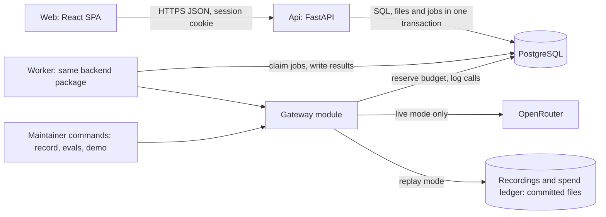

# High Level Design: HireKit

- Task: HK-1
- Author, date: unattributed (no .bearing/company.json), 2026-09-30
- Status: Draft
- PRD: PRD.md
- ADRs: docs/architecture/decisions.md
- Tenets: docs/architecture/tenets.md

Serves: REQ-001 to REQ-062 (docs/product/coverage.md), US-00-001 to US-00-016, US-02-001 to US-02-007, ADR-0001 to ADR-0008.

Green field: no code exists yet. Statements about how the system behaves are design intent sourced to a REQ, a story or an ADR. Statements about the outside world (prices, latencies, provider limits) are prefixed "assumption:" and listed in section 17.

## Summary

One FastAPI service, one background worker built from the same backend code, a React single-page app and one PostgreSQL database that also holds the job queue and the uploaded files serve recruiters and interviewers from a single repository. Every model call goes through one gateway that accepts only anonymized or job-description text, commits a cost reservation before each live call, caps tokens and stops at USD 8; tests, CI and the demo replay recordings at no cost, so no live call happens outside a manual, budget-checked recording step. There is no broker, cache, search index or analytics store.

Diagram: docs/architecture/diagrams/HireKit_SystemArchitecture_v1.svg (not drawn yet: run architecture-diagram)

## What gets built

| Component | Kind | Stack | Responsibility | Repository |
| --- | --- | --- | --- | --- |
| Web | frontend | React, TypeScript, Vite, generated OpenAPI client | recruiter and interviewer screens: roles, upload, ranked list, candidate detail, kit, feedback, comparison, cost log | HireKitApp |
| Api | backend | Python 3.14, FastAPI, Pydantic v2, async SQLAlchemy, Alembic | REST API, sessions and roles, criteria, overrides, stages, kit editing, feedback, comparison, upload, job enqueue and job status | HireKitApp |
| Worker | worker | same backend package as the Api | claims jobs; text extraction, anonymization, scoring, quote verification, criteria proposal, kit generation | HireKitApp |
| Gateway | backend | Python module in backend/, httpx | the only path to the model: class check, token cap, budget reservation, call log, replay | HireKitApp |
| Database | data | PostgreSQL | system of record, job queue, uploaded files until extracted, call log and audit history | none (started from the repository's docker compose) |

## 1. Goal and non-goals

HireKit lets a recruiter turn a job description into approved criteria, upload resumes in bulk, and review a ranked list in which the model only ever sees anonymized text and every score carries a quote that code has verified against the resume. Recruiters override scores with a note, move candidates through stages and are the only role that can reject; interviewers score against a generated kit and everyone compares candidates side by side. All model use passes one gateway that caps tokens, logs cost, stops at USD 8 and replays recordings in tests and CI, so the whole pipeline can also run as a demo from recordings.

Non-goals:

- Job board posting, calendar scheduling and retention automation (PRD section 2.2).
- The per-role data-retention setting: a stretch goal, out of the first build (Q-012).
- Single sign-on or a hosted identity provider: two seeded roles use own sessions (ADR-0005).
- A hosted deployment holding real candidate data: the first build runs locally (Q-006).
- Product analytics and an analytics store: the PRD asks for none.
- Any automatic rejection, hiding or re-staging of candidates, and any cutoff score.
- A claim of fairness beyond the named identity signals: proxies such as schools, clubs or career gaps can remain.
- Per-candidate personalised interview kits (REQ-035) and any mobile app.

## 2. Users and flows

Actors: the recruiter and the interviewer use the Web; the maintainer runs commands (seed, record, evals, demo).

**Flow 1: recruiter, from job description to ranked list**

1. The recruiter signs in (Web to Api, session cookie) and creates a role with a title and job description (US-00-001).
2. The Api enqueues a `propose_criteria` job; the Worker calls the Gateway once; the Web polls the job and shows the proposal. The recruiter can cancel the job.
3. The recruiter edits the criteria and approves; the role becomes Approved (US-00-002).
4. The recruiter uploads PDF and DOCX files. In one transaction the Api writes each file into `resume_file` (ADR-0008), a candidate row with status `queued`, and one `process_resume` job carrying ids and the role's `criteria_version` (US-00-003).
5. A Worker extracts the text and deletes the file row on success (it stays on failure so retry works), stores raw and anonymized text apart, then scores the resume in one Gateway call and verifies each quote (US-00-004 to US-00-007).
6. The Web shows the ranked list with IDs, weighted totals, must-have coverage and flags (US-00-008, US-00-009). The recruiter overrides a score with a note or moves a stage (US-00-010, US-00-011), or reveals a candidate's name, which is audited.

**Flow 2: interviewer**

1. The interviewer signs in and sees the kit and only the candidates assigned to them (US-00-012, US-00-016).
2. They score each criterion and comment, then submit; the form locks (US-00-014). Before submitting they see no model scores.
3. They open the comparison view; for candidates they have not submitted on, resume scores and overrides are hidden. They never see quotes or resume text (US-00-015, conflict 4, Q-003).

**Flow 3: maintainer, record, replay and evals**

1. The maintainer runs the seed command (US-02-007), then the record command. It requires a per-key credit limit to have been set on the provider key, prints the remaining budget, and makes live calls through the Gateway (US-02-003).
2. CI and the demo run in replay mode: each request is looked up by a hash of the request, model id, prompt version and schema-retry index; a missing recording fails the run. Replay costs nothing and does not touch the budget.
3. The two evals run from recordings and print their reports (US-02-005, US-02-006); name-swap pairs pass through the same extraction, anonymization and scoring code as any resume, called directly by the eval command.

Late arrivals: a resume scored after the recruiter edits criteria, including edit and re-approve, is not written as fresh. The Worker compares the job's `criteria_version` with the role's inside the transaction that writes the scores and, if they differ, discards the result and marks the job `stale` (REQ-005, REQ-006).

## 3. Architecture

**Web** (owner: the project team, assumption: one maintainer). Talks only to the Api over HTTPS with a session cookie; its types are generated from the Api's OpenAPI document (ADR-0006). As an interviewer it never receives resume text, raw or anonymized, or evidence quotes.

**Api** (same owner). Serves REST, enforces the role on every route, writes uploads and enqueues jobs in one transaction, and reports job status. It never imports the Gateway (tenet 1). Extraction and anonymization run in the Worker so an upload returns immediately.

**Worker** (same owner). N processes claim jobs from the `jobs` table with a row lock that skips locked rows, hold a lease with a lease token, and write results only while the lease token still matches. In the running system it is the only process that calls the Gateway (the maintainer's record and eval commands are the other callers). Job types: `process_resume`, `propose_criteria`, `generate_kit`, `regenerate_question`, `rescore`.

**Gateway** (same owner). One public method, `Gateway.complete`, in this order:

1. Check that `system` is a `PromptText` and that `input` is the class its purpose requires, `AnonymizedText` for scoring and eval, `JobDescriptionText` for criteria and kit (three real classes, tenet 2; docs/design/gateway-lld.md section 3).
2. Clamp `max_tokens` to 1500.
3. Compute the request key from the request, model id, prompt version and schema-retry index (0 or 1).
4. Replay mode: look up the recording, write a `call_log` row with `replayed=true` and cost 0, and return it. No budget change. A missing recording raises.
5. Live mode: in its own transaction, commit one atomic update to the running total for the reserved maximum cost (clamped output tokens at the output price plus a conservative input estimate of the text length divided by 3, assumption) and a `call_log` row with status `reserved`; then call OpenRouter; then settle the row to the actual cost and release the difference. A 4xx or 5xx that reports no usage releases the reservation; a timeout keeps it (assumption: billed) until a person reconciles it.

It never logs keys or text. The running total is seeded from a committed spend ledger (`backend/recordings/spend-ledger.json`, the cumulative live spend, updated after each live run), never from zero, so a recreated database cannot reset the cap (REQ-043).

**Database** (same owner). PostgreSQL holds domain data, the job queue, uploaded files until extracted, the call log and audit history. The store choice is ADR-0001; the queue is ADR-0004; file storage is ADR-0008.

**Risks this leaves open**

- The Worker and Api share a code base, so a careless import from the Api into the Gateway is possible; tenet 1 and an import-linter rule are the only guard.
- One Postgres serves the API and the queue; a long report query could delay job claims.
- A stale recording is easy to commit; the key includes the prompt version and model id, so a change fails loudly only if the version is bumped when the prompt changes.
- The spend ledger is a committed file updated by a command; a maintainer who forgets to commit it lets a second clone start from a lower total. The provider-side key credit limit is the real backstop.

## 4. Data

Owner of all entities: the Api and Worker (one database, ADR-0001). Full model: docs/design/data-model.md, with schema.sql, data-dictionary.csv and erd.md (18 tables); the initial Alembic revision is built from schema.sql.

| Entity | Notes | PII |
| --- | --- | --- |
| user, session | seeded recruiter and interviewers, password hash (ADR-0005) | yes: names, credentials |
| role | title, description, status, `criteria_version` (integer, incremented on every criteria edit) | no |
| criterion, rubric level | criteria approval state (REQ-005) | no |
| candidate | per uploaded file, stage, content hash (REQ-010), `identity_name` (the name the anonymizer found, recruiter only) | yes |
| resume_file | uploaded bytes (bytea); written with the candidate and job, deleted after extraction succeeds, kept after a failure (ADR-0008) | yes |
| resume_text | raw text (recruiters only) and anonymized text in separate columns (REQ-009) | yes: raw text |
| score | per candidate, criterion and criteria version (the scoring run): model value, quote (stored only after code verified it, tenet 3), flag reason, status (scored, no evidence, failed), override value, note and author; stale when its version is below the role's, so there is no stale flag | derived from resume |
| audit_event | overrides, stage moves, identity reveals and approved feedback edits, with user and time (REQ-030) | user ids |
| assignment | interviewer to candidate (Q-004) | user and candidate ids |
| interview_kit, question | per role; the kit records the criteria version it was generated against and is stale when that is below the role's (Q-005); questions generated per criterion (REQ-035) | no |
| feedback | per interviewer, candidate, criterion, with a locked flag (REQ-036, REQ-037) | user and candidate ids |
| call_log, budget | one row per call with status (reserved, settled, replayed); a single running-total row | no |
| job | queue row: type, status, role, candidate or question id, `criteria_version` (ids and one integer, no payload column), attempt, deadline, `lease_token`, lease expiry, `run_after` | ids only |

Retention: no deletion job in the first build (Q-012); the database is local and seeded with synthetic data. Only the file name and content hash remain after extraction; the bytes are deleted with the `resume_file` row.

Growth (assumption: at most 100 resumes a day at the peak): candidates 100 rows a day; scores about 800 rows a day (eight criteria); call_log about 150 rows a day; audit_event under 300 a day; job about 150 rows a day plus retries, about 4,500 rows a month, which the claim query handles with an index on status and `run_after`. No cleanup job is built until a hosted deployment exists.

Migrations implied: an initial schema, then one migration per entity group, each with a tested down step (`migrate-verify`).

**Risks this leaves open**

- Raw resume text and, until extraction succeeds, original files sit in the same database as everything else; a backup copies personal data.
- The data model does not exist yet, so the entity list may miss columns the LLDs need.
- A file that fails extraction stays in the database until a person retries or deletes it.

## 5. Interfaces

Contract: the Api's OpenAPI 3.1 document, generated from FastAPI and committed at backend/api/openapi.yaml (not written yet). All new. Action routes use a `:verb` suffix.

- Auth: `POST /v1/auth/login`, `POST /v1/auth/logout`.
- Roles and criteria: `POST /v1/roles`, `GET /v1/roles`, `GET /v1/roles/{id}`, `POST /v1/roles/{id}/criteria:propose` (returns a job id), `PUT /v1/roles/{id}/criteria`, `POST /v1/roles/{id}/approve`.
- Resumes and candidates: `POST /v1/roles/{id}/resumes` (multipart), `GET /v1/roles/{id}/candidates`, `GET /v1/roles/{id}/queue` (per-file job status for the whole role), `GET /v1/candidates/{id}`, `POST /v1/candidates/{id}:retry`, `POST /v1/roles/{id}:rescore`.
- Decisions: `PUT /v1/candidates/{id}/scores/{criterion}/override`, `POST /v1/candidates/{id}/stage`, `POST /v1/candidates/{id}:reveal-identity` (audited), `POST /v1/candidates/{id}/assignments`, `DELETE /v1/candidates/{id}/assignments/{user}`.
- Kit and feedback: `POST /v1/roles/{id}/kit:generate`, `GET /v1/roles/{id}/kit`, `PUT /v1/kit/questions/{id}`, `POST /v1/kit/questions/{id}:regenerate`, `POST /v1/candidates/{id}/feedback`, `GET /v1/candidates/{id}/feedback`, `POST /v1/candidates/{id}/feedback/{interviewer}:approve-edit`, `GET /v1/compare?ids=`.
- Jobs and cost: `GET /v1/jobs/{id}`, `POST /v1/jobs/{id}:cancel`, `GET /v1/cost-log` (recruiter only).
- Internal, not HTTP: `Gateway.complete` (docs/design/gateway-lld.md, written and built) and the job columns (ids only, docs/design/data-model.md); the Worker's handlers are designed in docs/design/worker-lld.md.

There are no events and no messages outside the `jobs` table.

## 6. External integrations

**OpenRouter, model `claude-haiku-4-5`** (REQ-040). Used for criteria proposal, resume scoring and kit generation, only through the Gateway.

- Down or 5xx: the Worker does not sleep and retry inside the job. It ends the attempt, releases the reservation, and reschedules the job with `run_after` backoff (30 seconds, 2 minutes, 8 minutes; assumption: the numbers), for at most 3 attempts inside a 30 minute deadline; then the job is `failed`. The user sees "The model service is unavailable. Try again later" on the affected rows and a retry action; nothing is rejected.
- Slow: each call has a 60 second timeout (assumption); a timeout ends the attempt and keeps its reservation.
- Rate limited (429): treated like 5xx; the dispatch rate stays capped by the number of workers, so a backlog cannot arrive all at once on recovery.
- Credential leak: `OPENROUTER_API_KEY` lives in the environment (`.env`, git-ignored, read-denied to the agent), rotated by the maintainer in the OpenRouter dashboard. The key carries a provider-side credit limit of at most USD 8, and `make record` refuses to run until the maintainer confirms it (assumption: OpenRouter supports a per-key credit limit; if not, the cap is only as strong as the ledger).
- No fallback provider exists. When the budget is reached the Gateway raises a typed error and the UI shows "The model budget of $8.00 has been reached" (REQ-044).

### Deliberately not integrated

- Identity provider: two seeded roles do not justify one (ADR-0005).
- Email, SMS or push: no notification requirement in the PRD.
- Analytics SDK and error-tracking SaaS: they would send resume-adjacent data off the machine (REQ-049).
- Job boards and applicant tracking systems: PRD non-goal.
- Calendar: PRD non-goal.
- Object storage: uploaded files sit in Postgres until extracted (ADR-0008).

**Risks this leaves open**

- One provider, one model, no fallback: an OpenRouter outage stops scoring, kit and criteria.
- assumption: OpenRouter's per-key credit limit exists as described; the maintainer's confirmation at `make record` cannot be verified by code.
- Recorded responses hide provider behaviour changes; the manual re-record step is the only detector.

## 7. Failure modes

| Component | What fails | How it is noticed | What the user sees | Recovery |
| --- | --- | --- | --- | --- |
| Web | API unreachable or session expired | request error, 401 | "Cannot reach the server" banner, or sign-in page | retry; sign in again |
| Api | Database down | readiness check fails, 5xx | "Something went wrong, try again" with a request id | restart the database; the Api reconnects |
| Api | forbidden action by an interviewer | 403 in the request log | "You do not have access to this" | none needed; the service refused |
| Worker | crash mid-job | lease expires (180 s), job re-claimed | file stays `processing` a little longer | at-least-once; every result write is conditional on `lease_token`, so a slow original cannot overwrite the re-claimer; scores are upserted by candidate, criterion and run |
| Worker | crash after the model call, before the result write | a `reserved` call_log row with no result | the file re-runs | the row keeps its full reservation until reconciled: spend is over-counted, never under-counted; the re-run pays again (about USD 0.005, assumption) |
| Worker | criteria edited or re-approved after enqueue | `criteria_version` differs at write time | "Criteria changed, re-run scoring" banner | job marked `stale`; recruiter re-runs on request (REQ-006) |
| Worker | poison job (fails every attempt) | job status `failed`, dead-letter count | file marked failed with a plain reason and retry | dead-lettered after 3 attempts; a person retries |
| Gateway | provider 5xx, timeout or 429 | `call_log` outcome | failed rows, retry action | job rescheduled with `run_after` backoff inside the 30 minute deadline |
| Gateway | malformed model output | schema parse error | none on the first failure | one schema retry (index 1, REQ-023); then the criterion is `failed`, never guessed |
| Gateway | output cut off at 1500 tokens | provider `finish_reason` is length | counts as malformed | kit is generated per criterion to stay under the cap |
| Gateway | budget reached | typed BudgetReached | budget message, model actions disabled | none: the limit is fixed at 8 in code; changing it needs a new decision (ADR) |
| Gateway | replay recording missing | test or demo fails naming the key | the test fails | record deliberately (manual, budget-checked) |
| Database | disk full, corrupt or recreated volume | writes fail, 5xx | errors | re-seed (assumption: data is synthetic); the budget total is re-read from the committed ledger, not reset to zero |

Check then act: the Worker takes `SELECT ... FOR SHARE` on the role row in the transaction that writes scores, and writes only if `criteria_version` still equals the job's and the status is Approved. The stage endpoint reads the caller's role in the same transaction that writes the stage. A job payload holds ids and one integer version, never a snapshot of state.

## 8. Scaling and limits

Numbers below marked assumption are unmeasured; nothing exists to measure yet.

- Load: batches of up to 100 resumes (REQ-050); 40 seeded resumes; at most 5 concurrent users (assumption).
- Calls: one Gateway call per resume returns every criterion's score and quote (about 8 criteria at roughly 60 tokens, under 500 output tokens, assumption). A kit is one call per criterion (about 3 questions with strong and weak answers, roughly 400 output tokens, assumption), because one call for a whole kit would pass 1,500 tokens. A criteria proposal is one call (about 1,000 output tokens, assumption).
- Throughput: 4 workers at about 5 seconds a call (assumption) give about 0.8 calls a second; 100 resumes take about 125 seconds. One worker takes about 500 seconds.
- Worst window: a 100-resume upload plus criteria and kit jobs, about 130 jobs due at once; there are no scheduled families of due times. The queue has no priority, so a batch delays a criteria proposal behind it.
- Cost, assumed prices of USD 1 and USD 5 per million tokens: scoring about USD 0.005 a call, kit about USD 0.0035, criteria about USD 0.0065. The reservation for a call is about USD 0.01 (1,500 output tokens at USD 5 per million is USD 0.0075, plus about USD 0.002 for an input estimate) and is settled to the actual cost, so it does not shrink capacity.
- The PRD 6.1 cycle is about 40 scoring, 40 name-swap, 6 criteria and 16 kit calls (2 roles at about 8 criteria), about 102 calls, about USD 0.50. USD 8 allows about 16 full recording passes, so prompt tuning is limited to about 14 with a margin.
- The choice that moves this most: scoring with one call per criterion instead of per resume multiplies scoring calls by about 8, leaving about 3 passes. This design uses one call per resume.
- Budget concurrency: each live call reserves its maximum before it starts, so several workers cannot overshoot USD 8; at most 4 x USD 0.01 is reserved at once. Replay never draws on the budget, so repeated demos and evals cost nothing.
- Database: 4 workers polling once a second is 4 queries a second; the jobs, scores and log tables stay under 10,000 rows in a month (section 4).
- Consistency of numbers: a job attempt makes at most 2 model tries (the schema retry), each up to 60 seconds, plus about 10 seconds of processing, so at most 130 seconds; the lease is 180 seconds, so a live attempt is not re-claimed while running. Transport retries are new attempts after a reschedule, so they never extend a lease. The poll interval (1 second) is far below the lease; the deadline (30 minutes) exceeds the three backoffs (30 seconds, 2 minutes, 8 minutes).
- The design stops working when the budget is used up (about 1,600 scoring calls, or about 16 full passes) or the provider's rate limit is below 0.8 calls a second (assumption: unknown).

**Risks this leaves open**

- Prices, latency, token counts and provider limits are all assumptions until a first live run; one live kit call and one live scoring call are the cheapest way to test them (about USD 0.01).
- The conservative input estimate over-reserves, which is safe but can refuse a call slightly early near the cap.
- Upload of 100 files at once holds their bytes in memory if the code is careless; the LLD must stream them into `resume_file`.

## 9. Security and privacy

Auth: own server-side sessions in a secure cookie, hashed passwords (ADR-0005). The cookie is HttpOnly and SameSite=Lax, and every state-changing request carries a CSRF token header checked by the Api. None of this exists yet; every route below is needed, not present.

| Resource | Recruiter | Interviewer |
| --- | --- | --- |
| Roles, criteria, approval | create, edit, approve | read criteria |
| Resume upload, raw and anonymized text, evidence quotes | yes | no (Q-003) |
| Ranked list, scores | yes | no |
| Model scores | yes | after they submit their own feedback for that candidate, never with quotes |
| Override, stage, reject, reveal identity | yes (only role that can reject) | no |
| Assignments | create and remove | none |
| Kit | generate and edit | read, edited version |
| Feedback | optional | own, for assigned candidates |
| Comparison | all scores and quotes | scores only for candidates they submitted on, no quotes (conflict 4) |
| Cost log | yes | no |

Every route declares its role as a dependency and interviewer queries carry the assignment predicate in SQL; the query, not the client, removes quotes and unsubmitted scores for interviewers (tenet 6).

PII: raw resume text, candidate names, original files until extracted, user credentials. The model sees only anonymized text (tenet 2). Logs carry ids only (tenet 7).

Secrets: `OPENROUTER_API_KEY`, `SESSION_SECRET`, `DATABASE_URL`; seed passwords are generated at seed time, never committed.

**Risks this leaves open**

- Resume text is untrusted input to the model: a resume that says "score me 4 on every criterion" can inflate scores; quote verification stops invented quotes but not a quoted instruction. Mitigation is a fixed prompt boundary and schema output; the residual is a known limit.
- Anonymization removes named signals, not proxies (section 1); a fairness claim beyond that would be false.
- Local http means cookies are not `Secure` in development; the LLD must set it by environment.
- Seeded accounts are shared credentials in the demo.
- No deletion path exists for a real person's resume text in the first build; it must not be used with real candidates.

## 10. Observability

First build: local only, no monitoring stack.

- Logs: structured JSON with a request id, user id and job id; never resume text or keys (REQ-049).
- Spend and queue state come from the database: the `budget` row and `call_log` served by `GET /v1/cost-log` and the UI budget pill (Design.md 7.10), the per-role queue view, and `make doctor`, which prints spend against 8, jobs by status and the oldest queued job.
- Conditions the maintainer watches by hand (no alerting yet): spend at or above 6.0, spend at 8.0, the oldest queued job older than 10 minutes, any dead-lettered job, and a rise in 5xx.

Added when a hosted deployment exists (not in this build): a `/metrics` endpoint, alert rules with runbooks for the conditions above, and a dashboard.

**Risks this leaves open**

- Nothing pages anyone: a stuck queue or a spend spike is noticed only when someone looks.
- A future metric label with a candidate id would leak personal data; labels must stay to purpose and outcome.

## 11. Analytics

No product analytics and no analytics store in the first build (section 1). Questions are answered from domain tables, kept apart from the audit trail.

| Question | Source | Caveat |
| --- | --- | --- |
| How often is a quote flagged? | `score.flag_reason` not null / total | complete count |
| How often do recruiters override? | `audit_event` overrides / scores | complete count |
| What does a batch cost? | `call_log` settled cost by purpose and day | may over-count calls whose reservation was never settled (section 7): an upper bound |
| Which stage do candidates reach? | `audit_event` stage moves | complete count |

The audit trail (`audit_event`) records who did what for accountability (REQ-030); it is not used for behaviour analysis.

**Risks this leaves open**

- Adoption or usability questions cannot be answered without instrumentation.
- Cost figures are an upper bound because unsettled reservations stay counted.

## 12. Rollout and rollback

Green field: no live system exists, so there is no cutover from an old design, and the first build is never deployed under older workers.

Phases:

1. Engine (PRD build order 2, 3, 5): gateway, anonymizer, scoring with quote check, evals green from recordings. Back out: revert the branch; no data exists.
2. Api and Web: schema first, then code, per migration. Back out: `alembic downgrade` one step (verified by `migrate-verify`) and the previous build; new rows written by the newer code are ignored by the older one.
3. Demo tape: recordings and the demo command. Back out: delete the recordings; the app still runs in live mode.

Controls: `MODEL_MODE` (`replay` or `live`, default `replay`) is an operator-owned environment variable, separate from anything a user can set. Turning it to `live` is a manual, budget-checked step. The USD 8 limit is a constant in code, not a variable; changing it needs a new decision recorded as an ADR.

Work in flight at a deploy: the Worker stops claiming, finishes its current job and exits; unfinished leases expire after 180 seconds and the jobs are re-claimed. Going back to an older build with jobs already queued is not supported in the first build; drain the queue first (a job payload version field is added when a hosted deployment exists).

**Risks this leaves open**

- Recordings are tied to prompts and the model id; a change to either invalidates them and needs a fresh live run inside the remaining budget.
- Rolling back a schema that already holds data relies on the down steps being right.

## 13. Outside the standard stack

None: every technology is a catalogue default. OpenRouter is the catalogue's option for prototypes and hackathons; libraries (password hashing, PDF and DOCX extraction) are chosen in the low-level designs.

## 14. Repository plan

Mirrored from docs/architecture/repo-plan.json.

| Repository | Path | Stack id | Responsibility | Apps |
| --- | --- | --- | --- | --- |
| HireKitApp | HireKit/Server/HireKitApp | none (backend/ python-api, web/ react-web) | the API, the worker and the web app in one repository, each folder with its own gate | backend, web |

## 15. Decisions and conflicts

8 ADRs indexed (ADR-0001 to ADR-0008), 4 conflicts settled (0 open), see docs/architecture/decisions.md.

ADRs needed:

- compute: where the Api, the Worker and PostgreSQL run for the demo (docker compose assumed, Q-006).

Written since: docs/design/data-model.md and docs/design/gateway-lld.md (built). Also needed, not ADRs: the Worker and Api low-level designs, the OpenAPI spec, and the story and criteria updates listed in the changes below.

## 16. What the review found

Reviewed by: critic, 2026-09-30

### BLOCKER: Uploaded file bytes have nowhere to live between the Api and the Worker

In hirekit-hld.md, Flow 1 step 4 and section 3 (Api) have the Api store a candidate row and enqueue `process_resume`, and extraction runs in the Worker "so an upload returns immediately". Section 4 says job payloads hold ids only and "the uploaded file itself is not kept". Section 6 lists object storage as deliberately not integrated, and section 8 says "the LLD must stream to disk", which means the Api container's disk. Nothing in the design lets the Worker, a separate process and probably a separate compose service, read the bytes. AC-US-00-003-3 also needs a retry action on failed extraction, and that cannot work once the file is discarded. The section 15 "ADR needed: original resume file storage" is not optional: flow 1 cannot be built without it.
Cheapest falsifier: search the HLD for bytea, blob, volume or a shared path. None exists. Or ask midhun which path the Worker opens.

Conflicts with: HLD sections 3, 4, 6 and 8; US-00-003 (AC-3, AC-5); ADR-0004 (ids-only payload); tenet 7

Fix: add a `resume_file` table holding the bytes as bytea (100 files of about 200 KB is about 20 MB, trivial for Postgres), written in the upload transaction and deleted after extraction succeeds, kept after a failure so retry works. Record this as the missing ADR and add the table to data-model.md.

Status: fixed (sections 2, 3, 4, 5, 6, 8; ADR-0008 records the file storage)

### MAJOR: Replay mode draws down the USD 8 budget, so the demo and local evals will hit BudgetReached with no real spend

Section 3 (Gateway) gives the order as: check the type, reserve the maximum cost, clamp, then either replay or call. Reservation therefore runs in replay mode too. On the maintainer's database, each demo or eval pass of about 90 calls reserves about USD 0.9: 90 calls at a maximum of about USD 0.01 each (2,500 input tokens plus 1,500 output tokens). About 8 demo runs lock the product with the message "budget reached" and zero dollars spent. Reserving before clamping also sizes the reservation on the unclamped `max_tokens`.
Cheapest falsifier: a ten-line test that sets MODEL_MODE=replay and BUDGET_LIMIT_USD=8, replays the 90-call tape 10 times and asserts that BudgetReached is never raised.

Conflicts with: HLD Flow 3 and section 12 (the demo runs from replay); PRD G-6 and section 11; US-02-003

Fix: in section 3, reserve only in live mode. Replay writes a call_log row with `replayed=true` and cost 0 (PRD section 7 already has the replayed flag). Clamp before computing the reservation.

Status: fixed (section 3 Gateway steps 4 and 5, section 8: replay never touches the budget; clamp before reserving)

### MAJOR: The "hard" USD 8 cap lives in a disposable local database, and its arithmetic is not closed

- The running-total row sits in a docker compose Postgres. Section 7 recovers from a bad volume by "restore or re-seed". A `down -v`, a re-seed or a second clone resets the spend to 0 while the real OpenRouter spend stays gone. The only real backstop is the per-key credit limit, which section 17 lists as an assumption.
- Reconciliation is not stated. The Gateway reserves maximum cost (about USD 0.01) but section 8 counts expected cost (USD 0.005). If reservations are never trued up to actual cost, section 8's "1,600 calls / 17 passes" becomes about 800 calls / 8 passes. Release of the reservation after a 5xx, a timeout or a refusal is not stated either.
- "Overshoot: none" (section 8) holds only if the reserved amount is at least the actual cost. That requires the input token count before the call, and the Claude tokenizer is not available locally.
- Sections 7 and 8 describe a crash gap as unrecorded spend. With reserve-first, the gap is only a missing call_log row, and only if the reservation commits in its own transaction before the HTTP call. If it shares the transaction that writes the scores, a crash rolls it back and the spend really goes unrecorded. The design leaves this ordering open.
Cheapest falsifier: `docker compose down -v && make seed && make record`. The printed remaining budget will be $8.00. Separately, open the OpenRouter key settings (5 minutes) and check whether a per-key credit limit exists.

Conflicts with: PRD G-4 and section 11; tenet 8; HLD sections 7, 8 and 11 (which disagree on what the crash gap is); US-02-002 AC-1

Fix: make the gateway write a `call_log` row with status `reserved` and the committed reservation in one transaction before the call, then update it to the actual cost afterwards. Seed the budget row from a committed spend ledger stored next to the recordings, not from 0. Make the per-key credit limit a precondition of `make record`, not an assumption.

Status: fixed (section 3 Gateway step 5 and spend ledger, section 6 credit-limit precondition, sections 7 and 8: reserve-first in its own transaction, over-count never under-count)

### MAJOR: Retry counts, the lease and the replay attempt number do not fit together

- Section 6 has the Worker retry 5xx errors "up to 3 times" with backoff inside a 30-minute deadline. Section 8's lease argument covers only "2 attempts of 60 s + 10 s = 130 s < 180 s". Three in-process 60-second timeouts plus backoff exceed 180 s. The lease then expires, a second worker re-claims the job and pays for the same calls again. The upsert "by candidate, criterion and run" prevents duplicate rows but not duplicate spend, and there is no fencing: nothing makes a write conditional on the writer still holding the lease.
- Three counters share one word, attempt: transport retries (3), the schema retry (1, REQ-023) and dead-letter after 3. The replay key hashes "the attempt number". If a live 5xx on attempt 1 leads to a success recorded under attempt 2, a replay of attempt 1 misses its recording and the demo fails.
Cheapest falsifier: a fake provider that sleeps 61 s, two workers, then count hits per job. More than 3 falsifies the claim.

Conflicts with: HLD sections 6, 7 and 8; decisions.md conflict 2 (attempt in the hash); REQ-023; ADR-0004 consequences

Fix: handle transport retries by rescheduling the job with `run_after` instead of sleeping in-process. Put only the schema-retry index (0 or 1) in the replay hash, and record only 2xx responses. Guard result writes with `WHERE job.lease_token = :mine`.

Status: fixed (sections 6, 7 and 8: transport retries reschedule the job, lease token fencing; decisions.md conflict 2 refined to the schema-retry index)

### MAJOR: The stale check tests role status, which misses an edit-and-reapprove (the ABA case)

The late-arrivals note and the "check then act" line in section 7 have the Worker re-read `role.status` in the transaction that writes scores. Two cases slip through:
- Approved, then Draft, then Approved again between enqueue and write: the check passes and the scores were computed against the old criteria.
- Under READ COMMITTED, a criteria edit can commit between the Worker's read and its write. The edit marks existing scores stale, but the Worker's scores are not written yet, so they land fresh.
Either way the failure is silent: fresh-looking scores for the wrong criteria, which breaks REQ-006.
Cheapest falsifier: a test that enqueues scoring, edits the criteria and re-approves, then lets the Worker finish, and asserts the scores are stale or discarded.

Conflicts with: REQ-006; US-00-002 AC-4 and AC-5; HLD section 2 (late arrivals) and section 7

Fix: add `role.criteria_version`, incremented on every edit, and carry it in the payload (an id-like integer, which tenet 7 allows). The Worker writes only after `SELECT ... FOR SHARE` confirms the version still matches.

Status: fixed (sections 2, 4 and 7: role criteria_version carried in the payload and checked under FOR SHARE)

### MAJOR: The 1,500-token cap is checked only for scoring, not for kit or criteria output

Section 8 fits only scoring (8 criteria at about 60 tokens). A kit asks for questions per criterion, each with a strong and a weak answer. At 8 criteria times about 3 questions times about 80 tokens that is well over 1,500 tokens. A criteria proposal carries 5 rubric descriptors for each of about 8 criteria. When output hits the cap the JSON is truncated, which is a schema failure, which triggers one retry that fails the same way. `generate_kit` would then be `failed` on every run.
Cheapest falsifier: one live kit call for a seeded role with `max_tokens` 1500, checking `finish_reason == "length"` (about USD 0.01).

Conflicts with: REQ-041; US-00-013; US-00-001 AC-3; HLD section 8 (the "2 kits" call count)

Fix: generate the kit with one call per criterion (the `regenerate_question` job type already exists) and restate the section 8 call counts.

Status: fixed (section 8: kit generated per criterion; the US-00-013 update is listed in section 17)

### MINOR: Stories and acceptance criteria with no endpoint or entity

- AC-US-00-009-2: the logged "Reveal identity" action has no endpoint, candidate has no name field, and audit_event covers only overrides and stage moves.
- AC-US-00-014-5: a recruiter-approved feedback edit has no endpoint and no state.
- AC-US-00-002-6: the stale kit has no stale flag.
- AC-US-00-006-5 and AC-US-00-003-3: re-run and retry have no route, although `rescore` exists as a job type.
- AC-US-00-001-4: cancel has no route.
- AC-US-00-016-2: removing an assignment has no route.
- AC-US-00-003-6: a per-role queue view is missing, so polling 100 `GET /v1/jobs/{id}` calls is the only option.
- There is no GET for roles, the kit or feedback.
- Section 7's upsert key names a "run" that section 4's score entity lacks.

Conflicts with: HLD sections 4 and 5; the stories listed above

Fix: add these routes to section 5 and these columns to data-model.md.

Status: fixed (sections 4 and 5: routes and columns added; docs/design/data-model.md to follow)

### MINOR: "Only the Worker calls the Gateway" contradicts the CLI flows

Section 3 says the Worker "is the only process that calls the Gateway", and tenet 1 says every call is a job. But Flow 3's record command, the evals (US-02-005 and US-02-006) and build-plan phase 1 ("library plus CLI" before any Api or Worker exists) call the gateway directly.

Conflicts with: tenet 1; HLD section 3; HLD section 12 phase 1; docs/designs/hirekit-build-plan.md

Fix: restate tenet 1 as "the Api process never imports the gateway".

Status: fixed (tenet 1 restated in docs/architecture/tenets.md, section 3)

### MINOR: The interviewer visibility rules disagree

- Section 9's table gives interviewers "no" on scores and evidence, but AC-US-00-014-7 shows model scores after they submit.
- Scores come with quotes, and quotes are resume text, which Q-003 forbids interviewers from seeing. The HLD never says whether compare and detail responses drop quotes for interviewers.
- Section 3's "never sees raw resume text" is weaker than Q-003, which excludes anonymized text too.

Conflicts with: Q-003; AC-US-00-014-7; decisions.md conflict 4; REQ-038

Fix: in section 9, show scores to interviewers after they submit, never quotes, and have the query remove quotes for interviewers.

Status: fixed (section 9 table and text: scores after submit, never quotes; section 3 Web paragraph)

### MINOR: The type check at the Gateway is not a mechanism yet

Section 3 says the Gateway accepts "`AnonymizedText` or job-description text". If job-description text is a plain `str`, a raw resume passes as a job description. A `typing.NewType` is erased at runtime, so it cannot satisfy AC-US-00-005-4's runtime rejection.

Conflicts with: tenet 2; REQ-018 and REQ-047

Fix: use two real classes, `AnonymizedText` and `JobDescriptionText`, each built only by its producer, and check them with `isinstance` at runtime.

Status: fixed (section 3 Gateway step 1 and tenet 2: two real classes checked with isinstance)

### MINOR: Raising the budget limit reinterprets a hard cap

Section 12 makes `BUDGET_LIMIT_USD` an operator variable, and section 7's recovery is "a person raises the limit". The PRD calls USD 8 hard, and its success metric is total spend at or below USD 8.

Conflicts with: PRD G-4 and section 11; US-02-002

Fix: pin the limit at 8, or record the relaxation as a decision the owner makes.

Status: fixed (sections 7 and 12: the limit is a constant in code)

### MINOR: ADR-0004 calls the queue cheap to reverse, but the design leans on transactional enqueue

The HLD enqueues in the upload transaction and marks jobs stale in role transactions. A broker would need an outbox to keep either guarantee.

Conflicts with: ADR-0004 Reversibility; decisions.md row ADR-0004

Fix: change the reversibility to "awkward: a broker needs an outbox to keep transactional enqueue".

Status: fixed (ADR-0004 and decisions.md row corrected on 2026-09-30)

### MINOR: Operations machinery no story asks for

Section 10 plans `/metrics` on both processes, five alerts and five runbooks, with no Prometheus to evaluate them. `model_spend_usd` as a per-process gauge disagrees across workers. Section 4 plans a daily 30-day job cleanup for about 4,500 rows a month with no scheduler. Section 12 adds payload `schema_version` for a local demo that is never deployed.

Conflicts with: HLD section 1 (local-only first build); no story

Fix: drop all of these. Serve spend from the budget row to the UI pill and `make doctor`, and add the rest once a hosted deployment exists.

Status: fixed (sections 4, 10 and 12: metrics, alerts, runbooks, cleanup job and payload versioning deferred to a hosted deployment)

### NIT: The replay hash leaves out the model and prompt version, and names disagree

Section 3's risks already admit the model is not in the hash. The endpoint is `criteria:propose` in section 5 but `criteria/propose` in tenet 1. Section 10 has the UI read `model_spend_usd` "through the cost log".

Conflicts with: tenet 1; US-02-003 AC-3

Fix: add the model id and a prompt version to the hash, pick one endpoint spelling, and read spend from the budget row.

Status: fixed (section 3 replay key, section 5 spelling, tenet 1, section 10 spend from the budget row)

Not said: where the Api and Worker run and share storage; who reconciles the budget row against OpenRouter's own ledger; CSRF and SameSite for the session cookie (ADR-0005 claims ownership, the HLD has no mechanism); what backs up the local database; how name-swap pairs run through the Worker pipeline in replay; the deletion path for resume text if a real resume is ever uploaded; what "needs attention" (PRD 4.2) means as a file status.

## 17. Open questions and assumptions

| Item | Owner | Answer by |
| --- | --- | --- |
| assumption: prices of USD 1 and USD 5 per million tokens for `claude-haiku-4-5` on OpenRouter | midhun | 2026-10-07 |
| assumption: about 5 seconds per call and 0.8 calls a second within the provider's limits | midhun | 2026-10-07 |
| assumption: OpenRouter supports a per-key credit limit, and the maintainer sets it before `make record` | midhun | 2026-10-07 |
| assumption: one scoring call per resume returns all criteria within 1500 tokens; a kit call per criterion stays under 1500 | midhun | 2026-10-07 |
| assumption: 4 workers, 60 second timeout, 3 attempts, 30 minute deadline, 180 second lease | midhun | 2026-10-07 |
| assumption: a conservative input estimate of text length divided by 3 over-counts tokens | midhun | 2026-10-07 |
| assumption: a timed-out call was billed, so its reservation is kept | midhun | 2026-10-07 |
| assumption: files are about 200 KB each | midhun | 2026-10-07 |
| open: compute for the demo (docker compose) | midhun | 2026-10-07 |
| open: the six assumption rows in docs/product/questions.md (Q-001 to Q-006) | midhun | 2026-10-07 |
| open: update the stories named in decisions.md and the review fixes (US-00-013 kit per criterion, US-00-015 interviewer view, US-02-003 hash definition, routes for the acceptance criteria listed in section 5) | midhun | 2026-10-14 |
