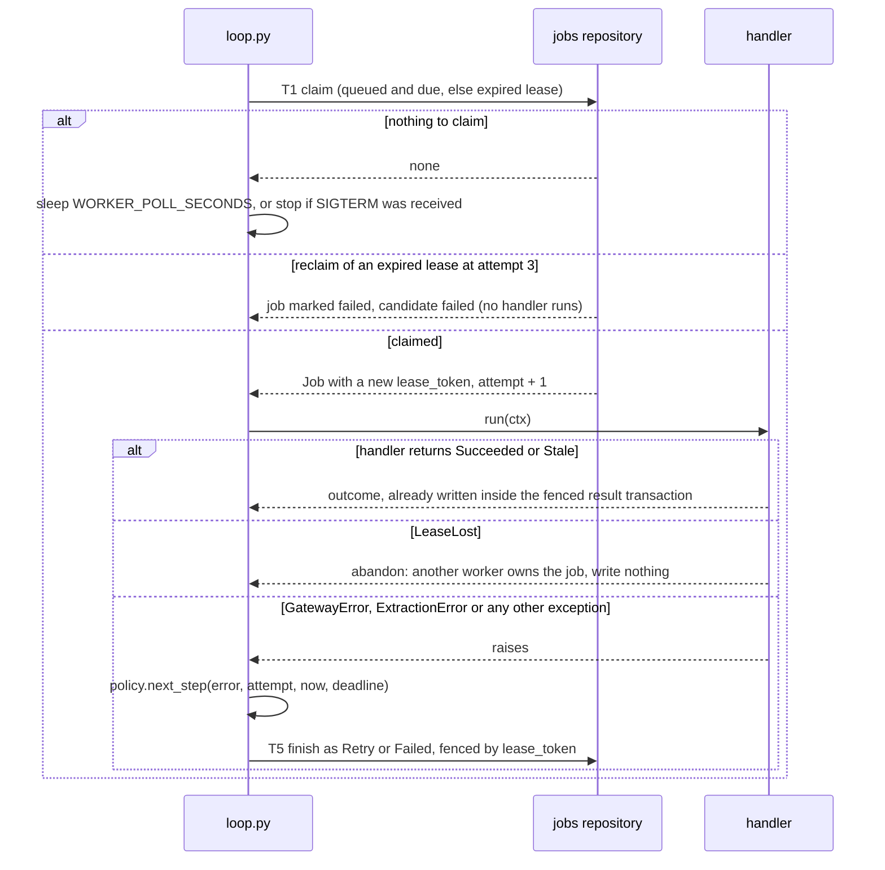
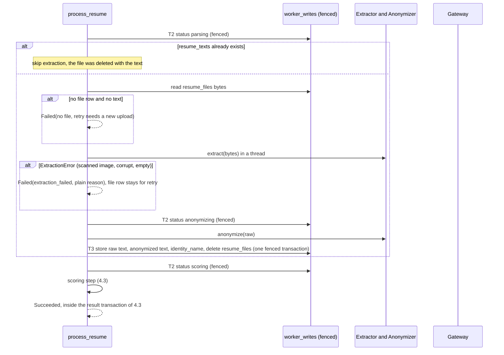
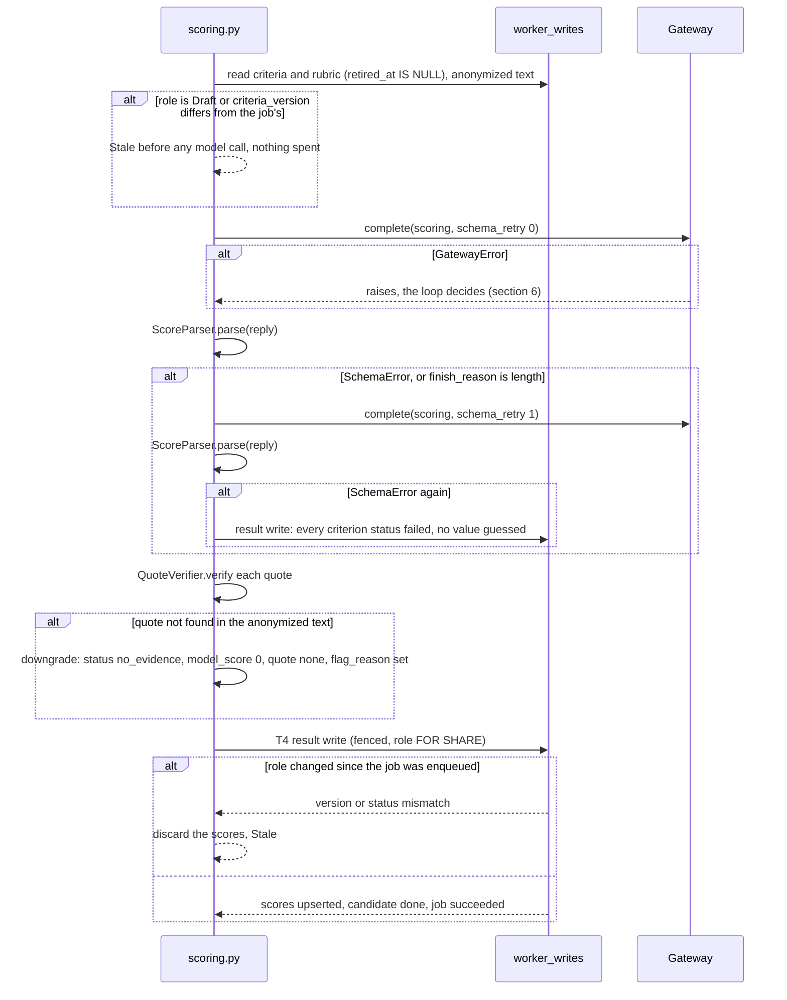
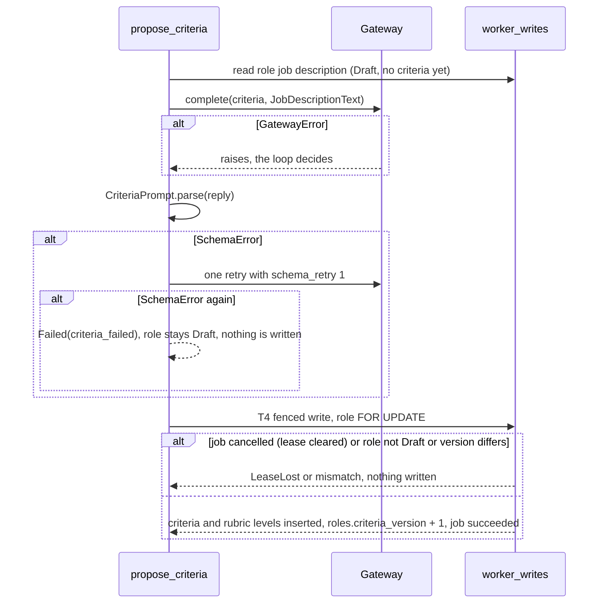
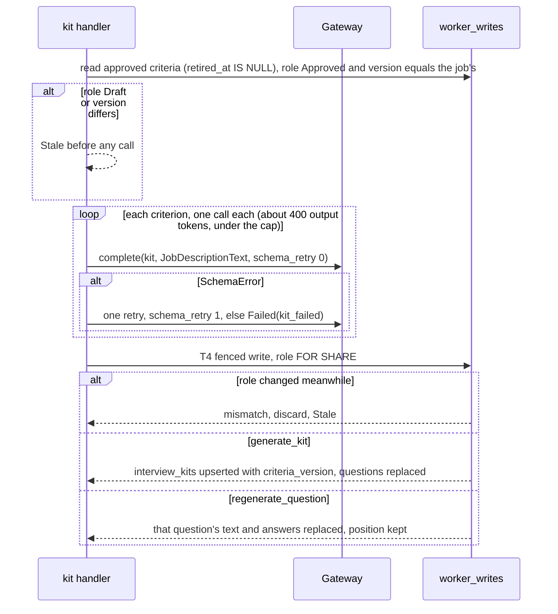

# Low Level Design: Worker

- Task: HK-12, HLD: docs/design/hirekit-hld.md (sections 2, 3, 6, 7, 8), ADRs: ADR-0001, ADR-0004, docs/architecture/tenets.md (tenets 1, 3, 4, 7, 8), docs/design/data-model.md (`jobs`, `candidates`, `scores`), docs/design/gateway-lld.md
- Author: midhun.m (git), delivering entity: unattributed (no .bearing/company.json), 2026-09-30, status Draft, version v1
- Serves: US-00-001, US-00-002, US-00-003, US-00-005, US-00-006, US-00-007, US-00-013; REQ-005, REQ-006, REQ-008, REQ-019 to REQ-023, REQ-031 to REQ-035, REQ-050, REQ-053
- Acceptance criteria the tests cover: AC-US-00-001-2, AC-US-00-001-4, AC-US-00-002-5, AC-US-00-003-3, AC-US-00-003-5, AC-US-00-005-2, AC-US-00-006-1, AC-US-00-006-3, AC-US-00-006-4, AC-US-00-006-5, AC-US-00-007-3, AC-US-00-007-4, AC-US-00-007-5, AC-US-00-013-1, AC-US-00-013-4, AC-US-00-013-5

The gateway (`backend/app/gateway/`), the `jobs` table and the other tables exist. Nothing under `backend/app/worker/` exists yet, so every path below is `(new)`. Statements about the outside world are prefixed "assumption:" and listed in section 10.

## 1. Scope

The Worker is a separate process (`python -m app.worker`, several copies at once) that claims rows from `jobs`, runs the handler for the job's type, and writes the result only while it still holds the job's lease and the criteria have not changed. It owns claiming, leases and fencing, retry and dead-lettering, the stale check, and the order of steps inside each of the five job handlers. Text extraction, the anonymizer, the scoring prompt and schema, quote verification and the kit prompts are separate components: this design defines the small interfaces (ports) the Worker calls, and each gets its own design later.

## 2. Module layout

All under `backend/`. Line counts are estimates. No file is expected to pass 400 lines.

| Path | Owns | Lines |
| --- | --- | --- |
| `app/worker/__init__.py` (new) | empty package marker | 1 |
| `app/worker/__main__.py` (new) | `python -m app.worker`: builds the engine, the gateway and the loop, installs the signal handlers | 70 |
| `app/worker/policy.py` (new) | constants (max attempts, backoff, lease, deadline) and `next_step(error, attempt, now, deadline)`: the pure decision "retry at T, fail, or stale" | 90 |
| `app/worker/outcome.py` (new) | `Outcome` types (`Succeeded`, `Retry`, `Failed`, `Stale`) and the plain failure texts the UI shows | 60 |
| `app/worker/loop.py` (new) | `run_worker`: claim, run one job, finish it; graceful stop | 120 |
| `app/worker/context.py` (new) | `JobContext`: the claimed job, its lease token, and the fenced-write helper every handler uses | 90 |
| `app/worker/ports.py` (new) | `Extractor`, `Anonymizer`, `ScoringPrompt`, `ScoreParser`, `QuoteVerifier`, `CriteriaPrompt`, `KitPrompt` protocols | 110 |
| `app/worker/handlers/__init__.py` (new) | `HANDLERS`: job type to handler | 30 |
| `app/worker/handlers/process_resume.py` (new) | extract, anonymize, score, verify, write; per-file statuses | 210 |
| `app/worker/handlers/scoring.py` (new) | the shared "score one candidate" step used by `process_resume` and `rescore` | 190 |
| `app/worker/handlers/rescore.py` (new) | re-run scoring for one candidate | 60 |
| `app/worker/handlers/propose_criteria.py` (new) | one model call, write criteria and rubric into a Draft role | 150 |
| `app/worker/handlers/kit.py` (new) | `generate_kit` and `regenerate_question` | 220 |
| `app/db/repositories/jobs.py` (new) | all SQL on `jobs`: claim, reclaim, fence, finish, reschedule, fail, stale | 230 |
| `app/db/repositories/worker_writes.py` (new) | SQL the handlers use to write results: texts, statuses, scores, criteria, kit | 250 |
| `app/core/config.py` (edit) | `worker_poll_seconds`, `worker_lease_seconds` | 15 |
| `.env.example` (edit) | the two worker variables | 4 |
| `alembic/versions/` | none | 0 |

Tests (new): `tests/worker/test_policy.py`, `test_outcome.py`, `test_loop.py`, `test_context.py`, `test_process_resume.py`, `test_scoring.py`, `test_rescore.py`, `test_propose_criteria.py`, `test_kit.py`, `test_boundaries.py`, `tests/worker/fakes.py`, and `tests/integration/test_jobs_repository.py`, `test_worker_writes.py`, `test_worker_end_to_end.py`.

Preconditions: migration 2 (the `hirekit_worker` database role with column grants, data-model section 7) before the Worker runs anywhere but a developer machine. Ports and their implementations come from later designs (section 3); until then the handlers are tested with fakes.

Rules that shape the layout: repositories own SQL and services own transactions (python rules), so handlers and `JobContext` open the transactions and the repositories take a session. The Worker is the only process that imports `app.gateway` besides the maintainer's commands (tenet 1). No file under `app/worker/` writes `candidates.stage` (tenet 4); `test_boundaries.py` scans for it.

## 3. Types and schemas

**Job** (frozen dataclass, `jobs.py`), read from the `jobs` row: `id`, `type`, `role_id`, `candidate_id`, `question_id`, `criteria_version`, `attempt`, `deadline_at`, `lease_token`. Ids and one integer only: no text, no snapshot (tenet 7).

**`JobContext`** (`context.py`) wraps a claimed job. `ctx.fenced()` is an async context manager that opens a transaction and, first thing inside it, runs `SELECT id FROM jobs WHERE id = :id AND lease_token = :mine AND status = 'running' FOR UPDATE`. No row means the lease is gone (expired and re-claimed, or cancelled): it raises `LeaseLost` and the handler stops without writing. Every write a handler makes goes through `ctx.fenced()`.

**Outcome** (`outcome.py`), what a handler or the loop's error handling ends with:

| Outcome | Effect on `jobs` | Effect on the candidate |
| --- | --- | --- |
| `Succeeded` | `status = 'succeeded'`, lease cleared | `processing_status = 'done'` (set inside the result write) |
| `Retry(run_after)` | `status = 'queued'`, `run_after`, lease cleared, `last_error` = the code | stays as it was |
| `Failed(code, reason)` | `status = 'failed'`, `last_error = code`, lease cleared | `processing_status = 'failed'`, `failure_reason = reason` (a plain sentence) |
| `Stale` | `status = 'stale'`, lease cleared | `processing_status = 'done'` with no fresh scores; the UI shows "Criteria changed, re-run scoring" from the version comparison |

**Failure texts** are constants in `outcome.py`, plain sentences with no ids, resume text or codes: extraction failed, "The model service is unavailable. Try again later", "The model budget of $8.00 has been reached. No new model calls can be made.", scoring failed, and so on.

**Ports** (`ports.py`), protocols the Worker calls. Their implementations are separate components with their own designs; here only the signatures are fixed:

| Port | Signature | Owner (later design) |
| --- | --- | --- |
| `Extractor` | `extract(data: bytes, media_type: str) -> str`; raises `ExtractionError` for a scanned image, a corrupt file or empty text | extraction |
| `Anonymizer` | `anonymize(raw: str) -> tuple[AnonymizedText, str or None]`; the second value is the name found (`candidates.identity_name`) | anonymizer |
| `ScoringPrompt` | `build(criteria: list[CriterionSpec]) -> PromptText` | scoring |
| `ScoreParser` | `parse(reply: str, criteria: list[CriterionSpec]) -> list[ParsedScore]`; raises `SchemaError` on any deviation from the strict schema (REQ-023) | scoring |
| `QuoteVerifier` | `verify(quote: str, text: AnonymizedText) -> bool`; whitespace normalization only, no fuzzy match (REQ-020) | scoring |
| `CriteriaPrompt` | `build() -> PromptText`; `parse(reply: str) -> list[ProposedCriterion]` | criteria |
| `KitPrompt` | `build(criterion: CriterionSpec) -> PromptText`; `parse(reply: str) -> list[ProposedQuestion]` | kit |

`CriterionSpec` (id, name, kind, weight, position, rubric levels) is a frozen dataclass loaded from `criteria` and `rubric_levels` with `retired_at IS NULL`. `ParsedScore` is `(criterion_id, value 0 to 4, quote or None)`.

**Where each validation lives.** Job rows are trusted (only the Api and the Worker write them). The model's reply is validated once, in `ScoreParser.parse`, `CriteriaPrompt.parse` or `KitPrompt.parse`; the Worker never reads a reply field itself. Settings are validated in `app/core/config.py` (section 7).

## 4. Sequence

Every flow draws its error branches. The decision table for errors is in section 6.

### 4.1 The loop: claim, run, finish

### 4.2 `process_resume`

### 4.3 The scoring step (`process_resume` and `rescore`)

### 4.4 `propose_criteria`

### 4.5 `generate_kit` and `regenerate_question`

## 5. Data access

All SQL is in `app/db/repositories/jobs.py` and `worker_writes.py`, parameterised, columns named, no `SELECT *`. Predicates repeat the partial-index predicates of `docs/design/data-model.md`.

| # | Query | Shape | Index |
| --- | --- | --- | --- |
| Q1 | claim: `SELECT id FROM jobs WHERE status = 'queued' AND run_after <= now() ORDER BY run_after, id LIMIT 1 FOR UPDATE SKIP LOCKED`, then `UPDATE jobs SET status = 'running', attempt = attempt + 1, lease_token = :t, lease_expires_at = now() + :lease, updated_at = now() WHERE id = :id RETURNING ...` | one row | `idx_jobs_queued_run_after` (repeats `status = 'queued'`) |
| Q2 | reclaim, tried only when Q1 found nothing: `... WHERE status = 'running' AND lease_expires_at < now() ORDER BY lease_expires_at LIMIT 1 FOR UPDATE SKIP LOCKED`; at `attempt >= 3` the row is set `failed` instead of re-leased | one row | `idx_jobs_running_lease` (repeats `status = 'running'`) |
| Q3 | fence: `SELECT id FROM jobs WHERE id = :id AND lease_token = :t AND status = 'running' FOR UPDATE` | one row | `jobs_pkey` |
| Q4 | finish: `UPDATE jobs SET status = :s, run_after = :r, last_error = :e, lease_token = NULL, lease_expires_at = NULL, updated_at = now() WHERE id = :id AND lease_token = :t` | one row | `jobs_pkey` |
| Q5 | role check: `SELECT id, status, criteria_version FROM roles WHERE id = :id FOR SHARE` (or `FOR UPDATE` in `propose_criteria`) | one row | `roles_pkey` |
| Q6 | criteria and rubric: `SELECT ... FROM criteria WHERE role_id = :r AND retired_at IS NULL ORDER BY position` and `SELECT ... FROM rubric_levels WHERE criterion_id = ANY(:ids)` | few rows | `idx_criteria_role_position` (repeats `retired_at IS NULL`), `rubric_levels_pkey` |
| Q7 | texts and file: by `candidate_id` on `resume_files`, `resume_raw_texts`, `resume_texts` | one row each | their primary keys |
| Q8 | status and store: `UPDATE candidates SET processing_status = :s, failure_reason = :f, identity_name = :n, updated_at = now() WHERE id = :id`; never touches `stage` | one row | `candidates_pkey` |
| Q9 | scores upsert: `INSERT INTO scores (...) ON CONFLICT (candidate_id, criterion_id, criteria_version) DO UPDATE SET status, model_score, quote, flag_reason, updated_at WHERE scores.status = 'failed'` (a same-version rewrite touches only failed rows and never `override_*`) | few rows | `scores_pkey` |
| Q10 | criteria and rubric insert, `UPDATE roles SET criteria_version = criteria_version + 1` (propose) | few rows | primary keys |
| Q11 | kit: upsert `interview_kits` by `role_id`; `DELETE FROM questions WHERE role_id = :r`; insert questions; single-question update by `id` | few rows | `interview_kits_pkey`, `idx_questions_role_criterion_position`, `questions_pkey` |
| Q12 | stale reads for the Api's list live in the Api LLD | n/a | n/a |

Queries: 11 (without index: 0).

**Transactions.** Every one is opened by `JobContext` or the loop; no repository opens one, and none is open during a gateway call, a file extraction or an anonymization (a model call can take 60 seconds, and a transaction holds no lock across it).

| # | Inside | Not inside, and why |
| --- | --- | --- |
| T1 claim | Q1 or Q2 with its UPDATE | the handler: the lease must be committed before any work starts |
| T2 progress | fence (Q3) then Q8 | the extraction or model call that follows |
| T3 store text | fence, insert raw and anonymized text, Q8 identity name, delete the `resume_files` row | the anonymizer run: it happens before, on values held in memory |
| T4 result | fence (Q3), role check (Q5), the writes (Q9, Q10 or Q11), Q8 status, Q4 succeeded | the model calls |
| T5 finish | Q4 with `lease_token = :t`, and Q8 for a failed candidate | the handler |

**Concurrency.** Four worker processes by default, one job at a time each (HLD section 8). Two are kept from taking the same job by `FOR UPDATE SKIP LOCKED` inside T1, and from writing the same result by the lease token: T3, T4 and T5 all start from a fence on the row (Q3) or a `WHERE lease_token` (Q4), so a Worker whose lease expired and was re-claimed writes nothing. If a fifth Worker is started by mistake it simply competes for the same rows; nothing in the design depends on the count. Deleting a job row while a Worker holds it makes the next fenced write find no row and abandon.

**Migrations.** None new. This design uses `initial_schema` (migration 1) and needs migration 2, `database_roles_and_grants`, to give `hirekit_worker` UPDATE on `candidates (processing_status, failure_reason, identity_name, updated_at)` only, so the database refuses a stage write (tenet 4).

## 6. Errors

Errors are decided in one place, `policy.next_step(error, attempt, now, deadline)`, a pure function with a table test. `attempt` is the value after the claim (1 to 3).

| Error | Where it comes from | Decision |
| --- | --- | --- |
| `RateLimitedError`, `ProviderUnavailableError`, `ProviderTimeoutError`, `LedgerUnavailableError` (all `retryable`) | gateway | `Retry` at `now + backoff[attempt - 1]` while `attempt < 3` and the new time is before `deadline_at`; else `Failed` with the text "The model service is unavailable. Try again later" |
| `BudgetReachedError`, `ProviderCreditExhaustedError` | gateway | `Failed`, `last_error = budget_reached`, text "The model budget of $8.00 has been reached. No new model calls can be made." No retry: the Api's `model_actions_allowed` blocks new work |
| `BudgetNotInitialisedError` | gateway | `Failed`, `last_error = budget_not_initialised` (a maintainer must start live mode through the ledger) |
| `RecordingMissingError`, `RecordingCorruptError` | gateway (replay mode) | `Failed`, `last_error = recording_missing`, text "No recorded response exists for this request." Never retried |
| `InputNotAllowedError`, `InvalidRequestError` | gateway | `Failed`, `last_error` = the code: a programming error, also logged at error level with ids |
| `ProviderRejectedError`, `ProviderProtocolError` | gateway | `Failed`, `last_error` = the code; text "Scoring failed. Try again, or contact the maintainer." The reservation is already released or kept by the gateway |
| `SchemaError` twice in a row | parsers | not an exception outside the handler: scores are written as `failed` (REQ-023) and the job `Succeeded`; for criteria and kit the job is `Failed` |
| `ExtractionError` | extractor | `Failed`, `last_error = extraction_failed`, text "No text could be read from this file (a scanned image or a corrupt file). Retry, or upload a text-based copy."; the `resume_files` row stays so a retry can run again |
| `LeaseLost` | `JobContext.fenced` | none: the loop drops the job without writing (another Worker owns it or it was cancelled) |
| any other exception | a bug | logged with the job id and exception type only; treated as retryable with the same limits, `last_error` = the exception class name; text "Something went wrong. Try again." Never the message: a message can carry text (tenet 7) |

Backoff is `(30, 120, 480)` seconds, `MAX_ATTEMPTS = 3`, deadline 30 minutes (`jobs.deadline_at`), lease 180 seconds. With three attempts in total only the first two backoffs are ever used (open assumption, section 10).

Mapping to a status code or user message: the Worker returns nothing over HTTP. What the user sees is `candidates.failure_reason` or `jobs.last_error` through the Api LLD's queue view; the Worker writes them as plain sentences and codes only.

## 7. Configuration

Read once in `app/core/config.py` (`pydantic-settings`, fails fast). The shared variables (`DATABASE_URL` and the gateway's) are in `.env.example` already; the two below are new. Count: 2 new (missing from `.env.example`: 2, added by item 3).

| Variable | Default | When missing |
| --- | --- | --- |
| `WORKER_POLL_SECONDS` | `1` | the default applies (HLD section 8: about 4 polls a second across 4 workers) |
| `WORKER_LEASE_SECONDS` | `180` | the default applies; must stay above the longest single attempt (two model tries of 60 seconds plus about 10 seconds of processing), and a validator refuses a value below 150 |

`MAX_ATTEMPTS`, the backoff schedule and the 30 minute deadline are constants in `policy.py` and the column default, not variables: the CHECK `chk_jobs_attempt_range` already fixes the attempt count, and changing any of them is a decision.

## 8. Tests

`pytest` with `asyncio_mode = "auto"`, no network, no `time.sleep`; the loop is driven with an injected clock and a fake gateway. Unit tests use fakes for ports and repositories; the SQL is proven on Postgres under `make test-integration`, because `make check` runs unit tests only and no CI host exists yet.

| Test | Kind | Proves |
| --- | --- | --- |
| `test_next_step_retries_a_retryable_error_with_the_first_backoff` | unit | HLD section 6 |
| `test_next_step_retries_again_with_the_second_backoff` | unit | HLD section 6 |
| `test_next_step_fails_a_retryable_error_at_the_third_attempt` | unit | HLD section 6 (the limit pair) |
| `test_next_step_fails_when_the_next_retry_would_pass_the_deadline` | unit | HLD section 6 |
| `test_next_step_maps_every_gateway_error_to_a_decision` | unit (table) | section 6 |
| `test_unexpected_exception_is_retried_and_only_its_class_name_is_recorded` | unit | tenet 7 |
| `test_failure_texts_carry_no_ids_or_resume_text` | unit | tenet 7 |
| `test_claim_takes_the_oldest_due_queued_job` | integration | Q1 |
| `test_claim_ignores_a_job_whose_run_after_is_in_the_future` | integration | Q1 |
| `test_two_workers_never_claim_the_same_job` | integration (20 tasks, 5 jobs) | ADR-0004, Q1 |
| `test_expired_lease_is_reclaimed_and_attempt_increments` | integration | Q2 |
| `test_reclaim_at_attempt_three_fails_the_job_and_the_candidate_instead_of_incrementing` | integration | data-model jobs note, Q2 |
| `test_a_live_lease_is_not_reclaimed` | integration | Q2 |
| `test_fenced_write_after_the_lease_expired_and_was_reclaimed_writes_nothing` | integration | HLD section 7 |
| `test_fenced_write_after_cancel_writes_nothing` | integration | AC-US-00-001-4 |
| `test_finish_is_conditional_on_the_lease_token` | integration | Q4 |
| `test_loop_runs_a_claimed_job_and_marks_it_succeeded` | unit | loop |
| `test_loop_sleeps_when_there_is_nothing_to_claim` | unit | loop |
| `test_loop_stops_claiming_after_sigterm_and_finishes_the_current_job` | unit | HLD section 12 |
| `test_lease_lost_drops_the_job_without_writing` | unit | HLD section 7 |
| `test_no_transaction_is_open_during_a_gateway_call` | unit (tracking transaction) | python rules, tenet 8 |
| `test_process_resume_walks_the_statuses_parsing_anonymizing_scoring_done` | unit | AC-US-00-003-5 |
| `test_process_resume_stores_raw_and_anonymized_text_apart_and_deletes_the_file` | unit + integration | AC-US-00-005-1, ADR-0008 |
| `test_process_resume_passes_only_anonymized_text_to_the_gateway` | unit | AC-US-00-005-2 |
| `test_process_resume_skips_extraction_when_the_text_already_exists` | unit | data-model jobs note |
| `test_extraction_failure_keeps_the_file_and_fails_with_a_plain_reason` | unit + integration | AC-US-00-003-3 |
| `test_scoring_retries_once_on_malformed_output_with_schema_retry_one` | unit | AC-US-00-006-3 |
| `test_scoring_marks_every_criterion_failed_after_the_second_malformed_output` | unit | AC-US-00-006-4 |
| `test_scoring_never_guesses_a_value_for_a_failed_criterion` | unit | AC-US-00-006-4 |
| `test_truncated_output_counts_as_malformed` | unit | HLD section 7 |
| `test_a_failed_criterion_can_be_rescored_without_touching_the_others` | integration | AC-US-00-006-5 |
| `test_a_quote_that_is_not_in_the_text_is_replaced_and_the_score_capped_and_flagged` | unit | AC-US-00-007-3, AC-US-00-007-4 |
| `test_no_evidence_is_stored_as_zero_with_no_quote` | unit | AC-US-00-007-5 |
| `test_a_score_row_is_written_only_after_its_quote_was_verified` | unit | tenet 3 |
| `test_upsert_never_overwrites_an_override` | integration | data-model scores note |
| `test_same_version_rescore_rewrites_only_failed_rows` | integration | data-model scores note |
| `test_scores_are_discarded_when_the_criteria_changed_after_enqueue` | unit + integration | REQ-006, HLD section 7 |
| `test_scores_are_discarded_when_the_role_was_reapproved_at_a_new_version` | integration | the ABA case, HLD section 16 |
| `test_stale_scoring_makes_no_model_call_when_the_version_already_differs` | unit | REQ-006 |
| `test_stale_job_is_marked_stale_and_the_candidate_done` | unit | AC-US-00-002-5 |
| `test_propose_criteria_writes_criteria_and_rubric_and_bumps_the_version` | integration | AC-US-00-001-2 |
| `test_propose_criteria_failure_leaves_the_role_draft_and_writes_nothing` | unit | AC-US-00-001-4 |
| `test_propose_criteria_after_cancel_writes_nothing` | integration | AC-US-00-001-4 |
| `test_generate_kit_makes_one_call_per_criterion` | unit | AC-US-00-013-1 |
| `test_kit_prompt_contains_the_job_description_and_criteria_and_no_candidate_data` | unit | AC-US-00-013-4 |
| `test_generate_kit_replaces_questions_and_records_the_criteria_version` | integration | AC-US-00-013-2 |
| `test_generate_kit_for_a_draft_role_is_stale_and_makes_no_call` | unit | AC-US-00-013-1 |
| `test_regenerate_question_replaces_one_question_and_keeps_its_position` | integration | AC-US-00-013-5 |
| `test_worker_never_writes_candidate_stage` | unit (AST scan of `app/worker/`) | tenet 4 |
| `test_worker_imports_the_gateway_and_the_api_does_not` | unit | tenet 1 |
| `test_a_batch_of_five_resumes_runs_end_to_end_with_fake_ports_and_replay` | integration | AC-US-00-003-5, REQ-050 |

Every retry, fallback and limit rule has both sides: the attempt limit (retry at attempts 1 and 2, fail at 3), the deadline, the schema retry (one retry then failed), and the stale check (fresh writes, stale discards). "A 429 then a 200" lives here as `test_next_step_retries_a_retryable_error_with_the_first_backoff` plus `test_loop_runs_a_claimed_job_and_marks_it_succeeded` on the second claim.

Tests named: 49.

## 9. Work breakdown

Each item is one MR and leaves `make check` green; integration tests run under `make test-integration`. Every type, function and table an item uses is defined by the same item or an earlier one.

1. **Outcome types, policy and their tests.** Files: `app/worker/__init__.py`, `outcome.py`, `policy.py`, `tests/worker/test_outcome.py`, `test_policy.py`. Pure code, no database. About 260 lines.
2. **Jobs repository.** Files: `app/db/repositories/jobs.py`, `tests/integration/test_jobs_repository.py`. Claim, reclaim, fence, finish, reschedule, fail, stale (Q1 to Q4). About 380 lines.
3. **`JobContext`, the loop, the entry point and settings.** Files: `context.py`, `loop.py`, `__main__.py`, `app/core/config.py` (edit), `.env.example` (edit), `tests/worker/fakes.py`, `test_context.py`, `test_loop.py`. The loop runs with a registry that has no handlers yet (an unknown type is failed as `no_handler`). About 390 lines.
4. **Ports and worker writes.** Files: `ports.py`, `app/db/repositories/worker_writes.py`, `tests/integration/test_worker_writes.py`. Q5 to Q11. About 380 lines.
5. **The scoring step and `rescore`.** Files: `handlers/scoring.py`, `handlers/rescore.py`, `handlers/__init__.py` (edit), `tests/worker/test_scoring.py`, `test_rescore.py`. About 390 lines.
6. **`process_resume`.** Files: `handlers/process_resume.py`, `handlers/__init__.py` (edit), `tests/worker/test_process_resume.py`. About 300 lines.
7. **`propose_criteria`.** Files: `handlers/propose_criteria.py`, `handlers/__init__.py` (edit), `tests/worker/test_propose_criteria.py`. About 260 lines.
8. **Kit handlers.** Files: `handlers/kit.py`, `handlers/__init__.py` (edit), `tests/worker/test_kit.py`. About 340 lines.
9. **Guards and the end-to-end test.** Files: `tests/worker/test_boundaries.py`, `tests/integration/test_worker_end_to_end.py`. About 220 lines.

Items: 9 (largest about 390 lines, over 400: 0).

## 10. Assumptions

- assumption: three attempts in total. The HLD names three backoffs (30 seconds, 2 minutes, 8 minutes) but `chk_jobs_attempt_range` allows attempts 0 to 3, so only two reschedules ever happen and the 8 minute step and most of the 30 minute deadline are never used. Confirm 3 attempts (data-model open concern 8); four would need a CHECK change. Owner: midhun.
- assumption: no heartbeat. A lease of 180 seconds outlasts one attempt (two model tries of 60 seconds plus about 10 seconds of processing, HLD section 8), and fenced writes make a lapse harmless. A very large PDF could exceed it; `WORKER_LEASE_SECONDS` can be raised, and the extractor design should bound extraction time.
- assumption: a retry after a partial failure re-pays. `generate_kit` makes one call per criterion and writes once, so a retry repeats the calls that already succeeded (about USD 0.0035 each). Caching per-criterion results would avoid it and is left out until it costs real money.
- assumption: one scoring call per resume returns every criterion within 1,500 tokens (HLD section 17). A malformed or truncated reply fails every criterion of that resume, not one, because the whole reply is one schema.
- assumption: the Worker's stale rule for `process_resume` sets the candidate to `done` with no fresh scores (data-model open concern 12), and the UI derives "re-run scoring" from the version comparison. A dedicated status would be a migration.
- assumption: extraction, anonymization and prompt libraries are chosen in their own designs; the ports here are the only contract, and their sync work runs in a thread (`asyncio.to_thread`) so the loop is never blocked.
- assumption: replay mode works for the whole pipeline (demo and evals): a missing recording fails the job as `recording_missing`, never retried.
- assumption: a Worker started by mistake beyond four is harmless; the count is not enforced anywhere.
- Downstream that goes stale once this is built: HLD section 3 (Worker paragraph now points here), the Api LLD (queue view, retry and cancel), the extraction, anonymizer, scoring, criteria and kit designs (each implements one port), and migration 2 (the `hirekit_worker` grants named in section 5).
